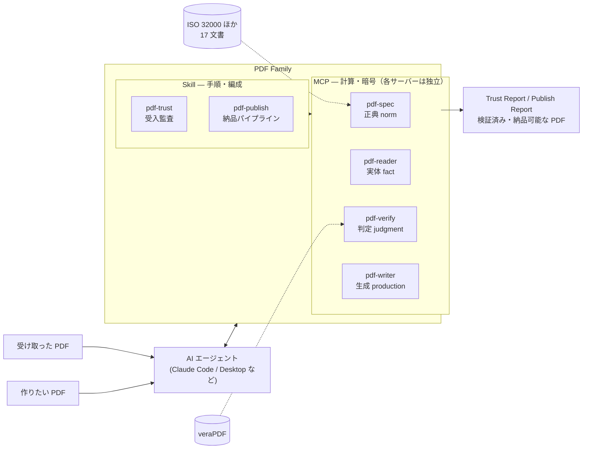

# PDF Agent Stack

PDF を **読む / 調べる / 反証する / 書く** を、LLM から決定論的に扱うための MCP サーバ・
ライブラリ・Skill 群。それぞれ独立して使えて、組み合わせると受入監査から納品までが 1 本になる。

**設計の中心にあるのは 3 つの区別**である。

| | 意味 |
| --- | --- |
| **宣言**（declaration） | ファイルが自分で書いたラベル。「私は PDF/A です」とメタデータに書いてあるだけ。**書いてあることは、証拠にならない** |
| **適合**（conformance） | 規格どおりであること。全部を証明する手段はなく、**規格破りを見つけることしかできない** |
| **検証**（validation） | 検証器（veraPDF など）が、自分の持っている検査項目で見た結果。パスは「この検査では落ちなかった」であり、**規格に適合している、ではない** |

この区別を守るために、判定はコードが下し、LLM は理由を説明する側に置いている。

## 全体像



図の正典はサイトの[全体構成と責務](https://shuji-bonji.github.io/pdf-agent-stack/ja/guide/architecture)。
責務境界・4 層モデル・言い切り強度（T1/T2/T3）はそちらで詳述している。

## 構成

<!-- stack:begin — scripts/generate-stack.mjs が生成。手で編集しない -->

> 版は実測（2026-08-31 時点の `npm view`）。

| リポジトリ | 役割 | 配布形態 | 版 | npm |
| --- | --- | --- | --- | --- |
| [pdf-spec-mcp](https://github.com/shuji-bonji/pdf-spec-mcp) | canon | mcp-server | 0.6.0 | `@shuji-bonji/pdf-spec-mcp` |
| [pdf-reader-mcp](https://github.com/shuji-bonji/pdf-reader-mcp) | structure | mcp-server | 0.14.0 | `@shuji-bonji/pdf-reader-mcp` |
| [pdf-verify-mcp](https://github.com/shuji-bonji/pdf-verify-mcp) | judgment | mcp-server | 0.26.0 | `@shuji-bonji/pdf-verify-mcp` |
| [pdf-writer-mcp](https://github.com/shuji-bonji/pdf-writer-mcp) | action | mcp-server | 0.21.0 | `@shuji-bonji/pdf-writer-mcp` |
| [pdf-constraints](https://github.com/shuji-bonji/pdf-constraints) | judgment | library | 0.6.1 | `@shuji-bonji/pdf-constraints` |
| [normativepdf](https://github.com/shuji-bonji/normativepdf) | action | library | 0.9.0 | `normativepdf` |
| [pdf-trust-skill](https://github.com/shuji-bonji/pdf-trust-skill) | procedure | skill | 0.8.0 | — |
| [pdf-publish-skill](https://github.com/shuji-bonji/pdf-publish-skill) | procedure | skill | 0.7.0 | — |
| [pdf-read-skill](https://github.com/shuji-bonji/pdf-read-skill) | procedure | skill | 0.2.0 | — |
| [pdf-specialist-plugin](https://github.com/shuji-bonji/pdf-specialist-plugin) | orchestration | plugin | 0.7.0 | — |
| [pdf-agent-pipeline](https://github.com/shuji-bonji/pdf-agent-pipeline) | orchestration | app | 0.1.0 | — |

<!-- stack:end -->

**版は `stack.json` が正典**で、`npm view` の実測から生成する。

```sh
node scripts/generate-stack.mjs            # 生成（手元）
node scripts/generate-stack.mjs --check    # npm と照合（CI）。ずれていれば exit 1
node scripts/generate-stack.mjs --readme   # 上の表を差し替え
```

`--check` は**ローカルの clone を見ない**。CI に clone は無いので、照合は npm だけで完結する。
`npm view` が応答しなかった場合は「ずれ」ではなく **判定不能**として exit 2 を返す
——「測れなかった」を「一致」に混ぜないため。

### 2 つの軸で見る

| 軸 | 値 |
| --- | --- |
| **役割**（layer） | canon / structure / judgment / action / procedure / orchestration / hub |
| **配布形態**（form） | mcp-server / library / skill / plugin / app / site |

配布形態を決めるのは「**誰が起動するか**」である。
`mcp-server` は LLM が呼び、`library` は開発者のコードが import し、`app` は人・シェル・CI が起動する。

同じ役割を違う配布形態で実装したものがある。`pdf-specialist-plugin`（plugin・LLM が主）と
`pdf-agent-pipeline`（app・コードが主）はどちらも編成層で、**主従が逆**の 2 実装である。

## このリポジトリの構成

```
pdf-agent-stack/
├── site/       ドキュメントサイト（VitePress）
├── scripts/    stack.json の生成・照合
├── stack.json  構成の正典（実測値）
├── mcp/ lib/ agent/ skill/   ← 各リポジトリの作業コピー（.gitignore 済み）
└── docs/       設計・評価の記録（非公開・.gitignore 済み）
```

`mcp/` などは**独立したリポジトリ**で、このリポジトリは束ねているだけである。
`.gitignore` に入れているのは秘匿のためではなく、`git add` で誤って gitlink として
登録されるのを防ぐため。clone しても中身は入らない。

## 版のずれを見る 3 つの検査

部品が 12 個あり、版は別々に上がる。ずれても**何も落ちない**場所が 3 か所あるので、
それぞれに検査を置いてある（いずれも週 1 と push で回る）。

| 検査 | 見ているもの | ずれたとき何が起きるか |
| --- | --- | --- |
| `generate-stack.mjs --check` | stack.json / README の表 vs npm | 構成表の版が古いまま残る |
| `skill-contract-probe.mjs --published` | Skill が分岐に使うフィールド vs 公開版の応答 | Skill の分岐が例外を出さずに素通りする |
| `version-mentions.mjs` | 文中に書いた版 vs いまある版 | まだ無い版を「ある」と書いた文が残る |

`skill-contract-probe.mjs` は実際に MCP サーバを起動して呼ぶ。
2026-08-31 に `pdf-read` の暗号化停止が発火しなくなっていたのは、
reader 0.14.0 が `metadata` を `null` にしたためで、その時は手で気づいた。

`version-mentions.mjs` は**書き換えない**。過去の記述（「2026-08-27 のリリース
（reader 0.13.0）」）は正しいので、未来の版を名乗る箇所だけを報告する。

marketplace（`claude-plugins`）側の版は、そのリポジトリの
`scripts/marketplace-version-check.mjs` が各 repo の `plugin.json` と照合する。

## ドキュメント

サイト: <https://shuji-bonji.github.io/pdf-agent-stack/>

## ライセンス

各リポジトリの LICENSE に従う。
