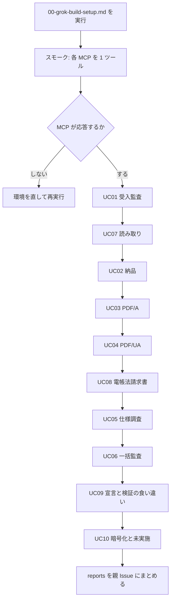

# PDF Agent Stack — Grok Build 実機評価キット

Grok Build 上で PDF Agent Stack（MCP 4 本 + Skill 3 本 + pdf-constraints）を動かし、利用価値と改善点を記録するための作業一式です。作成日は 2026-09-15 JST です。

対象リポジトリ: [shuji-bonji/pdf-agent-stack](https://github.com/shuji-bonji/pdf-agent-stack)  
サイト（日本語）: https://shuji-bonji.github.io/pdf-agent-stack/ja/

## このキットでやること

1. Grok Build に MCP と Skill を登録する。
2. ユースケースごとに指示書を 1 本だけ渡し、実務寄りの PDF で操作する。
3. 呼び出し入力、ツール応答、想定結果、実結果、エージェントの言い回し（風合い）を報告書に残す。
4. 「使える」「使えない」「直すべき」を Issue に返す。

サイト掲載の e2e 実測（2026-09-04 前後、検体は `docs/specimens/`）は通過済みです。本キットは同じ型を、Grok Build という別ホストと、より実務に近いデータで再走します。

## ファイル構成

| パス | 役割 |
| --- | --- |
| `00-grok-build-setup.md` | 環境構築。Grok Build の最初のセッションで読む |
| `00-evaluation-criteria.md` | 合否と改善点の見方 |
| `00-report-template.md` | 報告書の型。コピーして `reports/` に書く |
| `AGENTS.md` | Grok Build がリポジトリ直下で読む作業規則 |
| `instructions/UC01`〜`UC10` | ユースケースごとの実行指示 |
| `issues/` | GitHub Issue 本文の控え |

## 実行順



推奨順の理由は次のとおりです。受入と読み取りは入力 PDF があれば動きます。納品系はフォントと veraPDF が要ります。仕様調査は `PDF_SPEC_DIR` が要ります。後半は境界と失敗経路です。

## ユースケース一覧

| ID | 種別 | 指示書 | 主役 |
| --- | --- | --- | --- |
| UC01 | 既存の拡張 | [受入監査](instructions/UC01-incoming-audit.md) | pdf-trust + pdf-verify |
| UC02 | 既存の拡張 | [納品パイプライン](instructions/UC02-publish-pipeline.md) | pdf-publish + pdf-writer |
| UC03 | 既存の拡張 | [長期保存 PDF/A](instructions/UC03-pdfa-archive.md) | writer + verify |
| UC04 | 既存の拡張 | [アクセシビリティ PDF/UA](instructions/UC04-accessibility.md) | writer + verify + reader |
| UC05 | 既存の拡張 | [仕様調査](instructions/UC05-spec-research.md) | pdf-spec |
| UC06 | 既存の拡張 | [一括監査](instructions/UC06-batch-audit.md) | pdf-trust |
| UC07 | 追加 | [大きい PDF・読めない PDF](instructions/UC07-pdf-read.md) | pdf-read + pdf-reader |
| UC08 | 追加 | [電帳法寄りの請求書](instructions/UC08-denshichoho-invoice.md) | publish + attach_file |
| UC09 | 追加 | [宣言と検証の食い違い](instructions/UC09-declaration-vs-conformance.md) | writer + verify |
| UC10 | 追加 | [暗号化 PDF と未実施の記録](instructions/UC10-encrypted-and-unmeasured.md) | verify + reader |

## Grok Build への渡し方

作業ディレクトリを作り、このキットと `AGENTS.md` を置きます。

```bash
mkdir -p ~/pdf-agent-stack-eval
cp AGENTS.md ~/pdf-agent-stack-eval/
# instructions / 00-*.md / reports も同じツリーに置く
cd ~/pdf-agent-stack-eval
grok
```

最初の発言は `00-grok-build-setup.md` の「セッション開始プロンプト」を貼ります。ユースケースに入ったら、指示書を 1 本だけ `@instructions/UCnn-....md` で渡します。複数の指示書を同時に渡さないでください。

## 成果物の置き場

| 成果物 | 置き場 |
| --- | --- |
| 検体 PDF | `fixtures/`（生成物） / `fixtures/incoming/`（受領想定） |
| 官報 PDF | 同梱しない。`00-grok-build-setup.md` の「検体の用意」にある入手先から各自で取得する |
| 納品 PDF | `out/` |
| 各 UC の報告書 | `reports/UC01.md` など |
| 横断サマリ | `reports/SUMMARY.md` |

## 既知の前提（サイト実測 2026-09-04）

- pdf-spec-mcp 0.6.0
- pdf-reader-mcp 0.15.0
- pdf-verify-mcp 0.26.0
- pdf-writer-mcp 0.21.0
- pdf-constraints 0.6.1
- veraPDF 1.30.0

評価時は `npx` で実際に入った版を報告書の先頭に書いてください。サイトの版とずれていれば、それ自体を所見にします。
