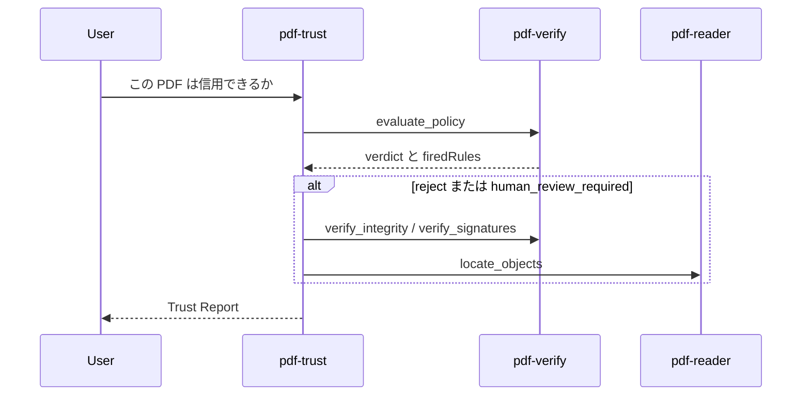

# UC01 — 受入監査（実務データ）

サイトの対応ページ: https://shuji-bonji.github.io/pdf-agent-stack/ja/use-cases/incoming-audit  
Skill: pdf-trust  
MCP: pdf-verify（必須）、pdf-reader（任意）

## Grok Build への指示（このブロックを貼る）

```text
@instructions/UC01-incoming-audit.md を実行してください。
AGENTS.md の言い切り強度を守ってください。
判定は evaluate_policy の verdict だけを使い、文章で上書きしないでください。
終了したら reports/UC01.md をテンプレートどおりに書いてください。
```

## 目的

取引先から届いた契約書と、行政から届いた公文書を、業務に載せる前に仕分ける。Grok Build が Trust Report をサイトの型で書けるか、署名後の増分更新を「改ざん」と誤認しないかを見る。

## データ準備

次の 3 検体を `fixtures/incoming/` に置く。存在する公式標本があればそれを優先する。

| ファイル | 用意の仕方 | ねらい |
| --- | --- | --- |
| `contract-unsigned.pdf` | writer の `create_markdown_pdf` で、件名「業務委託契約書（ダミー）」、甲乙は架空名、署名欄はテキストのみ | `contract` プロファイルで署名必須が効くか |
| `contract-like-signed.pdf` | 署名付き公開標本。無ければ「署名フィールドがあるが暗号検証できない自作」と明記してスキップ可 | `verify_signatures` の応答形 |
| `gazette-or-gov.pdf` | 公開の官報 PDF をローカルへ。使えなければ政府系の公開 PDF 1 件 | `government`、暗号化、文書タイムスタンプ |

官報を使えない場合は、`contract-unsigned.pdf` と、writer で作った請求書ダミー `invoice-plain.pdf` の 2 件に減らす。減らした理由を報告書に書く。

## 登場するもの



## 実行手順

1. `contract-unsigned.pdf` に対し、依頼文は「取引先から届いた契約書を受入監査して。プロファイルは contract」。
2. `evaluate_policy` の入力は絶対パス、`profile: "contract"`、`response_format: "json"`。
3. 返った `verdict` と `firedRules[].ruleId` をそのまま転記する。
4. `gazette-or-gov.pdf` がある場合は `profile: "government"` で同じことをする。
5. `verify_integrity` が増分更新を返したら、変更オブジェクト番号を `locate_objects` に渡す。
6. Trust Report を書く。判定欄はツールの `verdict` と一致させる。
7. 同じファイル・同じプロファイルでもう一度 `evaluate_policy` を呼び、`verdict` と `firedRules` が一致するか見る。

## 想定される結果

| 検体 | 想定 |
| --- | --- |
| 未署名の契約書 | `contract` では署名必須のため `human_review_required` または `reject`。ruleId に unsigned 系が含まれる |
| 官報（アンカー無し） | サイト実測では `use_with_caution`。`POL-CAUTION-TRUST-NOT-EVALUATED` と `POL-CAUTION-REVOCATION-UNKNOWN` が出ることがある |
| 再実行 | 同じ JSON 判定 |

官報で PDF/A が測れない場合は「未実施」と書く。暗号化のため veraPDF に渡せない、というサイト実測と同じ型にする。

## 見てほしい風合い

- 「信用できる？」という曖昧な依頼から、Skill が `evaluate_policy` に落ちるか
- 文書タイムスタンプによる末尾追記を、改ざんと書くか（ISO 32000-2 §7.5.6 では末尾追記が正規の増分更新）
- `trust: not_evaluated` を「信頼できない」と訳すか

## 成果物

- `reports/UC01.md`
- Trust Report 本文（報告書内で可）
