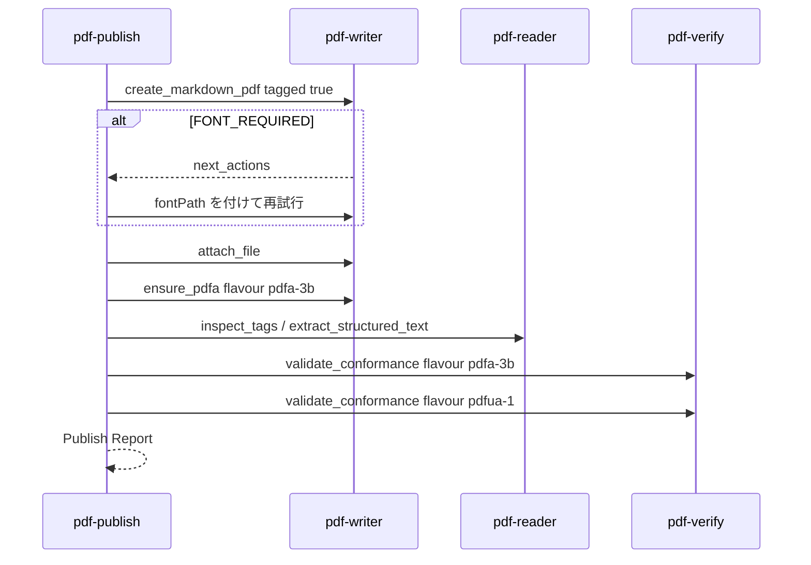

# UC02 — 納品パイプライン（実務データ）

サイトの対応ページ: https://shuji-bonji.github.io/pdf-agent-stack/ja/use-cases/publish-pipeline  
Skill: pdf-publish  
MCP: pdf-writer（必須）、pdf-reader（推奨）、pdf-verify（conformance 水準で必須）

## Grok Build への指示（このブロックを貼る）

```text
@instructions/UC02-publish-pipeline.md を実行してください。
write → read-back → verify の順を守ってください。
writer の正常終了を適合の証拠にしないでください。
FONT_REQUIRED が出たら next_actions に従って fontPath を付け、復帰手数を記録してください。
終了したら reports/UC02.md を書いてください。
```

## 目的

日本語の請求書を PDF にし、読み戻し、veraPDF で採点してから納品する。サイトのデモ請求書と同じループを、Grok Build が編成できるかを見る。

## データ準備

`fixtures/generated/invoice-source.md` を次の内容で作る（実在社名は使わない）。

```markdown
# 請求書 INV-2026-0915

発行日: 2026-09-15
支払期限: 2026-09-30
請求元: 架空商事株式会社
請求先: 架空工業株式会社

| 品目 | 数量 | 単価 | 金額 |
| --- | --- | --- | --- |
| 設計支援 | 1 | 120000 | 120000 |
| レビュー | 2 | 30000 | 60000 |

小計 180000
消費税 10% 18000
合計 198000 円
```

CSV も `fixtures/generated/invoice-2026-0915.csv` として同じ明細を置く。フォントが無い場合でも手順は最後まで進め、欠けたゲートを「未実施」にする。

## 登場するもの



## 実行手順

1. `create_markdown_pdf` で `out/publish-invoice.pdf` を作る。`tagged: true`。日本語があるのでフォント指定を先に試す。
2. `FONT_REQUIRED` なら、返った指示どおり `fontPath` または環境変数を付けて 1 回だけ再試行する。
3. `attach_file` で CSV を付ける。関連ファイル名は `invoice-2026-0915.csv`。
4. **最後に** `ensure_pdfa`（`pdfa-3b`）。先に器付けすると添付が壊れる経路があるため、順序を守る。
5. `ensure_pdfa` の warning（CLAIMS … NOT checked）を報告書に残す。消さない。
6. `inspect_tags` と `extract_structured_text` で、見出しと表が観測できるか見る。合否は書かない。
7. `validate_conformance` を `pdfa-3b` と `pdfua-1` で呼ぶ。
8. 修正ループは最大 3 回。同じ違反が 2 回続いたら止めて人手に渡す。
9. Publish Report を書く。PDF/A は T2、PDF/UA-1 は T1。

## 想定される結果

| 段階 | 想定 |
| --- | --- |
| 生成 | ファイルができる。日本語フォント無しなら `FONT_REQUIRED` |
| ensure_pdfa 成功時 | warning が必ず付く（設計） |
| 読み戻し | `isTagged` が true になることが多い。タグが無いならその観測を書く |
| ゲート | veraPDF があれば `engine: "verapdf"` と `compliant` 真偽。無ければ内蔵で `compliant` が null になり得る → 適合と書かない |

サイト実測（2026-09-04）のデモ請求書は、veraPDF 1.30.0 が PDF/A-3b 146/146、PDF/UA-1 106/106 だった。今回の自作ファイルが同じ点数になる必要はない。点数と `flavour` を記録する。

## 見てほしい風合い

- モデルが `ensure_pdfa` のあとに verify を忘れるか
- warning を「もう検証済み」と読むか
- 修正ループで writer と verify を交互に呼べるか

## 成果物

- `out/publish-invoice.pdf`
- `reports/UC02.md`
