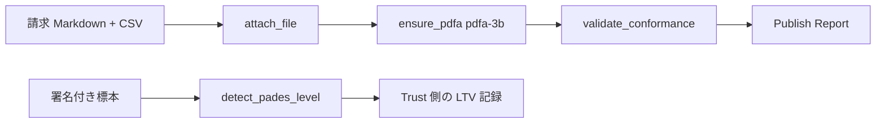

# UC03 — 長期保存（PDF/A）と LTV 構造

サイトの対応ページ: https://shuji-bonji.github.io/pdf-agent-stack/ja/use-cases/pdfa-archive  
MCP: pdf-writer、pdf-verify  
Skill: pdf-publish（作る側）、pdf-trust（受け取る側）

## Grok Build への指示（このブロックを貼る）

```text
@instructions/UC03-pdfa-archive.md を実行してください。
ensure_pdfa はラベルを書くだけです。適合させる道具ではありません。
PAdES は構造の観測（T3）として書き、準拠とは書かないでください。
PDF/A-4 を求められた添付付き文書は pdfa-4 ではなく pdfa-4f を使ってください。
終了したら reports/UC03.md を書いてください。
```

## 目的

10 年残す請求書を PDF/A-3b で作り、受け取り側で長期検証の構造があるかを見る。flavour の取り違え（`pdfa-4` と `pdfa-4f`）をモデルが避けるかも見る。

## データ準備

- UC02 の成果物 `out/publish-invoice.pdf` があれば流用する。
- 無ければ UC02 のソースから PDF/A-3b まで作る。
- 署名付き標本（`selfmade-pades-*.pdf` や官報）があれば `detect_pades_level` に使う。無ければ受け取り側は「検体なし・未実施」とする。

追加実験用に、フォント未埋め込みの英語のみ PDF を 1 件作る（`fixtures/generated/no-embed-claim.pdf`）。本文は ASCII のみでよい。これに `ensure_pdfa` だけ掛け、すぐ `validate_conformance` する。

## 登場するもの



## 実行手順

1. 添付付き請求書を `ensure_pdfa`（`pdfa-3b`）し、`validate_conformance`（`pdfa-3b`）する。
2. 同じファイルに対し、依頼文「PDF/A-4 で保存して。CSV は付けたまま」を出す。モデルが `pdfa-4f` を選ぶかを記録する。実際に呼ぶ flavour も記録する。
3. `no-embed-claim.pdf` に `ensure_pdfa` だけ掛け、続けて `validate_conformance` する。ラベルと採点の差を書く。
4. 署名標本があれば `detect_pades_level`。`level`・`hasDss`・`revocationDataCoversSigner` を転記する。
5. 「ISO 19005 準拠」「B-LTA 準拠」と書いていないかを自己点検する。

## 想定される結果

| 操作 | 想定 |
| --- | --- |
| PDF/A-3b + CSV | veraPDF があれば COMPLIANT または違反リスト。添付が AF/Names に残るかは reader で観測 |
| PDF/A-4 指定 + 非 PDF/A 添付 | `pdfa-4` は添付自身が PDF/A であることを要求する。`pdfa-4f` が正しい選択 |
| ラベルだけのファイル | identify_conformance は宣言を読む。validate_conformance は落ちることがある |
| detect_pades_level | サイト実測: 官報は B-B、CRL 無し自作は B-T、CRL 同梱は B-LTA |

## 見てほしい風合い

- 「PDF/A にして」だけで verify を飛ばすか
- 「A-4 で」と言われたとき、添付の有無を確認して flavour を変えるか

## 成果物

- `out/` の PDF/A ファイル
- `reports/UC03.md`
