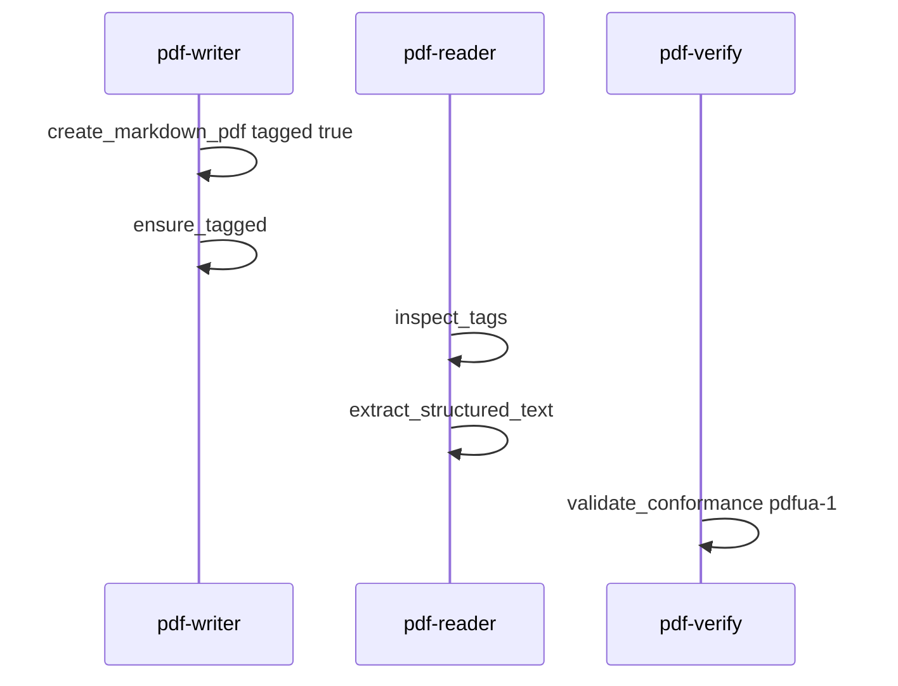

# UC04 — アクセシビリティ（PDF/UA）

サイトの対応ページ: https://shuji-bonji.github.io/pdf-agent-stack/ja/use-cases/accessibility  
MCP: pdf-writer、pdf-verify、pdf-reader  
Skill: pdf-publish

## Grok Build への指示（このブロックを貼る）

```text
@instructions/UC04-accessibility.md を実行してください。
PDF/UA-1 の違反は ISO 14289-1 の条文を引いてよいです（T1）。
機械検証が alt テキストの意味まで見ないことを Report に書いてください。
終了したら reports/UC04.md を書いてください。
```

## 目的

日本語レポートをスクリーンリーダー向けに作り、タグと検証結果を突き合わせる。不合格側として、タグ無し PDF を同じゲートに通す。

## データ準備

`fixtures/generated/ua-report.md` を作る。

```markdown
# 四半期進捗レポート（ダミー）

## 背景
本レポートは評価用のダミーです。実在の案件名は使いません。

## 進捗
| 項目 | 状態 |
| --- | --- |
| 設計 | 完了 |
| 実装 | 進行中 |
| 検証 | 未着手 |

## 次の四半期
検証手順を固定し、報告書の型を揃えます。
```

不合格側は UC01 の未署名契約書、または `create_text_pdf` で `tagged` を付けずに作った `fixtures/generated/ua-untagged.pdf`。

## 登場するもの



## 実行手順

1. `tagged: true` で `out/ua-report.pdf` を作る。日本語フォントを付ける。
2. `ensure_tagged` を掛ける。これは宣言である。
3. `inspect_tags` で StructTreeRoot 相当の観測、見出し、表セルを記録する。
4. `extract_structured_text` で論理順の本文を取る。タグ無しなら `isTagged: false` だけで論理順を推測しない（reader の制約）。
5. `validate_conformance` flavour `pdfua-1`。
6. タグ無し PDF にも同じ `validate_conformance` を掛け、条文付き違反が出るか見る。
7. Publish Report に「機械検証の範囲」と「人手レビューが残る範囲（alt、読み順の自然さ）」を分ける。

## 想定される結果

| 検体 | 想定 |
| --- | --- |
| タグ付き自作 | veraPDF があれば `flavour: "PDF/UA-1"` と `compliant`。サイトデモは 106/106 だったが点数は一致しなくてよい |
| タグ無し | `compliant: false`。条文例として 7.1-3（タグも Artifact もない実コンテンツ）、7.1-11（StructTreeRoot なし）、6.2-1（MarkInfo）が出ることがある |
| extract_structured_text on タグ無し | 論理本文を捏造しない |

`tagged: true` では title と埋め込みフォントが要る。標準 14 フォントだけだと ISO 14289-1 7.21.4.1 で落ちることがある。

## 見てほしい風合い

- 「読める？」という依頼を、reader の感想ではなく `validate_conformance` に落とすか
- 不合格結果を条文なしの「アクセシブルでない」で済ませるか

## 成果物

- `out/ua-report.pdf`
- `reports/UC04.md`
