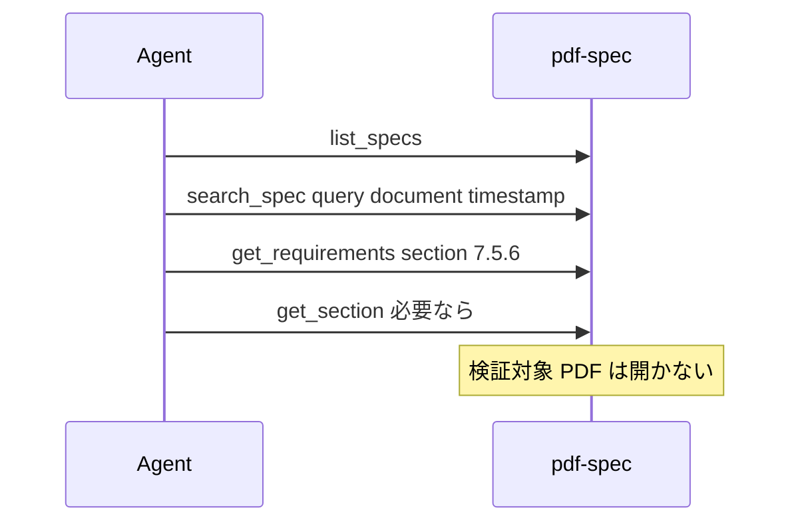

# UC05 — 仕様調査（監査結果を条文に落とす）

サイトの対応ページ: https://shuji-bonji.github.io/pdf-agent-stack/ja/use-cases/spec-research  
MCP: pdf-spec（必須）、pdf-verify（接続するときだけ）

## Grok Build への指示（このブロックを貼る）

```text
@instructions/UC05-spec-research.md を実行してください。
pdf-spec に検証対象 PDF のパスを渡さないでください。
コーパスが空なら list_specs のエラーだけ記録し、条文を記憶から書かないでください。
終了したら reports/UC05.md を書いてください。
```

## 目的

受入監査で見た「署名後にバイトが増えている」を、ISO 32000 の原文要求に着地させる。検索エンジンの要約やモデルの記憶で条文を作らないことを見る。

## データ準備

- `PDF_SPEC_DIR` に正規入手した規格 PDF があること。無ければ本 UC は環境欠落として「未実施」し、その事実自体を所見にする。
- UC01 の `verify_integrity` 結果があれば引用する。無ければ質問だけでも成立する。

## 登場するもの



## 実行手順

1. `list_specs`。返った文書名と `coverage.gaps` を転記する。ISO 19005 と ETSI PAdES が gaps に入る想定。
2. `search_spec`。`query: "document timestamp"`、`max_results: 10`。
3. `get_requirements`。`section: "7.5.6"`（増分更新）。
4. 「DocTimeStamp の定義はどこか。DSS との関係も」と依頼し、モデルが `search_spec` / `get_section` を使うかを見る。
5. ヒットが 0 件のとき、「要求が存在しない」と書かず「このコーパスは答えられない」と書くかを見る。
6. 条文本文を報告書へ長文転記しない。節番号、要求 ID（例 `R-7.5.6-1`）、shall/should/may の件数に留める。

## 想定される結果

サイト実測（pdf-spec-mcp v0.6.0、既定 spec iso32000-2）:

- `search_spec("document timestamp")` は 10 件。先頭付近に §12.8.4.2（DSS）、§12.8.4.3、§12.8.1
- `get_requirements("7.5.6")` は 10 要求（shall 8 / may 2）。先頭要求は末尾追記・原本無傷

コーパスが無い場合の想定: ツールが失敗し、モデルが ISO の文章を暗記で埋めない。

## 見てほしい風合い

- 仕様質問なのに verify や reader にファイルを渡すか
- gaps にある PDF/A を spec に聞いて「規格に無い」と断言するか

## 成果物

- `reports/UC05.md`
