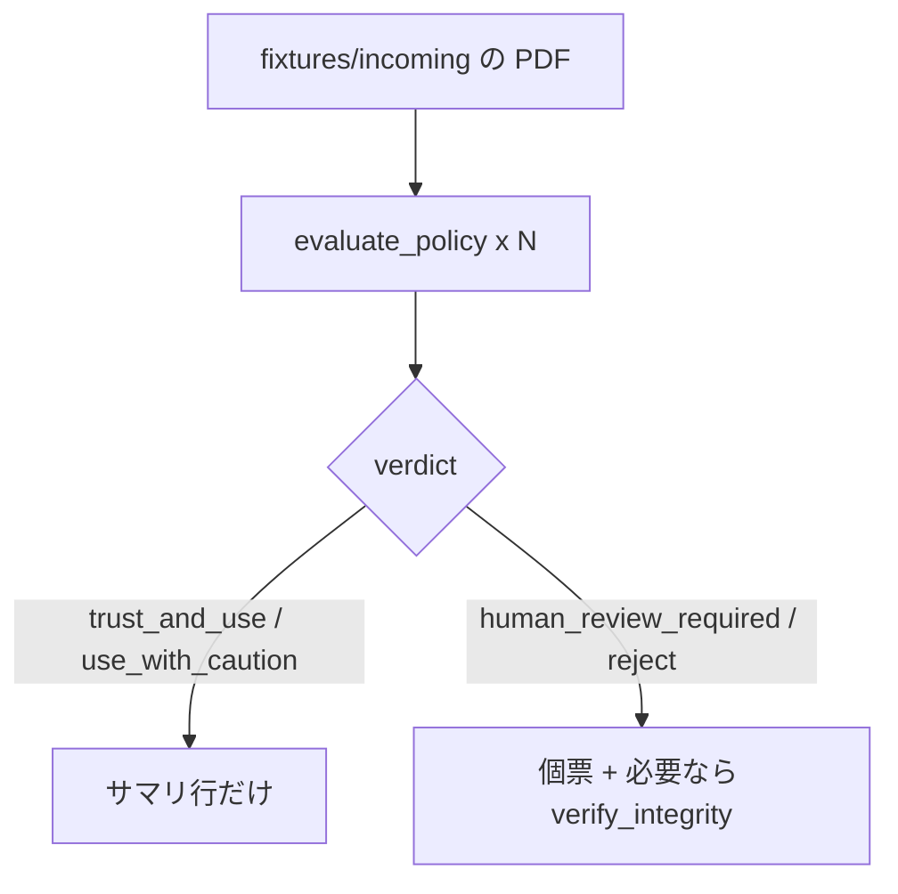

# UC06 — 一括監査（トリアージ）

サイトの対応ページ: https://shuji-bonji.github.io/pdf-agent-stack/ja/use-cases/batch-audit  
Skill: pdf-trust  
MCP: pdf-verify

## Grok Build への指示（このブロックを貼る）

```text
@instructions/UC06-batch-audit.md を実行してください。
全件に evaluate_policy を掛け、個票は reject と human_review_required だけに書いてください。
終了したら reports/UC06.md にサマリ表を入れてください。
```

## 目的

受領フォルダをまとめて仕分け、人の目を問題ファイルに限る。Grok Build が全件を長文解説して文脈を潰さないかを見る。

## データ準備

`fixtures/incoming/` に 4 件以上置く。足りなければ writer で足す。

| ファイル | 作り方 | 使う profile |
| --- | --- | --- |
| `batch-unsigned-contract.pdf` | 未署名の契約ダミー | `contract` |
| `batch-plain-invoice.pdf` | 請求ダミー | `financial` |
| `batch-ua-report.pdf` | UC04 の成果をコピーして可 | `general` |
| `batch-gov.pdf` | 官報など。無ければプレーン PDF | `government` または `general` |

改ざん標本や署名無効標本があれば 5 件目にする。サイト実測では `selfmade-tampered.pdf` が `reject` 側だった。

## 登場するもの



## 実行手順

1. フォルダ内の PDF を列挙する。
2. ファイルごとに profile を表のとおり付ける。依頼例:「`fixtures/incoming/` の PDF を全部受入監査して。契約は contract、請求は financial」。
3. 各件 `evaluate_policy`（絶対パス、`response_format: "json"`）。
4. サマリ表を作る列: ファイル名、profile、verdict、firedRules の ruleId 一覧、再実行の一致。
5. `reject` と `human_review_required` だけ個票を書く。
6. 可能なら 1 ファイルを 2 回呼び、再現を見る。

## 想定される結果

| 観察 | 想定 |
| --- | --- |
| 未署名 × contract | review または reject |
| 全件 caution | `trust_anchors` 未指定が原因になり得る。その説明が Trust の型にあるか |
| 個票の枚数 | 問題ファイルの数と一致。全件に長文を付けない |

## 見てほしい風合い

- 4 件すべてに同じ長さの物語を付けるか
- profile を全件 `general` に潰すか

## 成果物

- `reports/UC06.md`（サマリ表必須）
