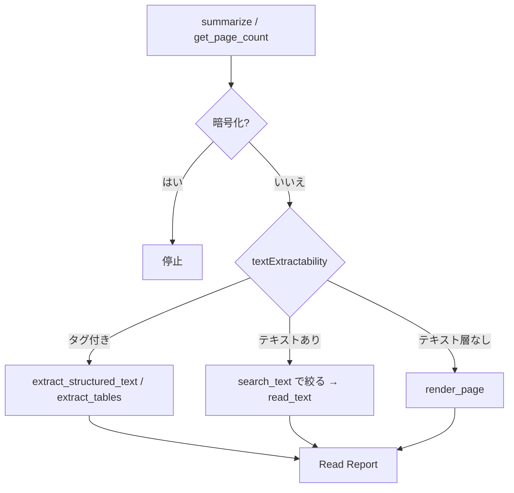

# UC07 — 大きい PDF・読めない PDF（pdf-read）

Skill: pdf-read  
サイト: https://shuji-bonji.github.io/pdf-agent-stack/ja/skills/pdf-read  
MCP: pdf-reader  
公式ユースケース一覧には独立ページが無い。Skill の本務を実機で測る追加ケース。

## Grok Build への指示（このブロックを貼る）

```text
@instructions/UC07-pdf-read.md を実行してください。
OCR はしないでください。画像ページは render_page で視覚読みし、Read Report に経路を書いてください。
全文をコンテキストに流し込まないでください。
終了したら reports/UC07.md を書いてください。
```

## 目的

必要な箇所だけ取り出し、読めなかったページを空欄にしない。Grok Build が 50 ページ超で `search_text` に絞るか、スキャンページを「テキストが無いのに読めた」と偽るか見る。

## データ準備

次を `fixtures/incoming/` に置く。巨大ファイルが作れない場合はページ数を減らしてよい。減らした数を書く。

| ファイル | 作り方 |
| --- | --- |
| `long-report.pdf` | `create_markdown_pdf` で見出しを 20 個以上。本文に「支払条件」「再委託の禁止」「検収日」を散らす。可能なら merge して 20 ページ以上 |
| `scan-like.pdf` | テキスト PDF を 1 ページ作り、`render_page` で画像を取る。その画像だけを別手段で 1 ページ PDF にできない場合は、`read_text` が空に近いページとして扱い、`render_page` 経路を強制する |

暗号化 PDF は UC10 に回す。

## 登場するもの



## 実行手順

1. 依頼:「`long-report.pdf` から支払条件と検収に関する箇所だけ抜いて。読めないページは理由を書いて」。
2. Phase 0: `summarize` と `get_page_count`。`isTagged` と `textExtractability` を記録する。
3. 20 ページを超える、または本文が長い場合は先に `search_text`。ヒットページだけ `read_text`。
4. テキストが取れないページは `render_page`。画像を見て内容を書くなら、経路を「視覚読み」と明記する。
5. Read Report をサイトの見出しで書く。読んだ範囲、経路、抽出可能性、読めなかった箇所、切り詰め。
6. 「読めなかった箇所」が空なら「なし」と明示する。欄自体を消さない。

## 想定される結果

| 項目 | 想定 |
| --- | --- |
| 経路 | 絞り込みが入り、全文ダンプが無い |
| スキャン相当 | no_text_layer と記録。OCR したと書かない |
| Report | Skill ページの型と一致 |

## 見てほしい風合い

- summarize を飛ばして全ページ read_text するか
- 画像ページを「内容は空」と切り捨てるか

## 成果物

- `reports/UC07.md`
- Read Report 本文
