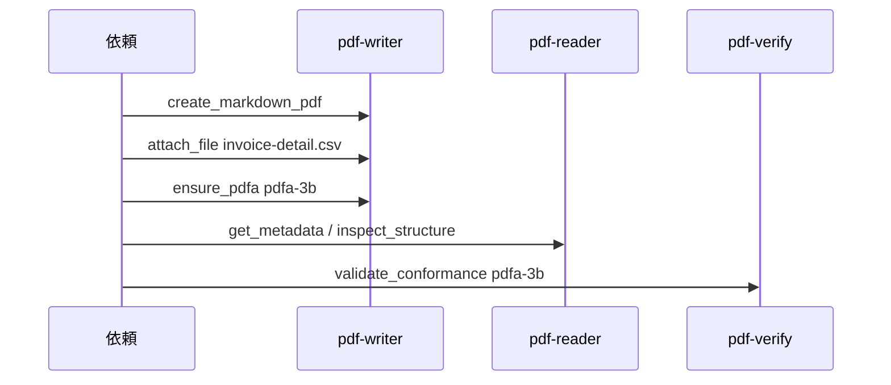

# UC08 — 電帳法寄りの請求書（実務シナリオ）

追加ユースケース。サイトの PDF/A と納品を、保存要件の言い方に寄せて測る。  
Skill: pdf-publish  
MCP: pdf-writer、pdf-reader、pdf-verify

法令の適合診断はしない。ファイル形式の操作だけを見る。条文の記憶引用はしない。

## Grok Build への指示（このブロックを貼る）

```text
@instructions/UC08-denshichoho-invoice.md を実行してください。
電帳法に「準拠した」とは書かないでください。行った操作（添付、PDF/A-3b、検証）だけを書いてください。
終了したら reports/UC08.md を書いてください。
```

## 目的

請求書 PDF に機械可読の明細 CSV を同梱し、PDF/A-3b で保存し、読み戻して添付が残っているかを確認する。実務の依頼文が、モデルを法令コンサルタントに変えてしまわないかを見る。

## データ準備

```text
fixtures/generated/denshi/
  invoice.md          # 取引日・金額・取引先（架空）・税込合計
  invoice-detail.csv  # 明細行
```

`invoice.md` に入れる項目（値はダミー）:

- 発行日 2026-09-15
- 取引日 2026-09-10
- 請求元 / 請求先（架空）
- 登録番号風の文字列は `T0000000000000` のような明らかに偽の値
- 税抜・税・税込

## 登場するもの



## 実行手順

1. 依頼文は次を使う。「この請求書を、明細 CSV 付きで 10 年残せる PDF にして。検証まで通して納品して。」
2. 生成 → 添付 → `ensure_pdfa`（最後）→ 読み戻し → `validate_conformance`。
3. 読み戻しで添付の存在を観測する（catalog の AF / Names など、reader が返すフィールド名で書く）。
4. モデルが「電帳法対応済み」と書いたら、その文を風合いに引用し、改善点にする。正しい結語は「CSV を添付し、veraPDF が PDF/A-3b を COMPLIANT と判定した / しなかった / 未実施」。
5. 税率や登録番号の真偽は扱わない。

## 想定される結果

| 項目 | 想定 |
| --- | --- |
| 添付後の PDF/A-3b | UC02 と同様。flavour を pdfa-1b に落とさない |
| 読み戻し | 添付が残っている観測、または残っていない観測。推測で「付いているはず」と書かない |
| 言い回し | 法令適合を断言しない |

## 見てほしい風合い

- 依頼の「10 年残せる」を、PAdES LTV まで勝手に拡張するか（署名していないファイルなら detect_pades_level は空でよいはず）
- 金額計算をモデルが検算して本文を書き換えるか（書き換えたら入力と出力の差を記録）

## 成果物

- `out/denshi-invoice.pdf`
- `reports/UC08.md`
