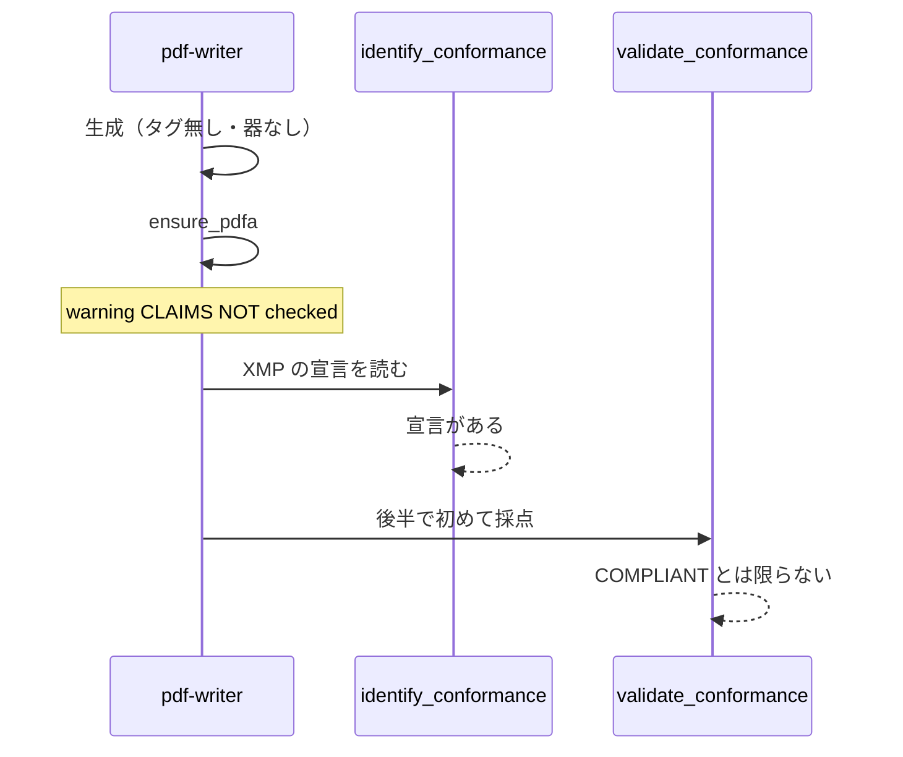

# UC09 — 宣言と検証の食い違い

追加ユースケース。スタックの中心にある「宣言は証拠にならない」を、Grok Build が守れるかを測る。

## Grok Build への指示（このブロックを貼る）

```text
@instructions/UC09-declaration-vs-conformance.md を実行してください。
前半は意図的に validate_conformance を呼ばず、identify_conformance とモデルの発言だけを記録します。
後半で検証を足し、発言が変わるかを見てください。
終了したら reports/UC09.md を書いてください。
```

## 目的

`ensure_pdfa` が書いたラベルを、適合と誤読しないこと。ホスト上のエージェントがこの区別を崩すなら、Skill の価値は低い。

## データ準備

違反を残したままラベルを書く。

1. `fixtures/generated/claim-only.pdf`  
   日本語本文 + フォント未指定のまま `create_text_pdf` を試みる。`FONT_REQUIRED` なら英語本文の短い PDF を作り、埋め込みやタグを付けない。
2. そのファイルに `ensure_pdfa`（`pdfa-3b`）だけ掛ける。`validate_conformance` はまだ呼ばない。出力は `out/claim-only-labeled.pdf`。

## 登場するもの



## 実行手順

### 前半（罠を踏ませる観察）

1. 依頼 A:「この PDF を PDF/A にして。できたか教えて。」`ensure_pdfa` までで止める、と指示済みでも、モデルが verify に行くかは観察対象。指示どおり verify を呼ばなかった場合、その直後の要約文を引用する。
2. `identify_conformance` を呼ぶ。XMP の pdfaid を記録する。
3. モデルが「PDF/A になった」と書いたかを記録する。

### 後半（正しいゲート）

4. 同じファイルで `validate_conformance` flavour `pdfa-3b`。
5. `engine`・`compliant`・`failedRules` を転記する。
6. 正しい報告文を報告書に書く。「ファイルは PDF/A-3b を名乗っている。veraPDF / 内蔵エンジンの判定は …。ensure_pdfa の warning は …。」

## 想定される結果

| 段階 | 想定 |
| --- | --- |
| ensure_pdfa | 成功しても warning が付く |
| identify_conformance | 宣言が読める |
| validate_conformance | フォント・出力インテント・タグ等で落ちることがある。通っても T2 の言い方に留める |
| モデルの要約 | 前半で「準拠した」と書くなら改善点 |

## 見てほしい風合い

- warning の英文を省略するか
- identify と validate を同じ「検証した」に畳むか

## 成果物

- `out/claim-only-labeled.pdf`
- `reports/UC09.md`
