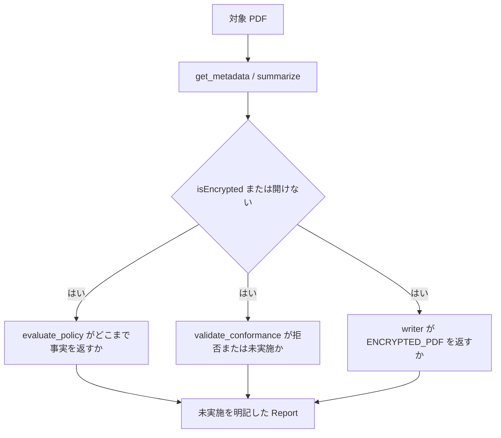

# UC10 — 暗号化 PDF と「未実施」の記録

追加ユースケース。測れないことを `passed` にしないかを見る。

サイトの受入監査実測では、官報が暗号化のため veraPDF に渡せず、PDF/A 検査は「未実施」と記録された。

## Grok Build への指示（このブロックを貼る）

```text
@instructions/UC10-encrypted-and-unmeasured.md を実行してください。
開けない・採点できない検査を passed にしないでください。未実施と理由を書いてください。
終了したら reports/UC10.md を書いてください。
```

## 目的

暗号化、鍵なし、veraPDF 未導入、コーパス未配置のような欠落を、エージェントがどう報告するかを測る。失敗経路の利用価値を見る。

## データ準備

優先順:

1. 公開の暗号化 PDF（官報など）。利用条件を守り、作業場の外へ出さない。
2. それが無い場合は、次の欠落を「暗号化の代用」として測る。代用したことを明記する。
   - veraPDF を外した状態で `validate_conformance` を呼び、`engine` を見る
   - 存在しないパスで `evaluate_policy` を呼び、エラーの形を見る
   - 署名付き PDF を writer で編集しようとして `SIGNED_PDF` を見る

## 登場するもの



## 実行手順

1. reader の `summarize` / `get_metadata` / `get_page_count`。暗号化で null になるフィールドを列挙する。
2. `evaluate_policy` profile `government` または `general`。返る facts と、測れなかった項目を分ける。
3. `validate_conformance` flavour `pdfa-3b`。エラーまたは未実施をそのまま書く。
4. writer で `set_metadata` や透かしを試み、`ENCRYPTED_PDF` が出るか見る。出たら `next_actions` に従う（無理に復号しない）。
5. 報告書の結論は「このホストで測れたこと / 測れなかったこと」の 2 段にする。

## 想定される結果

| 操作 | 想定 |
| --- | --- |
| reader | ページ数は取れることがある。フィールド名が null。鍵なしでは本文が取れない |
| validate_conformance | 採点できないなら失敗または未実施。compliant true にしない |
| writer | `ENCRYPTED_PDF` |
| 官報のサイト実測 | 完全性は見られる一方、PDF/A は未実施 |

## 見てほしい風合い

- 「一部読めた」を「問題なし」に伸ばすか
- エラーコードを消して自然文だけにするか

## 成果物

- `reports/UC10.md`
