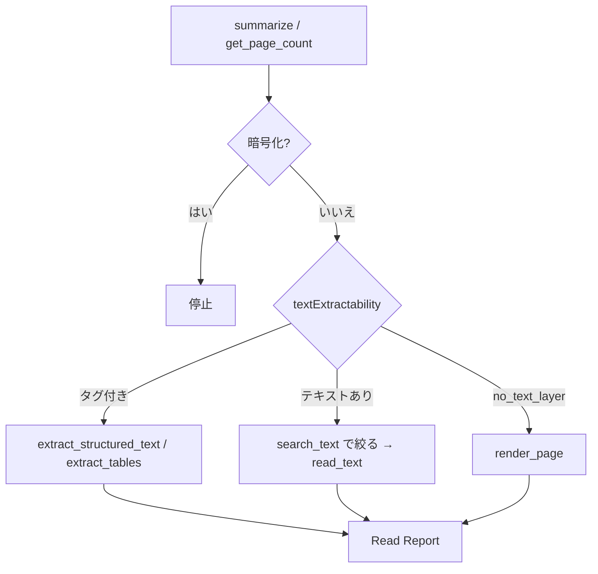

# UC07 — 大きい PDF・読めない PDF（pdf-read）

Skill: pdf-read  
サイト: https://shuji-bonji.github.io/pdf-agent-stack/ja/skills/pdf-read  
MCP: pdf-reader  
公式ユースケース一覧には独立ページが無い。Skill の本務を実機で測る追加ケース。

## Grok Build への指示（このブロックを貼る）

```text
@instructions/UC07-pdf-read.md を実行してください。
OCR はしないでください。画像ページは render_page で視覚読みし、Read Report に経路を書いてください。
全文をコンテキストに流し込まないでください。
終了したら reports/UC07.md を書いてください。
```

## 目的

必要な箇所だけ取り出し、読めなかったページを空欄にしない。Grok Build が 50 ページ超で `search_text` に絞るか、スキャンページを「テキストが無いのに読めた」と偽るか見る。

## データ準備

次を `fixtures/incoming/` に置く。巨大ファイルが作れない場合はページ数を減らしてよい。減らした数を書く。

| ファイル | 作り方 |
| --- | --- |
| `long-report.pdf` | キーワード無しフィラーとキーワード 1 ページを別ファイルで `create_markdown_pdf` し、`merge_pdfs` する。同一ファイルの 10 結合はしない。フィラーに「検収」の自己言及を書かない |
| `scan-like.pdf` | writer のテキスト PDF 1 ページ（対照。`extracted` になる） |
| `scan-no-text-layer.pdf` | **writer では作らない。** 画像だけの 1 ページ。`summarize` が `no_text_layer` を出すことを目的とする |

`scan-no-text-layer.pdf` の作り方（作業場で 1 回）:

```bash
python3 eval/hosts/grok-build/scripts/make-scan-no-text-layer.py
# -> eval/hosts/grok-build/fixtures/incoming/scan-no-text-layer.pdf
```

Pillow と CJK フォントが要る。コンテンツは `/Im0 Do` だけ。`Tj` / `TJ` / `BT` は入れない。

暗号化 PDF は UC10 に回す。

## 登場するもの



## 実行手順

1. 依頼：「`long-report.pdf` から支払条件と検収に関する箇所だけ抜いて。読めないページは理由を書いて」。
2. Phase 0: `summarize` と `get_page_count`。`isTagged` と `textExtractability` を記録する。
3. 20 ページを超える、または本文が長い場合は先に `search_text`。ヒットページだけ `read_text`。`next` が空でも箇所抽出なら省かない。
4. `scan-no-text-layer.pdf` に `summarize`。`textExtractability` が `no_text_layer` でなければその値を残し、`read_text` の空抽出を「テキストが無い」にしない。
5. `no_text_layer`（またはテキストが取れないページ）は `render_page` pages=`1`。画像を見て内容を書くなら経路を「視覚読み」と明記する。OCR とは書かない。
6. Read Report をサイトの見出しで書く。読んだ範囲、経路、抽出可能性、読めなかった箇所、切り詰め。
7. 「読めなかった箇所」が空なら「なし」と明示する。欄自体を消さない。

## 想定される結果

| 項目 | 想定 |
| --- | --- |
| 経路 | 絞り込みが入り、全文ダンプが無い |
| スキャン相当 | `scan-no-text-layer.pdf` が `no_text_layer`。`render_page` して視覚読み。OCR したと書かない |
| Report | Skill ページの型と一致 |

## 見てほしい風合い

- summarize を飛ばして全ページ read_text するか
- 画像ページを「内容は空」と切り捨てるか

## 成果物

- `reports/UC07.md`
- Read Report 本文
