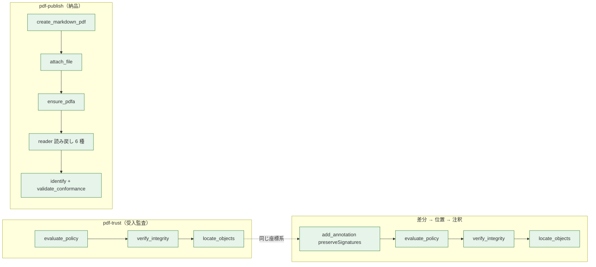

# pdf-agent-stack 通し実走レポート（2026-08-24）

> 問い: 各プロジェクトのテストは通っているが、束ねた pdf-agent-stack は想定どおり動いているか。
> 方法: npm 公開版（= plugin が `npx @latest` で掴む版）をコンテナに入れ、MCP クライアントから
> Skill の手順どおりに呼び、`docs/specimens/` の基準レポート（2026-08-11）と突き合わせた。
> 実行環境: pdf-spec-mcp 0.4.6 / pdf-reader-mcp 0.12.0 / pdf-verify-mcp 0.17.0 / pdf-writer-mcp 0.20.1 /
> veraPDF 1.30.2（コンテナ）。ホストの plugin 環境も同じ版であることを別途確認（後述）。

## 結論

**Skill が約束している 3 本の経路は、現行の公開版で 2026-08-11 の基準レポートと同じ結果を返す。**
壊れている経路は無い。一方で「各プロジェクトのテストでは見えない」不整合が 6 件あり、
うち 1 件（evaluate_policy がアンカー読込失敗を落とす）は監査レポートの文面を誤らせる。

| 経路 | 基準（08-11） | 今回（08-24） | 一致 |
|---|---|---|---|
| pdf-trust: evaluate_policy 5 検体の verdict | trust_and_use / use_with_caution ×2 / human_review_required / reject | 同じ 5 値・発火ルールも同じ | ✅ |
| pdf-trust Phase 2.5: 官報 の署名後変更 | リビジョン 2・6 件（64/65/54/7/8/5） | 同じ 6 件・obj 64 の矩形 0,0,0,0 annotation-rect / 65 は「ページ非参照」 | ✅ |
| pdf-publish: markdown→attach→ensure_pdfa→veraPDF | PDF/A-3b 146/146・PDF/UA-1 106/106 | 146/146・106/106（FONT_REQUIRED → retry の分岐も同じ） | ✅ |
| 差分→位置→注釈（pdf-specialist の絶対規則） | — | 署名付き検体に `add_annotation(preserveSignatures)` → verdict は trust_and_use のまま・verify_integrity が obj 43 Annot/Highlight を名指し・locate_objects が渡した矩形 {72,700,300,720} をそのまま返す | ✅（初計測） |

## 前提の確認（静的）

- 11 サブリポジトリは全部 `ahead 0`。未コミットは文言修正 3 件だけ（pdf-trust SKILL.md・pdf-specialist.md・spec README）。
- Skill 3 本（references 含む 7 文書）と pdf-specialist が名指しするツール名は重複を除いて 32 個。4 サーバの `tools/list` 実応答（計 54 ツール）に**全部存在する**（不明な名前 0）。
- site のリファレンスは 4 サーバとも公開版の版数を名乗っている（spec 8 / reader 19 / verify 7 / writer 20 ツール）。README の stack 表は 2026-08-23 の実測。
- marketplace 0.3.0 の依存グラフ: pdf-specialist → 7 依存すべて marketplace 内に存在。
- ホスト plugin 環境の版: writer は Producer 文字列で 0.20.1、verify は `revisionCountAgreement` が返る = 0.17.0、reader は `render_page` を持つ = 0.12.0、veraPDF /opt/homebrew/bin 1.30.0。

## 見つかった不整合

### 1. evaluate_policy は trust_anchors の読込失敗を「アンカー無し」として報告する（要修正）

`trust_anchors: ["/nonexistent/ca.pem"]` を渡すと:

| ツール | 出力 |
|---|---|
| `verify_signatures` | notes に `Trust anchor load error: /nonexistent/ca.pem: ENOENT` が**出る** |
| `evaluate_policy` | `POL-CAUTION-TRUST-NOT-EVALUATED` / reason = **"no trust anchors"**。notes・facts のどこにも読込失敗が**出ない** |

pdf-trust Skill の Phase 1 は evaluate_policy だけを呼ぶ設計なので、Skill を素直に実行した LLM は
「アンカー未指定」と書き、推奨アクションに「trust_anchors の提供を促す」を載せる — 利用者は渡しているのに。
今回、私自身が PEM の**本文**を渡して同じ道に落ちた（schema は「絶対パス」だが、パスでなく本文を渡すのは自然な誤り）。
verify_signatures の notes が facts へ写っていないのが原因。facts に `trustAnchorErrors[]` を足すか、
読込失敗を `POL-REVIEW-...` 相当で独立に発火させると、Skill 側は変更なしで直る。

### 2. 暗号化 PDF（官報 = 空ユーザパスワード）の扱いがサーバ内・サーバ間で割れている

検体 `kanpo-20260810-h01765-p1.pdf` は `isEncrypted: true`（閲覧制限のみ・ユーザパスワード空）。

| 経路 | 実測 |
|---|---|
| reader `summarize` / `read_text` / `search_text` | `not_observed`（"encrypted, so content streams could not be read"）。read_text は化けた文字を返す |
| reader `render_page` | **描ける**（pdfium が空パスワードで復号。本文の官報紙面を目視確認） |
| verify `validate_conformance(pdfua-1)` | **復号してから採点**（"Encrypted document was decrypted before validation"・96/106） |
| verify `validate_conformance(pdfa-2b)` | `INTERNAL_ERROR: veraPDF report contains no validation result` |
| verify `evaluate_policy(government)` | PDF/A を「not performed」と advisories に書いて続行（正しい縮退） |
| normativepdf 0.7.0（公開版） | 復号なし。HEAD（Phase 4・未公開）は §7.6 復号あり |

pdf-read Skill は「`isEncrypted: true` → 停止。qpdf 等での復号を案内」と書いているが、
reader 自身の `render_page` 経路（Phase 4）が読めるので、**停止は Skill が自分の道具を捨てている**。
summarize の `next` も "Decrypt the file first" だけで render_page を指さない。
また PDF/A の暗号化文書は本来 veraPDF が「暗号化 = 違反」と言うべきところで結果無しになり、
verify が `INTERNAL_ERROR` に包む（UA 経路は `ENCRYPTED_PDF` を出すので非対称）。

normativepdf Phase 4 の復号が公開されたあと、reader / verify / writer がそれを取り込むかどうかで
この表は一本化できる。現状は復号器が verify（`services/decryptor.js`）・pdfium・normativepdf HEAD の 3 つ。

### 3. normativepdf の消費が 3 サーバで揃っていない

| サーバ | normativepdf | 使っている API | pdf-lib |
|---|---|---|---|
| writer 0.20.1 | **0.6.1**（固定） | 生成・編集の全部 | 無し（devDependencies） |
| verify 0.17.0 | **0.2.0**（固定） | `readXrefSectionAt` / `dictGet` のみ | 併用 |
| reader 0.12.0 | 未使用 | — | + pdfjs + pdfium |

同時に install すると normativepdf が 2 部（0.2.0 と 0.6.1）入る。
verify を `overrides` で 0.7.0 に差し替えて `verify_integrity` を 4 検体で回した結果は 0.2.0 と**同一**
（revisionChain / revisionCountAgreement / 変更一覧すべて）。API 互換で挙動差も無いので、
verify 側の pin を上げること自体は安全。ただし「normativepdf が進んでも verify の結果は変わらない」ということでもあり、
normativepdf の改善を verify に届けるには xref 歩行以外の層（オブジェクト読み・復号）を寄せる必要がある。

### 4. pdf-publish Skill の記述が writer 0.17.0 時点のまま

| 記述 | 現状（writer 0.20.1） |
|---|---|
| 「`create_markdown_pdf` は `_` を除去し `identify_conformance` → `identifyconformance` になる」 | **残る**（`snake_case_identifier` がそのまま抽出された）。stale |
| 「`title` と本文先頭の H1 が両方 H1 になる」 | **今も起きる**（H1:タイトル / H1:本文の見出し）。有効 |
| `ensure_pdfa` の出力 | 0.20 で **`declarationRisks[]`**（B-21: `FONT_NOT_EMBEDDED` を名指し）が増えた。Skill は未記載。warnings にも "Known to fail" として写るので実害は無い |

writer 0.18 → 0.20.1 は「tool schema 変更なし」なので Skill の手順は成立している。文言の追随だけ。

### 5. locate_objects が XRef ストリームを「free された」と説明する

verify_integrity の変更一覧に載る XRef ストリーム（`bookkeeping: true`）を locate_objects に渡すと
`found: false` + "An object freed by a later revision is expected to look like this" が返る。
実際は free ではなく pdf-lib が xref ストリームをオブジェクトとして登録しないだけ。
pdf-trust Skill の表「`found: false` = 後のリビジョンで free された」も同じ説明を写している。
bookkeeping を渡さなければ起きないので、Skill に「`bookkeeping: true` は locate_objects に渡さない」を足すだけで足りる。

### 6. 注釈の外観ストリーム（XObject Form）は locate_objects で位置が出ない

add_annotation が足した obj 42（Form XObject）は "No page references this object" になる。
ページから `/Annots → /AP → XObject` と 2 段挟まるため。Annot 本体（obj 43）で矩形は取れるので運用上は困らない。

## 実行のメモ（次に同じことをする人へ）

- `trust_anchors` は**ファイルパス**。PEM 本文を渡すと不整合 1 の道に落ちる。
- reader / writer の `pages` は文字列（`"1"`, `"1-3,5"`）。配列は validation error。
- `add_annotation` の `rect` は `{x1,y1,x2,y2}`・`type` は小文字（`highlight`）。locate_objects の `rect` と同じ形なので、そのまま渡せる（実測で往復一致）。
- コンテナで pdf-spec を起動するには DOMMatrix shim（`NODE_OPTIONS --require`）が要る。
- veraPDF はコンテナに入る: `software.verapdf.org/rel/verapdf-installer.zip` → `java -jar verapdf-izpack-installer-*.jar auto.xml`（izpack の自動応答 XML）。`PDF_VERIFY_VERAPDF=/opt/verapdf/verapdf` で verify が拾う。
- 検体は `docs/specimens/` の 15 本。基準レポート 2 本がそのまま回帰テストの期待値になる。

## 提案する順番

1. verify: evaluate_policy の facts にアンカー読込失敗を載せる（不整合 1）。Skill は変更不要。
2. pdf-read Skill: `isEncrypted` → 停止 ではなく Phase 4（render_page）へ分岐。summarize の `next` にも同じ行を足す（不整合 2 の Skill 側）。
3. verify: PDF/A の暗号化文書を `ENCRYPTED_PDF` で返す（不整合 2 の verify 側）。
4. pdf-publish Skill: `_` の記述を消し、`declarationRisks` を足す（不整合 4）。
5. pdf-trust Skill: `bookkeeping: true` を locate_objects に渡さない一文（不整合 5）。
6. normativepdf Phase 4 公開後に、verify の pin を上げるかどうか・復号器を寄せるかどうかを決める（不整合 3）。
