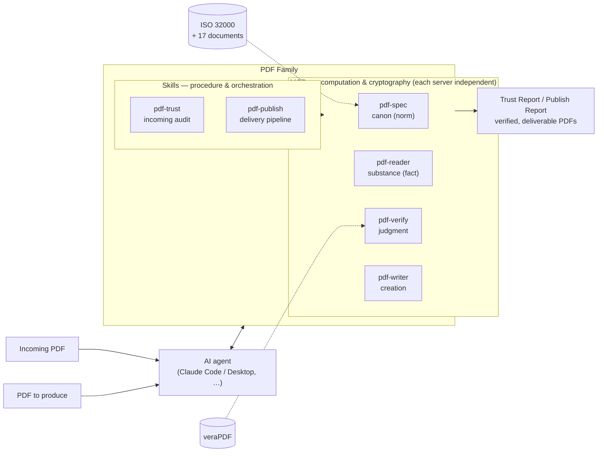
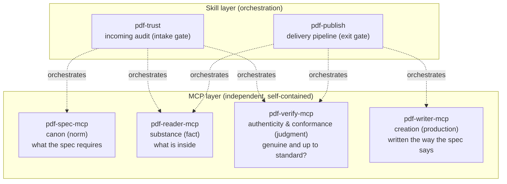

# Architecture & Responsibilities

PDF Family is built as **independent MCPs × Skill orchestration**. Each MCP is self-contained with no dependency on the others; orchestrating multiple servers (procedure and knowledge) is the Skills' job.

## The whole picture

An agent may call the MCPs directly, or leave the orchestration to a Skill. With the Skills installed, the **call order, how to read the verdicts, and the report format** are all fixed for you.

There are only two external dependencies: pdf-spec needs the corpus of specification PDFs (not bundled, as they may not be redistributed), and pdf-verify delegates PDF/A and PDF/UA verdicts to veraPDF. The reader and the writer depend on nothing outside themselves.

## The four-layer model — who orchestrates what

| Layer | Server | Returns | Never does |
|---|---|---|---|
| Canon | pdf-spec | Clauses and requirements (shall/should/may) | Never opens a file. Never judges conformance |
| Substance | pdf-reader | Observations (text, structure, signature fields) | **Never says pass/fail**. No cryptographic verification |
| Authenticity & conformance | pdf-verify | Verdicts (signatures, tampering, PDF/A, PDF/UA, 4-value policy) | **Never proves — it can only disprove** |
| Creation | pdf-writer | New and edited PDFs | Never signs. Can write a declaration but **cannot make a file conform** |

## The boundary rule (one line)

> If it returns compliant / valid / pass-fail against an ISO standard, it belongs to **verify**; if it only returns observations, it belongs to **reader**.

## Declaration, conformance, validation

This distinction runs through the whole Family.

- **Declaration** — pdfaid / pdfuaid in XMP. The document's claim about itself; proves nothing
- **Conformance** — nobody can prove it; it can only be disproved
- **Validation** — valid only within the rules a validator actually implements

That is why the writer's `ensure_pdfa` is a tool that *writes a declaration*, and the Family's rule is: whatever you declare, you measure with verify's `validate_conformance`.

## Two gates: intake and exit

The two inputs in the diagram above (an incoming PDF, a PDF to produce) each pass through their own gate.

| Gate | Skill | Flow |
|---|---|---|
| Intake (audit) | [pdf-trust](/skills/pdf-trust) | incoming PDF → audit → use / archive |
| Exit (delivery) | [pdf-publish](/skills/pdf-publish) | PDF to produce → write → read-back → verify → delivery |

verify is the gatekeeper standing at both the intake (audit) and the exit (delivery). The 4-value verdict (trust_and_use / use_with_caution / human_review_required / reject) is decided by `evaluate_policy`'s deterministic rule engine; the LLM only supplies the explanation and recommended actions — **the judge is code, the narrative is the LLM**.

## Assertion strength (T1/T2/T3)

How strongly a verification result may be stated depends on whether the normative text is at hand.

| Tier | Standard | How strongly you may speak |
|---|---|---|
| T1 | ISO 32000-1/-2, ISO 14289 (PDF/UA) | Quote the clause and state it plainly |
| T2 | ISO 19005 (PDF/A) | Say only "veraPDF judged this COMPLIANT" |
| T3 | ETSI PAdES | Report a structural observation — "structure matching B-LT" — never "conforms" |

The prose on this site follows the same rule.
