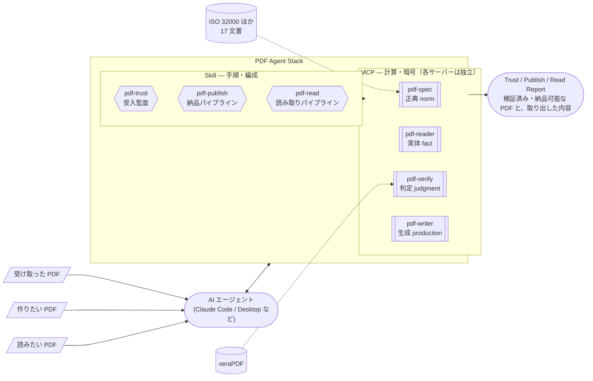
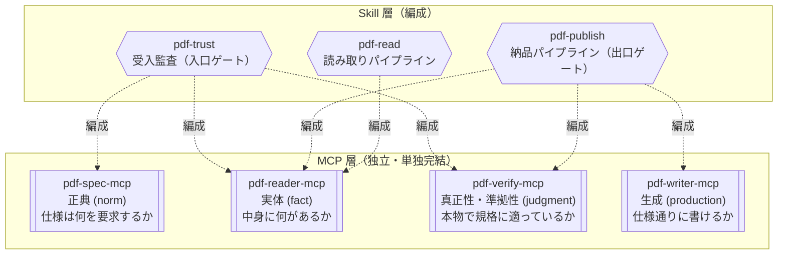

# 全体構成と責務

PDF Agent Stack は「独立 MCP × Skill 連携」で構成されます。各 MCP は相互非依存で単独完結し、複数サーバーの編成（手順・知識）は Skill が担います。

## 全体構成

図中の形は要素の種別を表します（→ [図の読み方](/ja/reference/glossary#図の読み方-形の凡例)）。

エージェントは MCP を直接呼んでもよいですし、Skill に編成を任せてもかまいません。Skill を入れると、複数 MCP の**呼び出し順序・判定の読み方・レポート形式**が定型化されます。

外部依存は 2 つだけです。pdf-spec は仕様 PDF のコーパス（手元に集めた仕様原文の束。再配布不可のため同梱しない）を、pdf-verify は PDF/A・PDF/UA の判定を委ねる veraPDF を必要とします。reader と writer は外部に依存しません。

## 4 層モデル — 誰が何を編成するか

| 層                               | サーバー   | 返すもの                                          | やらないこと                                                                |
| -------------------------------- | ---------- | ------------------------------------------------- | --------------------------------------------------------------------------- |
| 正典（= 正しさの基準となる原文） | pdf-spec   | 規格条文・要求事項（shall/should/may）            | 検証対象の PDF を開かない（読むのは自分の仕様コーパスだけ）。準拠判定しない |
| 実体                             | pdf-reader | 観測結果（テキスト・構造・署名フィールド）        | **合否を言わない**。暗号検証しない                                          |
| 真正性・準拠性                   | pdf-verify | 判定（署名・改ざん・PDF/A・PDF/UA・4 値ポリシー） | **規格どおりであることは証明しない — 規格破りを見つけることしかできない**   |
| 生成                             | pdf-writer | 新規・編集済み PDF                                | 署名しない。ラベルは書けるが**規格どおりにはできない**                      |

## 境界ルール（1 行）

> ISO 規格等に照らした compliant / valid / pass-fail を返すなら **verify**、観測を返すだけなら **reader**。

## 宣言・準拠・検証の三区別

PDF Agent Stack 全体を貫く思想です。

- **宣言 (declaration)** — ファイルが自分で書いたラベル。「私は PDF/A です」とメタデータに書いてあるだけ。書いてあることは、証拠にならない
- **準拠 (conformance)** — 規格どおりであること。全部を証明する手段はなく、規格破りを見つけることしかできない
- **検証 (validation)** — 検証器（veraPDF など）が、自分の持っている検査項目で見た結果。パスは「この検査では落ちなかった」であり、規格に準拠している、ではない

だから writer の `ensure_pdfa` は「ラベルを書く」ツールであり、書いたら必ず verify の `validate_conformance` で測る、が PDF Agent Stack の作法です。

### 検証器の出力は証拠ではなく判定です

外部の設計論では、「証拠（何を見たか）」の例として「検証器の出力」「署名検証」を挙げることがあります。PDF Agent Stack ではこの 2 つを分けます。

| | 誰が出すか | 例 |
| --- | --- | --- |
| 観測 (証拠) | reader | XMP に `pdfaid` の宣言がある。増分更新が 2 回ある。文書内に失効情報が無い |
| 判定 | verify | `use_with_caution`。発火したのは `POL-CAUTION-REVOCATION-UNKNOWN` |

veraPDF の結果も観測ではありません。「veraPDF がこのプロファイルで違反を報告しなかった」は観測ですが、それを受入プロファイルに照らして値にするのは `evaluate_policy` です。

次の 3 行は別のことを言っています。混ぜると、一番下だけが残ります。

- **観測**: XMP に PDF/A の宣言があり、veraPDF が当該プロファイルで違反を報告しなかった
- **判定**: この検査では落ちなかった（`use_with_caution`。検査項目の外は測っていない）
- **誤った要約**: PDF/A に準拠している

### 4 値を 3 値に潰すと何が消えるか

`evaluate_policy` の値は 4 つです。yes / no / unknown の 3 値に写すと、次の 2 行が消えます。

| 4 値 | 3 値に潰すと | 消えるもの |
| --- | --- | --- |
| `trust_and_use` | yes | — |
| `use_with_caution` | yes | 用途制限。留意事項付きで使う、が「そのまま使える」になる |
| `human_review_required` | unknown | 「証拠が無い」と「基準が書けない」の区別。後者が人に届かなくなる |
| `reject` | no | — |

3 行目が要点です。`human_review_required` は「判定に必要な事実が欠けている」と「基準が書けない領域」の両方を受けます。unknown 1 値に潰すと、後者が「事実を足せば解決する項目」として扱われ、いつまでも人に回りません。**3 値からは 4 値に戻せません。**

## 入口と出口の 2 ゲート

全体構成図の 3 本の入力のうち 2 本（受け取った PDF / 作りたい PDF）は、それぞれ別のゲートを通ります。

| ゲート       | Skill                                 | 流れ                                         |
| ------------ | ------------------------------------- | -------------------------------------------- |
| 入口（受入） | [pdf-trust](/ja/skills/pdf-trust)     | 受け取った PDF → 監査 → 利用・保存           |
| 出口（納品） | [pdf-publish](/ja/skills/pdf-publish) | 作る PDF → write → read-back → verify → 納品 |

3 本目の入力（読みたいだけの PDF）はゲートを通りません。[pdf-read](/ja/skills/pdf-read) が読み取りを編成し、読んだ範囲と読めなかった箇所を Read Report で申告します。受け入れるものも送り出すものも無いので、verify が下す判定もありません。

verify は入口（受入）と出口（納品）の両方に立つゲートキーパーです。4 値判定（trust_and_use / use_with_caution / human_review_required / reject）は `evaluate_policy` の決定論的（同じ入力なら常に同じ結果を返す）ルールエンジンが下し、LLM は解説と推奨アクションだけを担います — **ジャッジはコード、ナラティブは LLM**（判定はコードが下し、LLM が書くのは説明の文章だけ）。

## 言い切り強度（T1/T2/T3）

検証結果をどこまで強く言えるかは、規範文書が手元にあるかで変わります。

| Tier | 規格                               | 言える強さ                                                  |
| ---- | ---------------------------------- | ----------------------------------------------------------- |
| T1   | ISO 32000-1/-2, ISO 14289 (PDF/UA) | 条文を引用して言い切る                                      |
| T2   | ISO 19005 (PDF/A)                  | 「veraPDF が COMPLIANT と判定した」とだけ言う               |
| T3   | ETSI PAdES                         | 構造の観測として「B-LT 相当の構造」と言う。準拠とは言わない |

本サイトの文章もこのルールに従って書かれています。
