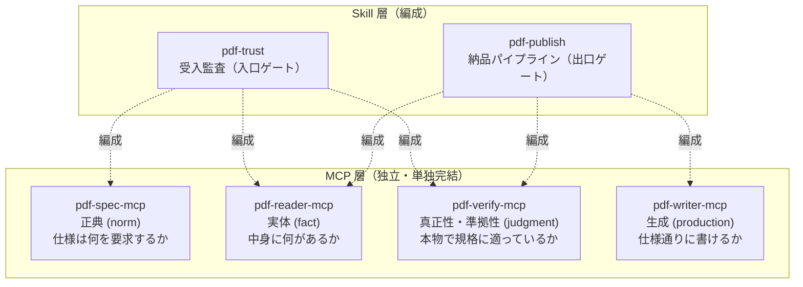
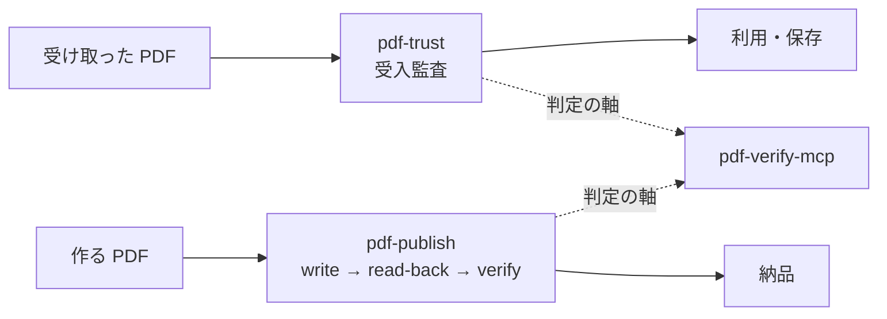

# 全体構成と責務

PDF Family は「独立 MCP × Skill 連携」で構成されます。各 MCP は相互非依存で単独完結し、複数サーバの編成（手順・知識）は Skill が担います。

## 4 層モデル

| 層 | サーバ | 返すもの | やらないこと |
|---|---|---|---|
| 正典 | pdf-spec | 規格条文・要求事項（shall/should/may） | ファイルを開かない。準拠判定しない |
| 実体 | pdf-reader | 観測結果（テキスト・構造・署名フィールド） | **合否を言わない**。暗号検証しない |
| 真正性・準拠性 | pdf-verify | 判定（署名・改ざん・PDF/A・PDF/UA・4 値ポリシー） | **証明はしない — 反証だけができる** |
| 生成 | pdf-writer | 新規・編集済み PDF | 署名しない。宣言は書けるが**準拠は作れない** |

## 境界ルール（1 行）

> ISO 規格等に照らした compliant / valid / pass-fail を返すなら **verify**、観測を返すだけなら **reader**。

## 宣言・準拠・検証の三区別

Family 全体を貫く思想です。

- **宣言 (declaration)** — XMP の pdfaid / pdfuaid。文書の自己申告であり、何も証明しない
- **準拠 (conformance)** — 誰にも証明できない。反証だけができる
- **検証 (validation)** — 検証器が実装するルールの範囲内でのみ有効

だから writer の `ensure_pdfa` は「宣言を書く」ツールであり、書いたら必ず verify の `validate_conformance` で測る、が family の作法です。

## 入口と出口の 2 ゲート

verify は入口（受入）と出口（納品）の両方に立つゲートキーパーです。4 値判定（trust_and_use / use_with_caution / human_review_required / reject）は `evaluate_policy` の決定論的ルールエンジンが下し、LLM は解説と推奨アクションだけを担います — **ジャッジはコード、ナラティブは LLM**。

## 言い切り強度（T1/T2/T3）

検証結果をどこまで強く言えるかは、規範文書が手元にあるかで変わります。

| Tier | 規格 | 言える強さ |
|---|---|---|
| T1 | ISO 32000-1/-2, ISO 14289 (PDF/UA) | 条文を引用して言い切る |
| T2 | ISO 19005 (PDF/A) | 「veraPDF が COMPLIANT と判定した」とだけ言う |
| T3 | ETSI PAdES | 構造の観測として「B-LT 相当の構造」と言う。準拠とは言わない |

本サイトの文章もこのルールに従って書かれています。
