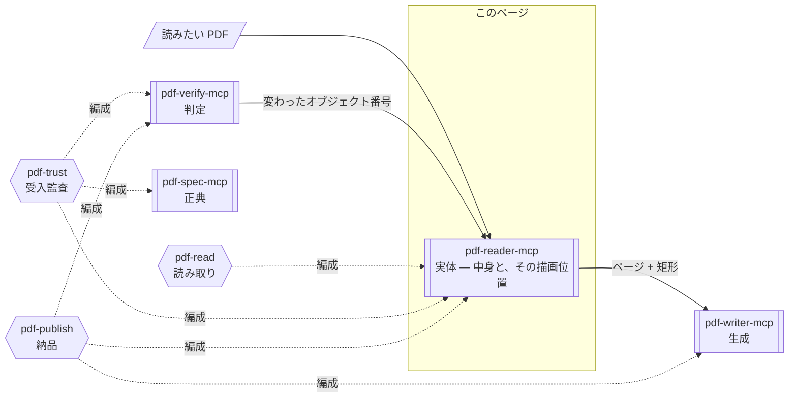

# pdf-reader-mcp

**PDF に何が書かれていて、それがページのどこにあるかを返すサーバーです。** テキスト・表・構造ツリー・フォント・注釈・署名フィールドを取り出し、各要素の描画位置（座標）も返します。返すのは観測した事実だけで、正しいかどうかの判定はしません。

- npm: [`@shuji-bonji/pdf-reader-mcp`](https://www.npmjs.com/package/@shuji-bonji/pdf-reader-mcp) / 現行 v0.15.0 / [GitHub](https://github.com/shuji-bonji/pdf-reader-mcp)
- このページは責務と使いどころの解説です。全ツールの引数・戻り値は[ツールリファレンス](/ja/reference/mcp/pdf-reader)（`tools/list` から自動生成）へ
- 環境変数なしで動作します

## これ 1 台でできること

**PDF を読むだけならこのサーバー 1 台で足ります。** 「この PDF の内容を要約して」「この表を CSV にして」「どんなフォントが埋め込まれている？」といった用途はすべてここで完結します。単純なテキスト抽出と違い、タグ付き PDF なら**論理的な読み順**で本文を取り出せるため、段組みや表が混じった文書でも順序が崩れません。

さらに「中身に何があるか」だけでなく、**それがページのどこに描かれているか**も返します。矩形は [pdf-writer-mcp](/ja/mcp/pdf-writer) の `add_annotation` が**そのまま使える座標系**（PDF default user space・左下原点・pt・正規化済み）で返るため、受け渡しの途中で座標系を解釈し直す必要がありません。

| 問い | ツール |
|---|---|
| 「**オブジェクト 27** はどこか」 | `locate_objects` |
| 「**この段落 / この見出し** はどこか」 | `extract_structured_text` の `include_bbox` |

## Skill 連携でできること

このサーバーは 4 層のうち**実体**（= 観測された事実）の層にあり、観測した事実だけを返します。その事実をどこまで読み、読めなかった箇所をどう報告するかは Skill の仕事です。



図中の形は要素の種別を表します（→ [図の読み方](/ja/reference/glossary#図の読み方-形の凡例)）。

| Skill | このサーバーの役割 | 必須か |
|---|---|---|
| [pdf-read](/ja/skills/pdf-read) | 読み取りの基盤。どの経路で読むかを Skill が決め、読めなかった箇所を報告させます | **必須**（v0.14.0+ 推奨） |
| [pdf-publish](/ja/skills/pdf-publish) | 書いた PDF の読み戻し（write → read-back → verify の中段） | 推奨 |
| [pdf-trust](/ja/skills/pdf-trust) | 署名フィールド構造・タグ・メタデータの観測。変更されたオブジェクトの位置特定 | 任意 |

**改ざん箇所を注釈で指す**という作業は、3 つのサーバーを順に接続する流れになります。pdf-verify の `verify_integrity` が返したオブジェクト番号を `locate_objects` に渡すと、ページと矩形が返ります。その矩形は pdf-writer の `add_annotation` にそのまま渡せます。

## できないこと

- **署名が有効かどうかは言えません。** `inspect_signatures` は署名フィールドの構造を読むだけで、暗号学的検証は行いません
- **規格に適合しているかは言えません。** 合否を返すのは pdf-verify です
- **OCR しません。** 画素として描かれた文字は読めません。テキストが取り出せないページは空文字ではなく、その理由（テキスト層が無い / Unicode への経路を持たないフォントがある / 読めなかった）を報告します
- **タグ無し PDF の論理読み順は座標から推測しません。** `extract_structured_text` は `isTagged: false` を返すだけです。論理読み順が必要なら、先に pdf-writer の `ensure_tagged` でタグを付与してください
- 鍵が導けない暗号化文書は開けません。ページ数などの数値は `null` を返し、一覧を返すツールはエラーになります

## しないこと

- 暗号検証（→ pdf-verify の `verify_signatures`）
- 準拠判定（`validate_*` は deprecated → pdf-verify の `validate_conformance`）
- 増分更新履歴の分析（→ pdf-verify の `verify_integrity`）

## インストール

```jsonc
{
  "mcpServers": {
    "pdf-reader": {
      "command": "npx",
      "args": ["-y", "@shuji-bonji/pdf-reader-mcp@latest"]
    }
  }
}
```

## 共通引数

ほぼ全ツールが以下を受け取ります。

| 引数 | 型 | 説明 |
|---|---|---|
| `file_path` **必須** | string | ローカル PDF の絶対パス |
| `response_format` | `markdown` / `json` | 出力形式。既定 markdown |
| `pages` | string | ページ範囲 `"1-5"` / `"3"` / `"1,3,5-7"`。省略時は全ページ（対応ツールのみ） |

## ツール一覧

引数・型・既定値は[ツールリファレンス](/ja/reference/mcp/pdf-reader)にあります（`tools/list` から自動生成）。

| Tier | ツール | 一行説明 |
|---|---|---|
| 1 | [`read_text`](/ja/reference/mcp/pdf-reader#read-text) | 読み順を保ったテキスト抽出（/ActualText 解決） |
| 1 | [`read_url`](/ja/reference/mcp/pdf-reader#read-url) | URL の PDF を直接読取 |
| 1 | [`read_images`](/ja/reference/mcp/pdf-reader#read-images) | 画像抽出（base64） |
| 1 | [`search_text`](/ja/reference/mcp/pdf-reader#search-text) | 大文字小文字を無視した検索 |
| 1 | [`get_metadata`](/ja/reference/mcp/pdf-reader#get-metadata) | メタデータ取得 |
| 1 | [`get_page_count`](/ja/reference/mcp/pdf-reader#get-page-count) | ページ数（軽量） |
| 1 | [`summarize`](/ja/reference/mcp/pdf-reader#summarize) | 概観レポート |
| 1 | [`render_page`](/ja/reference/mcp/pdf-reader#render-page) | ページを PNG / JPEG にラスタライズ（テキストとして読めない文書向け） |
| 2 | [`extract_structured_text`](/ja/reference/mcp/pdf-reader#extract-structured-text) | 論理コンテンツ順のテキスト（タグ付き PDF） |
| 2 | [`extract_tables`](/ja/reference/mcp/pdf-reader#extract-tables) | `<Table>` サブツリーの構造化抽出 |
| 2 | [`inspect_structure`](/ja/reference/mcp/pdf-reader#inspect-structure) | 内部オブジェクト構造 |
| 2 | [`inspect_tags`](/ja/reference/mcp/pdf-reader#inspect-tags) | タグ構造ツリーの観測 |
| 2 | [`inspect_fonts`](/ja/reference/mcp/pdf-reader#inspect-fonts) | フォントと埋め込み状況 |
| 2 | [`inspect_annotations`](/ja/reference/mcp/pdf-reader#inspect-annotations) | 注釈の分類・棚卸し |
| 2 | [`inspect_signatures`](/ja/reference/mcp/pdf-reader#inspect-signatures) | 署名フィールドの**構造**観測 |
| 2 | [`locate_objects`](/ja/reference/mcp/pdf-reader#locate-objects) | オブジェクト番号 → ページ + 矩形 |
| 3 | [`compare_structure`](/ja/reference/mcp/pdf-reader#compare-structure) | 2 PDF の構造比較 |
| 3 | [`validate_metadata`](/ja/reference/mcp/pdf-reader#validate-metadata) | **deprecated** |
| 3 | [`validate_tagged`](/ja/reference/mcp/pdf-reader#validate-tagged) | **deprecated** |

## 使い方の要点

### まず `summarize` で文書の性質を測る

メタデータ・テキスト有無・画像数・1 ページ目のプレビューを返します。**どの詳細ツールを使うかは、これを見てから決めます。** ページ数だけなら `get_page_count` が軽量です。

### 本文の取り出しは 3 経路ある

| 文書 | ツール | 理由 |
|---|---|---|
| タグ付き PDF | `extract_structured_text` | 論理コンテンツ順（ISO 32000-2 §14.8.2.5 の深さ優先走査）。「H1 のテキストは何か」に答えられる唯一のツール |
| タグ付き PDF の表 | `extract_tables` | `<TR>` → `<TH>/<TD>` で構造化。カーニング空白を除去（「消 費 税 法」→「消費税法」） |
| タグ無し | `read_text` | Y 座標ベースの読み順。多段組は `split_columns: 2` / `3` で X 座標により列分割 |

`read_text` については 3 点あります。

- `/ActualText` 置換（ISO 32000-2 §14.9.4）を、構造要素と `Span` マーク付きコンテンツの両方で解決します。合字やハイフン処理された語も、見た目どおりの綴りで返ります
- `search_text` は `read_text` と同じテキストを検索します。ヒットするのは置換後の綴りです
- 全角空白でインデントされた日本語帳票では、`compact_whitespace: true` がトークンを 20–40% 削減します

**テキストとして読めないページは `render_page` に切り替えます。** `read_text` が `no_text_layer`（スキャン）や `not_extractable` と報告したページがこれにあたります。ベクタ図形・フォーム・手書き・印影も同じです。

`read_images` はページが埋め込む画像 XObject を取り出すだけですが、`render_page` は**ページの上にあるすべて**を描きます。

描画には WebAssembly の PDFium を使います。テキストを読む pdf.js とは**別のエンジン**です。壊れたファイルに対する挙動が両者で違う場合、一方の出力はもう一方の証拠になりません。

`pages` は必須です。全ページの描画が暗黙に起きることはありません。

`extract_structured_text` の出力については 4 点あります。

- 要素は `role` / `depth` / `text` / `pages` を持つフラットなリストです。深さ優先の並びと `depth` の組で、木の形をそのまま表せます
- ページをまたぐ要素は **1 要素のまま**です。段落は分割されません
- `alt` は `text` に混ぜず、別の項目で返します（§14.9.3）。`Lbl`（箇条書き記号）も `label` に分けます
- Artifact（ページ番号・柱）は除外されます

### 位置は 2 経路あり、根拠の強さが違う

`locate_objects` と `extract_structured_text`（`include_bbox: true`）はどちらも各矩形に **`basis`（根拠）** を付けて返します。その矩形が実測なのか、ファイルの自己申告なのか、それともページ全体を指しているだけなのかを区別するためです。**根拠の強さが違う値を、同じ形式のまま区別せず返さない**ための仕組みです。

`extract_structured_text` の `basis`:

| `basis` | 中身 |
|---|---|
| `layout-attribute-bbox` | ファイルが**宣言**している `/BBox`（ISO 32000-2 Table 379）。生成者の自称であって測定値ではない。**テキストを持たない要素（画像だけの Figure 等）について言える唯一の根拠** |
| `text-extent` | 要素が持つテキストからの**実測**。ベースライン原点＋フォントの ascent/descent = 行ボックスであってグリフ輪郭ではない。画像・ベクター描画は一切寄与しない |

`locate_objects` の `basis`:

| `basis` | 意味 |
|---|---|
| `annotation-rect` | オブジェクト自身の `/Rect`。**正確** |
| `page-box` | オブジェクトがページ。その crop / media box |
| `page-content-stream` | オブジェクトがページを描いている。矩形は**ページ全体**であって変更箇所ではない |
| `page-resource` | フォント・画像などのリソース。**矩形は存在しない**（`rect: null`） |

- ページを跨ぐ要素は**ページごとに 1 矩形**です。1 つにまとめると、その要素が無いページにも矩形を置くことになります
- **宣言はそのまま返した上で突き合わせます。** ページボックス（§7.7.3.3）と要素自身の本文の両方に照合し、矛盾すれば `boxNote` で報告します。ファイル上の宣言は、実測と一致しないことがあります。実例として、*Well-Tagged PDF 1.0* の表紙 Figure は `/BBox [-32768 -32768 32767 32767]`（矩形であるべき場所に int16 のセンチネル）を宣言しています
- **矩形が出せない要素は 0 幅の矩形を返さず、`boxNote` で理由を述べます**
- `locate_objects` に存在しない番号を渡すと `found: false` です（「座標が不明」ではありません）。リビジョンで解放された番号が差分から渡ってくるため、両者を混ぜると「あるが位置不明」と誤読されます
- 暗号化文書では座標と型は返しますが `/T` は `null` です（数値と名前は非暗号 = §7.6.2。文字列は暗号文のまま）

::: tip 独立した正解との突き合わせ
*Well-Tagged PDF 1.0* の `Link` 構造要素 166 件の実測矩形を、生成者が同じリンクに置いた `Link` **注釈**の `/Rect` 173 件と比較した結果、IoU 中央値は **0.972** で、完全に外れたものは 0 件でした。
:::

::: warning 「この段落はどこか」と「オブジェクト 27 はどこか」は別の経路
`locate_objects` はコンテンツストリームについて「ページ全体」までしか言えません。段落・見出し単位で指したいときは `extract_structured_text` の `include_bbox` を使ってください。
:::

### 署名は構造だけ

`inspect_signatures` は署名フィールド数・署名済み/未署名の内訳・各フィールドの詳細（署名者名・理由・場所・署名日時・filter/subFilter）を返します。**暗号学的検証は行いません。** 署名が数学的に有効かは pdf-verify の `verify_signatures` / `verify_integrity` が答えます。

### deprecated な 2 つ

`validate_metadata` と `validate_tagged` は次メジャーで削除予定です。どちらも pdf-verify の `validate_conformance` が上位互換です。構造ツリーの**事実**が必要なら `inspect_tags`（deprecated ではありません）、メタデータを読むだけなら `get_metadata` を使ってください。
