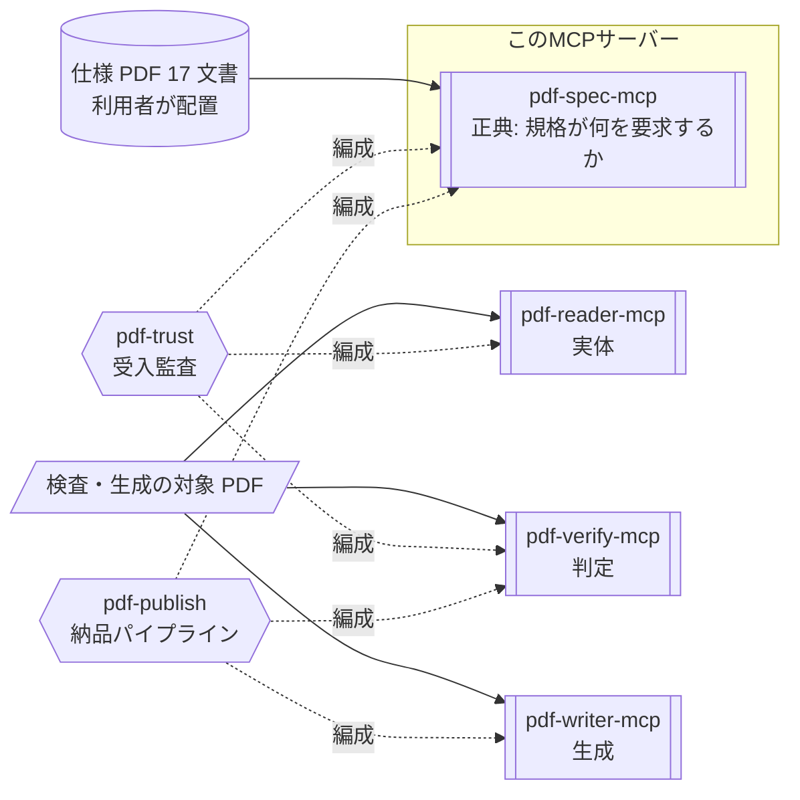

# pdf-spec-mcp

**PDF の仕様書を AI が引けるようにするサーバーです。** ISO 32000-1/-2、ISO TS 32001〜32005、PDF/UA-1/-2、Tagged PDF ガイドなど 17 文書を横断検索し、条文・要求事項（shall/should/may）・定義・表を構造化して返します。

- npm: [`@shuji-bonji/pdf-spec-mcp`](https://www.npmjs.com/package/@shuji-bonji/pdf-spec-mcp) / 現行 v0.6.0 / [GitHub](https://github.com/shuji-bonji/pdf-spec-mcp)
- このページは責務と使いどころの解説です。全ツールの引数・戻り値は[ツールリファレンス](/ja/reference/mcp/pdf-spec)（`tools/list` から自動生成）へ

::: warning 仕様 PDF は同梱していません
`PDF_SPEC_DIR` に、無償入手できる原文をご自身で配置してください（→ [導入手順 Step 2](/ja/guide/getting-started)）  
**コーパスとなる中核文書はすべて正規ルートで無償入手できます。**  
このコーパスが無いと、このサーバーは検索できません。
:::

## これ 1 台でできること

「PDF 2.0 で増分更新は何を要求している？」、「タグ付き PDF の読み順はどの条文？」といった**仕様の疑問に、LLMが原文を引いて答えられる**ようになります。  
1,000 ページ近い ISO 規格を人が探す代わりに、AI が条文 ID 付きで示します。  
実装や監査の判断を、記憶や検索エンジンではなく規格原文に着地させたいときに使います。

## Skill 連携でできること

このMCPサーバーは、4 つの層（MCPサーバー）のうち**正典**（= 正しさの基準となる原文）の層にあり、「規格が何を要求するか」のみを供給します。  
判定は pdf-verify、観測は pdf-reader、生成は pdf-writer の仕事です。



図中の形は要素の種別を表します（→ [図の読み方](/ja/reference/glossary#図の読み方-形の凡例)）  
**検証対象の PDF は、このサーバーには渡しません。**  
参照するのは、`PDF_SPEC_DIR` に、ご自身で配置した仕様 PDF だけです。

| Skill                                 | このサーバーの役割                                           | 必須か |
| ------------------------------------- | ------------------------------------------------------------ | ------ |
| [pdf-trust](/ja/skills/pdf-trust)     | 逸脱が見つかったとき、その根拠を ISO 32000 の条文 ID で示す  | 任意   |
| [pdf-publish](/ja/skills/pdf-publish) | 修正ループが上限に達したとき、残違反リストに条文根拠を添える | 任意   |

単体で使う主なユースケースは[仕様調査](/ja/use-cases/spec-research)です。

## できないこと

- **仕様PDFのコーパス以外の範囲は引けません。  
  例えば、** ISO 19005（PDF/A）・ETSI PAdES は収録していません。
- **ユーザが作成したファイルについては何も言えません。**  
  返すのは規格の文であって、特定の PDF がそれを満たすかは pdf-verify の答えです。
- `compare_versions` は PDF 1.7（`PDF32000_2008.pdf`）と PDF 2.0 の**両方**が配置されていないと動きません。

## しないこと

- ファイル検査・準拠判定・ビジネスルール定義

## インストール

```jsonc
{
  "mcpServers": {
    "pdf-spec": {
      "command": "npx",
      "args": ["-y", "@shuji-bonji/pdf-spec-mcp@latest"],
      "env": { "PDF_SPEC_DIR": "/path/to/pdf-specs" },
    },
  },
}
```

`PDF_SPEC_DIR`（必須）に PDF Association の sponsored 版仕様 PDF を配置してください。ファイル名パターンで自動判別されます。入手先と手順は[導入手順 Step 2](/ja/guide/getting-started) を参照してください。

## コーパスのキャッシュ

v0.5.0 から、文書全体を走査する 2 つの操作は、初回構築のあとディスクにキャッシュされます。対象は `search_spec` の検索索引と、`section` を指定しない `get_requirements` の全走査です。以後のプロセスはこの 2 つに、6〜14 秒ではなく 1 秒未満で答えます。

置き場所の既定は `${XDG_CACHE_HOME:-~/.cache}/pdf-spec-mcp` で、コーパス全体で約 18 MB です。キーにサーバーの版・pdfjs の版・PDF の SHA-256 が入るので、更新やファイルの差し替えでは作り直します。キャッシュは利用者の PDF から利用者の機械上に作る派生物で、配布はしません。

全仕様の索引を先に構築する（1 分程度）

```sh
npx -y @shuji-bonji/pdf-spec-mcp@latest --build-cache
```

置き場所を変える・無効にする:

```jsonc
{
  "mcpServers": {
    "pdf-spec": {
      "command": "npx",
      "args": ["-y", "@shuji-bonji/pdf-spec-mcp@latest"],
      "env": {
        "PDF_SPEC_DIR": "/path/to/pdf-specs",
        "PDF_SPEC_CACHE_DIR": "/path/to/cache",
        "PDF_SPEC_CACHE": "off",
      },
    },
  },
}
```

## 共通引数

多くのツールが `spec`（Spec ID, 例 `"iso32000-2"` / `"pdf17"`, 省略時は既定の ISO 32000-2）を受け取ります。
ID の一覧は `list_specs` で得られます。

## 出力の 3 種類

出力は大きく **仕様条文**・**要件**・**定義** の 3 つに分かれます。

| 種類                                         | 説明                                                                                                                              |
| -------------------------------------------- | --------------------------------------------------------------------------------------------------------------------------------- |
| **仕様条文**（`get_section` / `get_tables`） | 節の本文を、見出し・段落・リスト・表・注記の**要素の列**として返します。NOTE / EXAMPLE は本文と別の要素になります                 |
| **要件**（`get_requirements`）               | 条文中の shall / shall not / should / should not / may を含む規範文を 1 文 = 1 要件で返します。**shall だけが適合の必要条件**です |
| **定義**（`get_definitions`）                | 第 3 節（Terms and definitions）の用語定義を返します。規格上の意味が日常語と違う用語は、議論の前にここで定義を確認してください    |

どれも「規格が何と書いているか」の構造化であり、あなたのファイルについて何かを言うものではありません。JSON の形と読み違えやすい箇所は [pdf-spec の出力の読み方](/ja/reference/pdf-spec-output) にまとめてあります。

::: tip 前提知識: ISO 規格の文書規約
NOTE（注記）と EXAMPLE（例）は参考情報であり、要求事項ではありません。また要求レベルには、 shall / should / may / can
とあり、shall だけが適合の必要条件です。こうした ISO 共通の読み方を知らないと出力を誤読しやすいため、先に [ISO 仕様書の読み方（入門）](/ja/reference/iso-reading-primer) に目を通すことをお勧めします。
:::

## ツール一覧

引数・型・既定値は[ツールリファレンス](/ja/reference/mcp/pdf-spec)にあります（`tools/list` から自動生成）。

| ツール                                                            | 一行説明                                    |
| ----------------------------------------------------------------- | ------------------------------------------- |
| [`list_specs`](/ja/reference/mcp/pdf-spec#list-specs)             | 発見済み仕様の一覧とカバレッジ（gaps 含む） |
| [`get_structure`](/ja/reference/mcp/pdf-spec#get-structure)       | 目次構造の取得                              |
| [`get_section`](/ja/reference/mcp/pdf-spec#get-section)           | 条番号指定で本文取得                        |
| [`search_spec`](/ja/reference/mcp/pdf-spec#search-spec)           | キーワード横断検索                          |
| [`get_requirements`](/ja/reference/mcp/pdf-spec#get-requirements) | shall / should / may 要求事項の抽出         |
| [`get_definitions`](/ja/reference/mcp/pdf-spec#get-definitions)   | 用語定義の取得                              |
| [`get_tables`](/ja/reference/mcp/pdf-spec#get-tables)             | 規格中の表の構造化取得                      |
| [`compare_versions`](/ja/reference/mcp/pdf-spec#compare-versions) | PDF 1.7 ↔ 2.0 の条文比較                    |

## 使い方の要点

**まず `list_specs` を呼びます。** 何が配置されていて、何が配置されていないか（`coverage.gaps`）を先に見てください。「その要求は存在しない」と結論づける前に必ず gaps を読みます。

**節番号が分かっているなら `get_section`、分からないなら `search_spec`。** `get_section` は**親節を指定するとサブツリー全体**（全下位節を文書順で）が返るため、上位の節では応答が非常に大きくなります。分かっている最も具体的な節番号を使ってください。`search_spec` はまず完全フレーズ、次に単語 AND でマッチします。コーパスは英語なので、検索語も規格の英語にします。

::: warning ヒット 0 件の意味
「このコーパスでは答えられない」であって「そのような要求は存在しない」では**ありません**。PDF/A・PAdES はコーパス外です。
:::

**要求だけが欲しいなら `get_requirements`。** `level` で shall / shall not / should / should not / may を絞れます。このツールは**あなたのファイルではなく「規格」を読みます。** 特定の PDF が満たすかは pdf-verify の `validate_conformance` / `evaluate_policy` が答えます。

**版の差を見るなら `compare_versions`。** 節タイトルを手がかりに 1.7 と 2.0 の節を対応づけ、次の 3 種を返します。

- **一致** — 同一、または移動した節
- **追加** — 2.0 で新設された節
- **削除** — 2.0 に無い節

PDF 1.7 と 2.0 の両ファイルが `PDF_SPEC_DIR` に必要です。

下に、上の 4 点を「プロンプト → ツールの引数 → 返る JSON」で実測した例があります。JSON の形の読み方は [pdf-spec の出力の読み方](/ja/reference/pdf-spec-output) へ。シナリオ全体は[仕様調査](/ja/use-cases/spec-research)です。

### 呼び出し例

v0.6.0、既定の `iso32000-2`（ISO 32000-2:2020 Errata Collection 3）。`spec` を省略しています。長い配列は先頭だけ残し、PDF 由来の折返しは空白に畳んでいます。

#### 例 1 — コーパスの外を先に見る（`list_specs`）

> PDF/A の適合要件を条文で示して

ISO 19005 はコーパスに無いので、条文検索の前に gaps を見ます。

**ツール** `list_specs`

**パラメータ** 空で足ります。

```jsonc
{}
```

**返る JSON**（`specs` 17 件は省略、`coverage.gaps` が本題）:

```jsonc
{
  "totalSpecs": 17,
  "coverage": {
    "note": "These normative areas are outside this corpus. A search returning no hits for them means \"cannot answer\", not \"no such requirement\".",
    "gaps": [
      {
        "area": "PDF/A — archival conformance",
        "standards": ["ISO 19005-1", "ISO 19005-2", "ISO 19005-3", "ISO 19005-4"],
        "consequence": "Requirements specific to PDF/A cannot be quoted or verified here. … A search returning nothing is not evidence that no requirement exists."
      },
      {
        "area": "PAdES — signature profiles",
        "standards": ["ETSI EN 319 142-1", "ETSI EN 319 142-2"],
        "consequence": "Baseline signature levels (B-B / B-T / B-LT / B-LTA) are defined by ETSI, not by ISO 32000-2. … ISO 32000-2 §12.8 covers signatures in general and is available."
      }
    ]
  }
}
```

ここから先は pdf-verify の `validate_conformance`（flavour `"pdfa-*"`）の領域です。このサーバーで `search_spec("PDF/A")` しても、ヒット 0 件は「要求が無い」ではありません。

#### 例 2 — 節番号が分からない（`search_spec` → `get_requirements`）

> PDF 2.0 で増分更新は何を要求している？

まず英語のフレーズで探し、当たった節の shall / may だけを取ります。

**ツール** `search_spec`

**パラメータ**

```jsonc
{
  "query": "incremental update",
  "max_results": 5
}
```

**返る JSON**

```jsonc
{
  "query": "incremental update",
  "totalResults": 5,
  "results": [
    {
      "section": "7.5.6",
      "title": "Incremental updates",
      "page": 75,
      "score": 12,
      "snippet": "7.5.6 Incremental updates The contents of a PDF file can be updated incrementally without rewriting…"
    },
    {
      "section": "12.7.8.3.1",
      "title": "General",
      "page": 576,
      "score": 12,
      "snippet": "…A stream containing all the bytes in all incremental updates made to the underlying PDF document…"
    }
    // … ほか 3 件（7.5.4 / 12.8.1 / 7.5.1）
  ]
}
```

先頭ヒットが §7.5.6 なので、要求だけ欲しいときはその節を `get_requirements` に渡します。`level` を省略すると shall / may などが混在して返ります。

**ツール** `get_requirements`

**パラメータ**

```jsonc
{
  "section": "7.5.6"
}
```

**返る JSON**

```jsonc
{
  "filter": { "section": "7.5.6", "level": "all" },
  "totalRequirements": 10,
  "statistics": { "shall": 8, "may": 2 },
  "requirements": [
    {
      "id": "R-7.5.6-1",
      "level": "shall",
      "section": "7.5.6",
      "sectionTitle": "Incremental updates",
      "text": "When updating a PDF file incrementally, changes shall be appended to the end of the file, leaving its original contents intact."
    },
    {
      "id": "R-7.5.6-2",
      "level": "shall",
      "section": "7.5.6",
      "sectionTitle": "Incremental updates",
      "text": "A cross-reference section for an incremental update shall contain entries only for objects that have been changed, replaced, or deleted."
    }
    // … 残り 8 件。適合の必要条件は shall だけ
  ]
}
```

`text` は原文のままなので、引用に使えます。これは規格の要求であって、手元のファイルがそれを満たすかの判定ではありません。

#### 例 3 — 規格の語で探す（`search_spec` → `get_section`）

> タグ付き PDF の読み順はどの条文？

日常語の `reading order` では、ストリームの読み方やシェーディングの頂点順など、別の節が先に出ます。規格の語は **logical content order** / **page content order** です。

**ツール** `search_spec`

**パラメータ**

```jsonc
{
  "query": "content order",
  "max_results": 5
}
```

**返る JSON**

```jsonc
{
  "query": "content order",
  "totalResults": 5,
  "results": [
    {
      "section": "14.8.2.5.1",
      "title": "General",
      "page": 764,
      "score": 39,
      "snippet": "14.8.2.5.1 General Page content order shall be defined by the sequencing of graphics objects within …"
    }
    // … ほか 4 件
  ]
}
```

本文が欲しいときは、分かった最も具体的な節番号で `get_section` します。親の `14.8.2.5` ではなく `14.8.2.5.1` です。

**ツール** `get_section`

**パラメータ**

```jsonc
{
  "section": "14.8.2.5.1"
}
```

**返る JSON**

```jsonc
{
  "sectionNumber": "14.8.2.5.1",
  "title": "General",
  "pageRange": { "start": 764, "end": 764 },
  "content": [
    { "type": "heading", "level": 5, "text": "14.8.2.5.1 General" },
    {
      "type": "paragraph",
      "text": "Page content order shall be defined by the sequencing of graphics objects within a page’s content stream."
    },
    {
      "type": "paragraph",
      "text": "Logical content order – the ordering for semantic purposes – shall be defined by a depth-first traversal of the document’s logical structure hierarchy."
    },
    {
      "type": "paragraph",
      "text": "The page content order in a tagged PDF should coincide with the logical content order."
    },
    {
      "type": "note",
      "label": "NOTE 1",
      "text": "Page content order is constrained by the need to render objects in an order that produces the desired visual appearance. …"
    }
  ]
}
```

`paragraph` の shall が要求、should は推奨、`note` は参考情報です。NOTE を根拠に「仕様違反」とは書けません。

#### 例 4 — 版の差（`compare_versions`）

> 増分更新の節は PDF 1.7 と 2.0 でどう変わった？

**ツール** `compare_versions`

**パラメータ**

```jsonc
{
  "section": "7.5.6"
}
```

**返る JSON**

```jsonc
{
  "totalMatched": 1,
  "totalAdded": 0,
  "totalRemoved": 0,
  "matched": [
    {
      "section17": "7.5.6",
      "section20": "7.5.6",
      "title": "Incremental updates",
      "status": "same"
    }
  ],
  "added": [],
  "removed": []
}
```

節番号とタイトルは 1.7 と 2.0 で同じです。本文の差分までは返しません。要求の中身を見るなら、例 2 のようにその節の `get_requirements` を両仕様（`spec: "pdf17"` と省略時の `iso32000-2`）で取ります。
