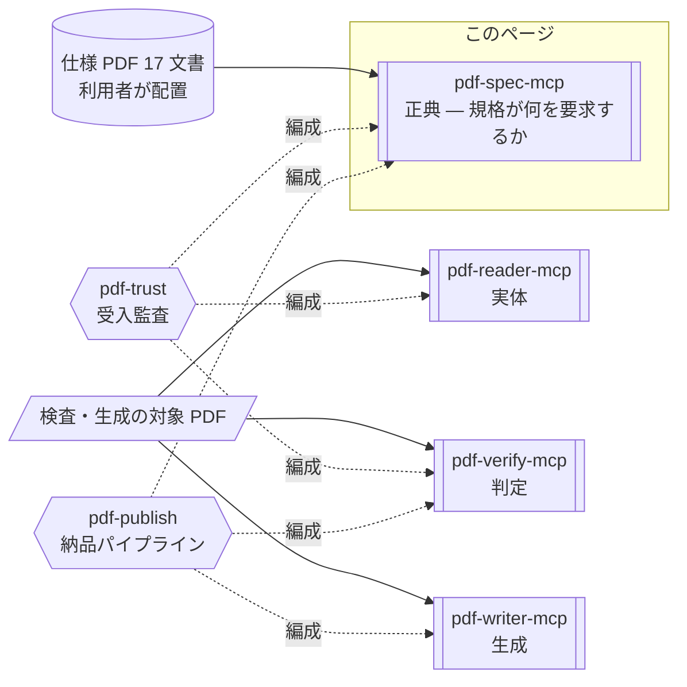

# pdf-spec-mcp

**PDF の仕様書を AI が引けるようにするサーバーです。** ISO 32000-1/-2、ISO TS 32001〜32005、PDF/UA-1/-2、Tagged PDF ガイドなど 17 文書を横断検索し、条文・要求事項（shall/should/may）・定義・表を構造化して返します。

- npm: [`@shuji-bonji/pdf-spec-mcp`](https://www.npmjs.com/package/@shuji-bonji/pdf-spec-mcp) / 現行 v0.6.0 / [GitHub](https://github.com/shuji-bonji/pdf-spec-mcp)
- このページは責務と使いどころの解説です。全ツールの引数・戻り値は[ツールリファレンス](/ja/reference/mcp/pdf-spec)（`tools/list` から自動生成）へ

::: info 仕様 PDF は同梱していません
`PDF_SPEC_DIR` に、無償入手できる原文をご自身で配置してください（→ [導入手順 Step 2](/ja/guide/getting-started)）。**中核文書はすべて正規ルートで無償入手できます。** コーパスが無いと本サーバーは 1 問も答えられません。
:::

## これ 1 台でできること

「PDF 2.0 で増分更新は何を要求している？」「タグ付き PDF の読み順はどの条文？」といった**仕様の疑問に、原文を引いて答えられる**ようになります。1,000 ページ近い ISO 規格を人が探す代わりに、AI が条文 ID 付きで示します。実装や監査の判断を、記憶や検索エンジンではなく規格原文に着地させたいときに使います。

## Skill 連携でできること

このサーバーは 4 層のうち**正典**の層にあり、「規格が何を要求するか」だけを供給します。判定は pdf-verify、観測は pdf-reader、生成は pdf-writer の仕事です。



図中の形は要素の種別を表します（→ [図の読み方](/ja/reference/glossary#図の読み方-形の凡例)）。**対象の PDF は pdf-spec に渡りません** — 入るのは利用者が配置した仕様 PDF だけです。

| Skill | このサーバーの役割 | 必須か |
|---|---|---|
| [pdf-trust](/ja/skills/pdf-trust) | 逸脱が見つかったとき、その根拠を ISO 32000 の条文 ID で示す | 任意 |
| [pdf-publish](/ja/skills/pdf-publish) | 修正ループが上限に達したとき、残違反リストに条文根拠を添える | 任意 |

単体で使うときの中心は[仕様調査](/ja/use-cases/spec-research)です。

## できないこと

- **コーパスの外は引けません。** ISO 19005（PDF/A）・ETSI PAdES は収録していません（`list_specs` → `coverage.gaps`）。**検索ヒットなし = 要求が存在しない、ではありません**
- **あなたのファイルについては何も言えません。** 返すのは規格の文であって、特定の PDF がそれを満たすかは pdf-verify の答えです
- `compare_versions` は PDF 1.7（`PDF32000_2008.pdf`）と PDF 2.0 の**両方**が配置されていないと動きません

## しないこと

- ファイル検査・準拠判定・ビジネスルール定義

## インストール

```jsonc
{
  "mcpServers": {
    "pdf-spec": {
      "command": "npx",
      "args": ["-y", "@shuji-bonji/pdf-spec-mcp@latest"],
      "env": { "PDF_SPEC_DIR": "/path/to/pdf-specs" }
    }
  }
}
```

`PDF_SPEC_DIR`（必須）に PDF Association の sponsored 版仕様 PDF を配置してください。ファイル名パターンで自動判別されます。入手先と手順は[導入手順 Step 2](/ja/guide/getting-started) を参照してください。

## コーパスのキャッシュ

v0.5.0 から、文書全体を走査する 2 つの操作 — `search_spec` の検索索引と、`section` を指定しない `get_requirements` の全走査 — は初回構築のあとディスクにキャッシュされます。以後のプロセスはこの 2 つに 6〜14 秒ではなく 1 秒未満で答えます。

置き場所の既定は `${XDG_CACHE_HOME:-~/.cache}/pdf-spec-mcp` で、コーパス全体で約 18 MB です。キーにサーバーの版・pdfjs の版・PDF の SHA-256 が入るので、更新やファイルの差し替えでは作り直します。キャッシュは利用者の PDF から利用者の機械上に作る派生物で、配布はしません。

全仕様の索引を先に構築する（1 分程度）:

```sh
npx -y @shuji-bonji/pdf-spec-mcp@latest --build-cache
```

置き場所を変える・無効にする:

```jsonc
{
  "mcpServers": {
    "pdf-spec": {
      "command": "npx",
      "args": ["-y", "@shuji-bonji/pdf-spec-mcp@latest"],
      "env": {
        "PDF_SPEC_DIR": "/path/to/pdf-specs",
        "PDF_SPEC_CACHE_DIR": "/path/to/cache",
        "PDF_SPEC_CACHE": "off"
      }
    }
  }
}
```

## 共通引数

多くのツールが `spec`（Spec ID。例 `"iso32000-2"` / `"pdf17"`。省略時は既定の ISO 32000-2）を受け取ります。ID の一覧は `list_specs` で得られます。

## 出力の 3 種類

出力は大きく **仕様条文**・**要件**・**定義** の 3 つに分かれます。

- **仕様条文**（`get_section` / `get_tables`）— 節の本文を、見出し・段落・リスト・表・注記の**要素の列**として返します。NOTE / EXAMPLE は本文と別の要素になります
- **要件**（`get_requirements`）— 条文中の shall / shall not / should / should not / may を含む規範文を 1 文 = 1 要件で返します。**shall だけが適合の必要条件**です
- **定義**（`get_definitions`）— 第 3 節（Terms and definitions）の用語定義を返します。日常語と意味がずれる語ほど、議論の前にここで確定させる価値があります

どれも「規格が何と書いているか」の構造化であり、あなたのファイルについて何かを言うものではありません。JSON の形と読み違えやすい箇所は [pdf-spec の出力の読み方](/ja/reference/pdf-spec-output) にまとめてあります。

::: tip 前提知識: ISO 規格の文書規約
NOTE は規範ではない・shall だけが適合の必要条件・定義は日常語を上書きする — といった ISO 共通の読み方を知らないと出力を誤読しやすいため、先に [ISO 仕様書の読み方（入門）](/ja/reference/iso-reading-primer) に目を通すことをお勧めします。
:::

## ツール一覧

引数・型・既定値は[ツールリファレンス](/ja/reference/mcp/pdf-spec)にあります（`tools/list` から自動生成）。

| ツール | 一行説明 |
|---|---|
| [`list_specs`](/ja/reference/mcp/pdf-spec#list-specs) | 発見済み仕様の一覧とカバレッジ（gaps 含む） |
| [`get_structure`](/ja/reference/mcp/pdf-spec#get-structure) | 目次構造の取得 |
| [`get_section`](/ja/reference/mcp/pdf-spec#get-section) | 条番号指定で本文取得 |
| [`search_spec`](/ja/reference/mcp/pdf-spec#search-spec) | キーワード横断検索 |
| [`get_requirements`](/ja/reference/mcp/pdf-spec#get-requirements) | shall / should / may 要求事項の抽出 |
| [`get_definitions`](/ja/reference/mcp/pdf-spec#get-definitions) | 用語定義の取得 |
| [`get_tables`](/ja/reference/mcp/pdf-spec#get-tables) | 規格中の表の構造化取得 |
| [`compare_versions`](/ja/reference/mcp/pdf-spec#compare-versions) | PDF 1.7 ↔ 2.0 の条文比較 |

## 使い方の要点

**最初の一手は `list_specs` です。** 何が配置されていて、何が配置されていないか（`coverage.gaps`）を先に見てください。「その要求は存在しない」と結論づける前に必ず gaps を読みます。

**節番号が分かっているなら `get_section`、分からないなら `search_spec`。** `get_section` は**親節を指定するとサブツリー全体**（全下位節を文書順で）が返るため、上位の節では応答が非常に大きくなります — 分かっている最も具体的な節番号を使ってください。`search_spec` はまず完全フレーズ、次に単語 AND でマッチします。

::: warning ヒット 0 件の意味
「このコーパスでは答えられない」であって「そのような要求は存在しない」では**ありません**。PDF/A・PAdES はコーパス外です。
:::

**要求だけが欲しいなら `get_requirements`。** `level` で shall / shall not / should / should not / may を絞れます。このツールは**あなたのファイルではなく「規格」を読みます** — 特定の PDF が満たすかは pdf-verify の `validate_conformance` / `evaluate_policy` へ。

**版の差を見るなら `compare_versions`。** タイトルベースの自動マッチングで、一致（同一・移動）・追加（2.0 で新設）・削除（2.0 に無い）を返します。PDF 1.7 と 2.0 の両ファイルが `PDF_SPEC_DIR` に必要です。
