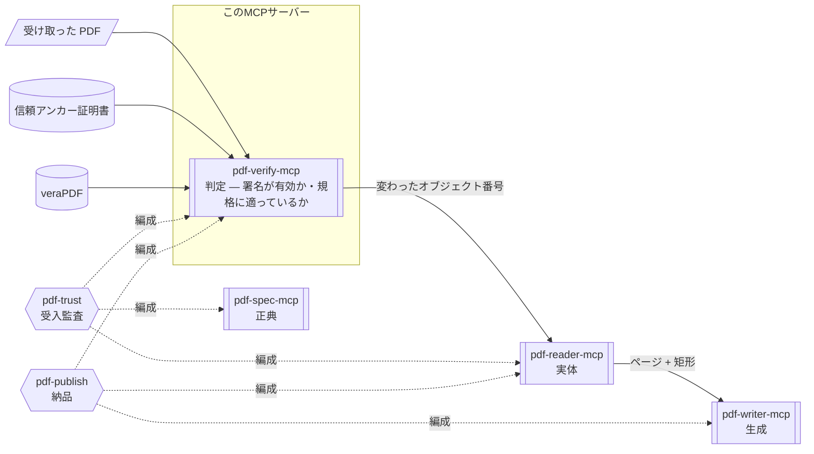

# pdf-verify-mcp

**署名が暗号学的に有効か、規格に適っているかを判定するサーバーです。**  
電子署名を暗号学的に検証し、署名後の改ざんを検知し、PDF/A（長期保存）や PDF/UA（アクセシビリティ）への適合を採点します。

- npm: [`@shuji-bonji/pdf-verify-mcp`](https://www.npmjs.com/package/@shuji-bonji/pdf-verify-mcp) / 現行 v0.28.0 / [GitHub](https://github.com/shuji-bonji/pdf-verify-mcp)
- このページは責務と使いどころの解説です。全ツールの引数・戻り値は[ツールリファレンス](/ja/reference/mcp/pdf-verify)（`tools/list` から自動生成）へ

## これ 1 台でできること

「この契約書の署名は有効？」「署名のあとに書き換えられていない？」「この PDF は PDF/A として保存に耐える？」に答えられます。判定は暗号計算とルール表によるもので、**同じファイルなら何度実行しても同じ結果**です。受け取った PDF を業務に載せてよいかの判断（受入監査）は、このサーバーが中心になります。

### 判定できるもの

| 問い                                       | 何を測るか                                                                                          | ツール                                      | [言い切り強度](/ja/guide/architecture#言い切り強度-t1-t2-t3) |
| ------------------------------------------ | --------------------------------------------------------------------------------------------------- | ------------------------------------------- | ------------------------------------------------------------ |
| 電子署名は暗号学的に有効か                 | ByteRange ダイジェストの再計算・CMS messageDigest の照合・署名値の検証・RFC 3161 タイムスタンプ     | `verify_signatures`                         | T1                                                           |
| 署名者は信頼できるか                       | 信頼アンカーに対する証明書チェーン評価・失効確認（OCSP / CRL）                                      | `verify_signatures`（`trust_anchors` 必須） | T1                                                           |
| 署名の後に書き換えられたか                 | 増分更新のリビジョン・署名済み範囲のカバレッジ・DocMDP の許可と違反・**変更されたオブジェクト番号** | `verify_integrity`                          | T1                                                           |
| ISO 32000 本体の条文に違反していないか     | [pdf-constraints](/ja/reference/pdf-constraints) の制約表（veraPDF が見ない領域）                   | `validate_clauses`                          | T1                                                           |
| PDF/UA（アクセシビリティ）に適合しているか | ISO 14289。veraPDF 委譲、または内蔵 12 ルール                                                       | `validate_conformance`                      | T1                                                           |
| PDF/A（長期保存）に適合しているか          | ISO 19005。veraPDF 委譲、または内蔵 15 ルール                                                       | `validate_conformance`                      | T2                                                           |
| 長期保存の構造を備えているか               | PAdES B-B / B-T / B-LT / B-LTA 相当の構造                                                           | `detect_pades_level`                        | T3（観測のみ）                                               |
| PDF/A・PDF/UA を**名乗っている**か         | XMP の pdfaid / pdfuaid 宣言                                                                        | `identify_conformance`                      | 宣言の読取                                                   |
| 業務に載せてよいか                         | 上記の事実を固定ルールに当てはめて集約した 4 値判定                                                 | `evaluate_policy`                           | 事実の集約                                                   |

## Skill 連携でできること

このMCP サーバーは 4 層のうち**真正性・準拠性**（= 事実に対する合否の判断）の層にあり、観測された事実に対して合否を下します。何をどの順で測り、その判定をどう説明し、どんな法令根拠を添えるかは Skill の仕事です。



図中の形は要素の種別を表します（→ [図の読み方](/ja/reference/glossary#図の読み方-形の凡例)）。

| Skill                                 | このサーバーの役割                                                                                        | 必須か                       |
| ------------------------------------- | --------------------------------------------------------------------------------------------------------- | ---------------------------- |
| [pdf-trust](/ja/skills/pdf-trust)     | 監査の軸。4 値判定は `evaluate_policy` が下し、Skill は firedRules の解説・推奨アクション・法令根拠を担う | **必須**（v0.7.0+、**v0.21.0+ 推奨**） |
| [pdf-publish](/ja/skills/pdf-publish) | 出口ゲート。書いた PDF を veraPDF で機械採点する。`conformance` 水準では未接続なら中止                    | **必須**（conformance 水準） |

::: warning 判定はプログラム、文章生成はAI（LLM）が行います
結果に含まれる firedRules（適用されたルール）や advisories（助言）は、あくまで「結果の理由を説明するため」のものであり、判定そのものを上書きするために使うものではありません。  
また、以下の点にご注意ください。

- `advisory`（助言）が出ているからといって、`「不合格（失敗）」`と判断しないでください。
- `advisory` が一切出ていないからといって、`「合格」`と判断しないでください。
  :::

## できないこと

- **規格どおりであることは証明できません。**  
  このサーバーがするのは「示せる誤りを探すこと」です。誤りが見つかれば「規格に適っていない」と断定できますが、誤りが見つからなくても「完全に適合している」と証明したことにはなりません
- **署名者が本人であることは、信頼アンカー無しでは言えません。**  
  `trust_anchors`（または env）なしの `valid` は**暗号計算の一致**のみを意味します（`trust: not_evaluated`）。失効も、確認できなかったなら「失効していない」とは言えません
- **PDF/UA は機械だけでは決められません。**  
  代替テキストが「存在するか」は検査できますが、「意味があるか」はできません
- **PAdES は準拠判定になりません。**  
  ETSI EN 319 142 は仕様コーパスに無く、第三者検証器も存在しないため、結果は「構造が B-LT に一致する」であって「PAdES B-LT に準拠」ではありません（全レポートに `normativeBasis: "T3"` が付きます）

## しないこと

- 内容の真偽の判定（正しく署名された文書にも、事実と異なる内容は書けます）
- 観測（→ pdf-reader）・仕様の引用（→ pdf-spec）・生成（→ pdf-writer）

## インストール

```jsonc
{
  "mcpServers": {
    "pdf-verify": {
      "command": "npx",
      "args": ["-y", "@shuji-bonji/pdf-verify-mcp@latest"],
      "env": {
        "PDF_VERIFY_VERAPDF": "/usr/local/bin/verapdf",
        "PDF_VERIFY_TRUST_ANCHORS": "/path/to/trust-anchors",
      },
    },
  },
}
```

環境変数はどちらも任意です。veraPDF なしでも内蔵ルールで動作します。

## 共通引数

全ツールが以下を受け取ります。

| 引数                 | 型                  | 説明                                                                                    |
| -------------------- | ------------------- | --------------------------------------------------------------------------------------- |
| `file_path` **必須** | string              | ローカル PDF の絶対パス                                                                 |
| `response_format`    | `markdown` / `json` | 出力形式。既定 markdown                                                                 |
| `password`           | string              | 暗号化 PDF のパスワード。権限暗号化（空ユーザパスワード）は自動で試行（対応ツールのみ） |

## ツール一覧

引数・型・既定値は[ツールリファレンス](/ja/reference/mcp/pdf-verify)にあります（`tools/list` から自動生成）。

| ツール                                                                      | 一行説明                                                 |
| --------------------------------------------------------------------------- | -------------------------------------------------------- |
| [`verify_signatures`](/ja/reference/mcp/pdf-verify#verify-signatures)       | 電子署名の暗号学的検証（チェーン・失効・タイムスタンプ） |
| [`verify_integrity`](/ja/reference/mcp/pdf-verify#verify-integrity)         | 署名後の変更の分析（増分更新・カバレッジ・DocMDP）       |
| [`detect_pades_level`](/ja/reference/mcp/pdf-verify#detect-pades-level)     | PAdES B-B / B-T / B-LT / B-LTA 相当構造の**観測**        |
| [`identify_conformance`](/ja/reference/mcp/pdf-verify#identify-conformance) | XMP 宣言（pdfaid / pdfuaid）の読取 — 判定の入口          |
| [`validate_conformance`](/ja/reference/mcp/pdf-verify#validate-conformance) | PDF/A / PDF/UA 検証。veraPDF 委譲 or 内蔵ルール          |
| [`validate_clauses`](/ja/reference/mcp/pdf-verify#validate-clauses)         | ISO 32000 **本体条文**の制約検査（veraPDF が見ない領域） |
| [`evaluate_policy`](/ja/reference/mcp/pdf-verify#evaluate-policy)           | 事実からの決定論的 4 値判定                              |

## 使い方の要点

各ツールの運用上の注意と「プロンプト → 引数 → 返る JSON」は [ツールリファレンス](/ja/reference/mcp/pdf-verify) の該当ツール末尾にあります。

### 署名を確認する

`verify_signatures` は、署名ごとに次の 3 つを返します。3 つは別々の結果です。

| フィールド | 値 | 見ているもの |
| --- | --- | --- |
| `verdict` | `valid` / `invalid` / `indeterminate` | 暗号計算が一致したか |
| `trust` | `trusted` / `untrusted` / `not_evaluated` | 証明書チェーン |
| 失効 | `good` / `revoked` / `revoked_after_validation_time` / `unknown` / `not_checked` | OCSP / CRL |

信頼アンカー（`trust_anchors` または `PDF_VERIFY_TRUST_ANCHORS`）を渡さないと、`trust` は `not_evaluated` のままです。そのときの `valid` は、ダイジェストが一致したという意味であって、署名者が本人であることの証明ではありません。`evaluate_policy` の判定も `use_with_caution` までです。

#### 署名の検証で確かめること

`verify_signatures` は、署名 1 つについて次の順に確かめます。PDF の外と通信するのは、`check_revocation: "online"` を指定したときの ③ と ④ だけです。それ以外は、PDF の中のデータと、利用者が渡したトラストアンカーだけで判定します。

| 段 | 確かめること | 使うデータ | 通信 | 結果が入るフィールド |
| --- | --- | --- | --- | --- |
| ① 完全性 | `/ByteRange` が指すバイト列のハッシュを計算し、CMS の `messageDigest` 属性と一致するか | PDF 本体 | なし | `cms.digestMatches` |
| ② 署名値 | 署名者証明書の公開鍵で、CMS の署名値を検証できるか | CMS の中の署名者証明書 | なし | `cms.signatureVerified` |
| ③ 証明書チェーン | 署名者証明書から発行者をたどり、トラストアンカーに行き着くか | CMS と DSS の証明書、トラストアンカー | `online` のときだけ、足りない発行者証明書を AIA caIssuers から取得 | `trust` |
| ④ 失効 | 署名者証明書が失効していないか | 下の「失効確認のモード」を参照 | 同左 | `revocation.status` / `revocation.source` / `revocation.origin` / `revocation.revocationTime` |
| ⑤ タイムスタンプ | RFC 3161 トークンの messageImprint が署名値と一致するか、TSA の署名を検証できるか。トラストアンカーがあれば TSA の証明書チェーンも評価 | CMS の非署名属性 | なし | `cms.signatureTimestamp` |

`verdict: valid`（暗号学的に有効）は、① と ② が通ったことを表します。署名のあとで対象のバイト列が変わっていないこと、そしてその証明書に対応する秘密鍵で署名されたことまでは言えます。その証明書を誰が発行したか（③）と、失効していないか（④）は別のフィールドに出ます。ただし ④ で `revoked` になった場合は、`verdict` が `indeterminate` になります（下の「失効した証明書の署名」を参照）。

③ と ④ の判定に使う時刻（検証時刻）は、次の順で決まります。選んだ時刻と出所は `validationTime`（`{ time, source }`）に出ます。

1. 検証できた署名タイムスタンプの `genTime`（`source: signature_timestamp`）
2. 1 が無ければ、この署名を覆う文書タイムスタンプのうち、最も早い `genTime`（`source: document_timestamp`）
3. どちらも無ければ、検証を実行した時刻（`source: current_time`）

トラストアンカーを渡したときは、TSA の証明書チェーンが `trusted` のタイムスタンプだけを使います。CMS の `signingTime` 属性は署名者が自分で書く値なので、検証時刻には使いません（ISO 32000-2 §12.8.3.4.5 b)）。

##### 失効確認のモード

OCSP は、証明書 1 枚の状態を CA のレスポンダに問い合わせる仕組みです（RFC 6960）。CRL は、CA が発行する失効済み証明書の一覧です（RFC 5280）。どちらも CA が署名したデータなので、PDF の DSS に入れておけば、あとから通信せずに検証できます。これが [LTV](/ja/reference/glossary#規格・技術用語) の考え方です。

| `check_revocation` | 調べる順 | 通信 |
| --- | --- | --- |
| `none` | 調べません（`revocation.status` は `not_checked`） | なし |
| `embedded`（既定） | 1. DSS と CMS 署名属性 `adbe-revocationInfoArchival` の OCSP 応答　2. CMS の `SignedData.crls`、`adbe-revocationInfoArchival`、DSS の CRL | なし |
| `online` | 1・2 で答えが出なければ、3. 証明書の AIA に書かれた OCSP レスポンダ　4. 証明書の CRL 配布点 | HTTP（1 回の取得は 10 秒で打ち切り） |

答えをどこから得たかは `revocation.source`（`ocsp_embedded` / `crl_embedded` / `ocsp_online` / `crl_online`）に出ます。埋め込み失効情報の置き場所は `revocation.origin`（`dss` / `cms_signed_data` / `cms_revocation_info_archival`）に出ます。どこからも得られなければ `status` は `unknown`、`source` は `null` です。

CRL と OCSP 応答は、署名を検証できたものだけを使います。CRL は発行 CA の証明書で、OCSP 応答は発行 CA 自身、または発行 CA が署名した委任応答者（`id-kp-OCSPSigning` 付き）の証明書で検証します。検証できなかったもの、`nextUpdate` が検証時刻より前のもの、`thisUpdate` が検証時刻より `revocation_freshness` 秒（既定 86400 = 24 時間）以上前のものは `unknown` になります。CRL の発行者証明書と OCSP の委任応答者の証明書は、失効情報を発行した時点で有効期間内である必要があります。発行 CA とは別の CA が発行した OCSP 応答者を信頼するときは、`trusted_ocsp_responders` にその証明書を渡します。

##### 失効した証明書の署名

タイムスタンプは「その時刻にはすでに署名があった」ことを示しますが、署名した時刻がそれより前のいつだったかは示しません。そのため、失効した証明書の署名は次のように判定します。

| 条件 | `revocation.status` | `verdict` |
| --- | --- | --- |
| 検証時刻がタイムスタンプで、失効日時がそれより後 | `revoked_after_validation_time` | 変わらない |
| それ以外（タイムスタンプが無い、失効日時がタイムスタンプ以前、失効日時が読めない） | `revoked` | `indeterminate` |

失効の後に署名したことを示す材料は無いので、`invalid` にはしません。`evaluate_policy` は、`revoked_after_validation_time` を `use_with_caution`、`revoked` を `reject` にします。

::: warning モードを選ぶ前に
- **同じ PDF でも、モードによって結果が変わります。** DSS に失効情報が無い PDF は、`embedded` では `unknown`、`online` では `good` や `revoked` になることがあります
- **`online` の結果は、問い合わせた時点の CA の状態です。** 日をおいて同じ PDF を検証すると、結果が変わることがあります。結果を記録に残すときは、実行日時も残してください
- **`online` では、どの証明書を検証しようとしているかが OCSP レスポンダと CRL の配布元に伝わります**
- `revocation` に出るのは、署名者証明書の結果だけです。中間 CA ごとの結果は `trust.chainRevocation` に出ます。中間 CA が失効していれば、`trust` が `untrusted` になります
- **`revocation_freshness` を小さくすると `unknown` が増えます。** 署名の直前に取得した OCSP 応答は、`thisUpdate` が署名タイムスタンプより数分〜1 時間早いのが普通です
:::

公開鍵暗号・証明書・PKI など、電子署名とタイムスタンプの一般的な仕組みは、作者のノート [Notes about Digital Signatures and Timestamps](https://github.com/shuji-bonji/Notes-about-Digital-Signatures-and-Timestamps/blob/main/DigitalSignature.md) にまとめています。

### 署名のあとにファイルが増えているとき

`verify_integrity` が返すのは「見てほしい箇所」です。それだけで改ざんとは言いません。署名の追加や、DSS / 文書タイムスタンプの付与は、PDF として認められた書き方です。ISO 32000-2 §12.8.2.2 に従い、P=1 の認証のあとでも、DSS と文書タイムスタンプの増分は違反として報告しません（`laterChangesAppearLtvOnly` の印が付きます）。

v0.10.0 からは、リビジョン単位に加えて、署名のあとにどのオブジェクトが書かれたかも返します（`revisions` / `objectChangesAfterLastSignature`）。xref チェーンは生バイトで歩きます（table / xref stream / hybrid）。この差分を見ても、署名の判定そのものは変わりません。

::: warning xref チェーンを辿れないことと、変更が無いことは同じではありません
辿れなかったときは、空の配列ではなく `null` を返します。次の 3 点は、そのまま実装すると誤ります。

- 線形化 PDF は、1 回の保存で xref が 2 つできます。併せないと「すべてのオブジェクトが追加された」と誤ります
- フルセーブでは、変更件数が過大になります（実測で 224,065 件）
- 辿れないことを「変更なし」と読むと、確認できていない事実を確定してしまいます

いずれも、実測を見て対処済みです。
:::

### 名乗っていることと、測った結果は別です

`identify_conformance` は、XMP に「私は PDF/A です」と書いてあるかを**読むだけ**です。書いてあることは証拠になりません。ルールで測るのは `validate_conformance` です。

`validate_conformance` は、veraPDF があればそちらに渡し（authoritative）、無ければ内蔵ルールで見ます。`flavour` は `"pdfa-1b"`〜`"pdfa-3b"` / `"pdfa-4"` / `"pdfa-4e"` / `"pdfa-4f"`（v0.11.0 以降）/ `"pdfua-1"` / `"pdfua-2"` です。省略すると XMP の宣言に従います。両方書いてあるときは PDF/A を優先し、どちらも無ければ `pdfa-2b` です。**PDF/A-4 に conformance level は無いので、`"pdfa-4b"` はありません。** `e` と `f` はレベルではなく variant です。

`compliant` の読み方は次のとおりです。veraPDF なら true / false です。内蔵ルールでは、false は決定的な違反あり、`null` は「見た範囲では違反なし」（認証ではありません）。PDF/UA の内蔵ルールの違反には severity が付きます。`error` だけが非準拠を証明でき、`warning` は人の確認が要ります。

### ISO 32000 の条文に照らす

`validate_clauses` は、ISO 32000-1/-2 本体の条文から書き起こした制約を見ます。PDF/A や PDF/UA に通っても、ISO 32000 に違反することはあります（例: CFF フォントプログラムを `/FontFile2` に入れる。Table 124 が禁じています）。制約の表と評価器は [pdf-constraints](/ja/reference/pdf-constraints) にあり、どの版が判定したかを出力に含めます。

| 状態 | 意味 |
| --- | --- |
| `pass` | この制約では、規格破りは見つからなかった |
| `fail` | 規格破りが見つかった。根拠となる事実と実測値が付く |
| `not_applicable` | この文書には、その条文が当たらない |
| `needs_external_fact` | ファイルの外の事実が無く、判定しなかった（pass にはしません） |

`trace` 印の失敗は、条文が PDF の**処理系**に向けたものです。誰かが破った痕跡であって、最後に書いた者が破ったとは限りません。

### PAdES の構造を見る

`detect_pades_level` が見るのは構造です。「PAdES に準拠している」とは書きません。レベルは次の順で足されます。

| レベル | 構造（上の行に足したもの） | 意味 |
| --- | --- | --- |
| B-B | CAdES 署名 | 署名だけ |
| B-T | + 署名タイムスタンプ（RFC 3161） | 署名時刻を第三者が証明する |
| B-LT | + 検証データ入り DSS（証明書・OCSP/CRL） | 失効確認の材料が文書の中で揃う |
| B-LTA | + 文書タイムスタンプ | 検証材料ごと封印し、長期の保存に耐える |

B-LT と B-LTA は、DSS の失効データが署名者証明書を実際に覆っていることも要ります。満たさなければ B-T までです。旧式の `adbe.pkcs7.detached` は、非 PAdES として報告します。

### 業務に載せてよいかを聞く

`evaluate_policy` は、内部で `verify_signatures`、`verify_integrity`、`detect_pades_level` を実行します。長期保存のプロファイルでは `validate_conformance` も実行します。得られた事実を固定のルールに当てはめ、4 値にまとめます。同じ事実と、同じ `profile` からは、いつも同じ判定です。

`profile` は次から選びます。`general` / `contract`（署名必須、本人性を重視）/ `financial` と `government`（長期保存の検査）/ `legal` / `medical`（いちばん保守的。caution が review に上がる）。

返るのは `verdict`、`firedRules`（発火したルールの ID と理由）、`advisories`（判定を動かさない推奨）、事実の要約です。この判定を軸に監査全体を組むのが [pdf-trust Skill](/ja/skills/pdf-trust) です。

#### 3 値のシートに写すとき

外部のチェックシートは yes / no / unknown の 3 値であることがあります。写すと 2 つ消えます。

| `verdict` | 3 値 | 消えるもの |
| --- | --- | --- |
| `trust_and_use` | yes | — |
| `use_with_caution` | yes | 用途制限。`firedRules` を併記しないと「そのまま使える」と読めます |
| `human_review_required` | unknown | 「事実が欠けている」と「基準が書けない」の区別 |
| `reject` | no | — |

**3 値から 4 値には戻せません。** 写すなら `verdict` の原値と `firedRules` を併せて残してください。

## 言い切り強度

判定の強さは規範文書の有無で変わります → [T1/T2/T3 ルール](/ja/guide/architecture#言い切り強度-t1-t2-t3)。ETSI PAdES（T3）は構造の観測のみ、PDF/A（T2）は「veraPDF がこう判定した」まで、ISO 32000 / PDF/UA（T1）は条文を引いて言い切れます。
