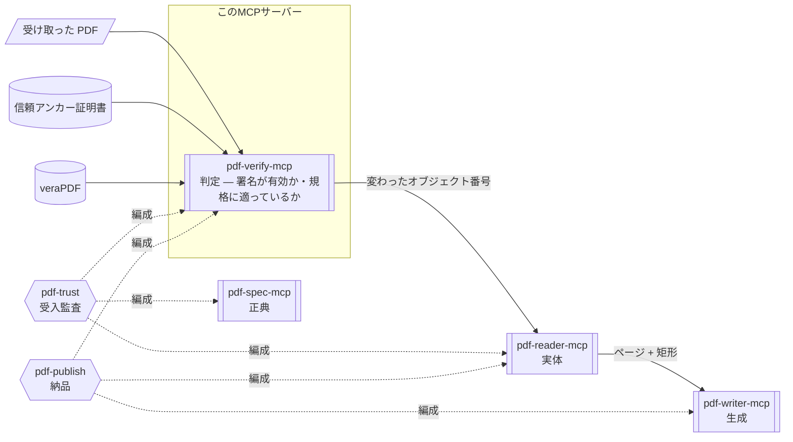

# pdf-verify-mcp

**署名が暗号学的に有効か、規格に適っているかを判定するサーバーです。**  
電子署名を暗号学的に検証し、署名後の改ざんを検知し、PDF/A（長期保存）や PDF/UA（アクセシビリティ）への適合を採点します。

- npm: [`@shuji-bonji/pdf-verify-mcp`](https://www.npmjs.com/package/@shuji-bonji/pdf-verify-mcp) / 現行 v0.26.0 / [GitHub](https://github.com/shuji-bonji/pdf-verify-mcp)
- このページは責務と使いどころの解説です。全ツールの引数・戻り値は[ツールリファレンス](/ja/reference/mcp/pdf-verify)（`tools/list` から自動生成）へ

## これ 1 台でできること

「この契約書の署名は有効？」「署名のあとに書き換えられていない？」「この PDF は PDF/A として保存に耐える？」に答えられます。判定は暗号計算とルール表によるもので、**同じファイルなら何度実行しても同じ結果**です。受け取った PDF を業務に載せてよいかの判断（受入監査）は、このサーバーが中心になります。

### 判定できるもの

| 問い                                       | 何を測るか                                                                                          | ツール                                      | [言い切り強度](/ja/guide/architecture#言い切り強度-t1-t2-t3) |
| ------------------------------------------ | --------------------------------------------------------------------------------------------------- | ------------------------------------------- | ------------------------------------------------------------ |
| 電子署名は暗号学的に有効か                 | ByteRange ダイジェストの再計算・CMS messageDigest の照合・署名値の検証・RFC 3161 タイムスタンプ     | `verify_signatures`                         | T1                                                           |
| 署名者は信頼できるか                       | 信頼アンカーに対する証明書チェーン評価・失効確認（OCSP / CRL）                                      | `verify_signatures`（`trust_anchors` 必須） | T1                                                           |
| 署名の後に書き換えられたか                 | 増分更新のリビジョン・署名済み範囲のカバレッジ・DocMDP の許可と違反・**変更されたオブジェクト番号** | `verify_integrity`                          | T1                                                           |
| ISO 32000 本体の条文に違反していないか     | [pdf-constraints](/ja/reference/pdf-constraints) の制約表（veraPDF が見ない領域）                   | `validate_clauses`                          | T1                                                           |
| PDF/UA（アクセシビリティ）に適合しているか | ISO 14289。veraPDF 委譲、または内蔵 12 ルール                                                       | `validate_conformance`                      | T1                                                           |
| PDF/A（長期保存）に適合しているか          | ISO 19005。veraPDF 委譲、または内蔵 15 ルール                                                       | `validate_conformance`                      | T2                                                           |
| 長期保存の構造を備えているか               | PAdES B-B / B-T / B-LT / B-LTA 相当の構造                                                           | `detect_pades_level`                        | T3（観測のみ）                                               |
| PDF/A・PDF/UA を**名乗っている**か         | XMP の pdfaid / pdfuaid 宣言                                                                        | `identify_conformance`                      | 宣言の読取                                                   |
| 業務に載せてよいか                         | 上記の事実を固定ルールに当てはめて集約した 4 値判定                                                 | `evaluate_policy`                           | 事実の集約                                                   |

## Skill 連携でできること

このMCP サーバーは 4 層のうち**真正性・準拠性**（= 事実に対する合否の判断）の層にあり、観測された事実に対して合否を下します。何をどの順で測り、その判定をどう説明し、どんな法令根拠を添えるかは Skill の仕事です。



図中の形は要素の種別を表します（→ [図の読み方](/ja/reference/glossary#図の読み方-形の凡例)）。

| Skill                                 | このサーバーの役割                                                                                        | 必須か                       |
| ------------------------------------- | --------------------------------------------------------------------------------------------------------- | ---------------------------- |
| [pdf-trust](/ja/skills/pdf-trust)     | 監査の軸。4 値判定は `evaluate_policy` が下し、Skill は firedRules の解説・推奨アクション・法令根拠を担う | **必須**（v0.7.0+）          |
| [pdf-publish](/ja/skills/pdf-publish) | 出口ゲート。書いた PDF を veraPDF で機械採点する。`conformance` 水準では未接続なら中止                    | **必須**（conformance 水準） |

::: warning 判定はプログラム、文章生成はAI（LLM）が行います
結果に含まれる firedRules（適用されたルール）や advisories（助言）は、あくまで「結果の理由を説明するため」のものであり、判定そのものを上書きするために使うものではありません。  
また、以下の点にご注意ください。

- `advisory`（助言）が出ているからといって、`「不合格（失敗）」`と判断しないでください。
- `advisory` が一切出ていないからといって、`「合格」`と判断しないでください。
  :::

## できないこと

- **規格どおりであることは証明できません。**  
  このサーバーがするのは「示せる誤りを探すこと」です。誤りが見つかれば「規格に適っていない」と断定できますが、誤りが見つからなくても「完全に適合している」と証明したことにはなりません
- **署名者が本人であることは、信頼アンカー無しでは言えません。**  
  `trust_anchors`（または env）なしの `valid` は**暗号計算の一致**のみを意味します（`trust: not_evaluated`）。失効も、確認できなかったなら「失効していない」とは言えません
- **PDF/UA は機械だけでは決められません。**  
  代替テキストが「存在するか」は検査できますが、「意味があるか」はできません
- **PAdES は準拠判定になりません。**  
  ETSI EN 319 142 は仕様コーパスに無く、第三者検証器も存在しないため、結果は「構造が B-LT に一致する」であって「PAdES B-LT に準拠」ではありません（全レポートに `normativeBasis: "T3"` が付きます）

## しないこと

- 内容の真偽の判定（正しく署名された文書にも、事実と異なる内容は書けます）
- 観測（→ pdf-reader）・仕様の引用（→ pdf-spec）・生成（→ pdf-writer）

## インストール

```jsonc
{
  "mcpServers": {
    "pdf-verify": {
      "command": "npx",
      "args": ["-y", "@shuji-bonji/pdf-verify-mcp@latest"],
      "env": {
        "PDF_VERIFY_VERAPDF": "/usr/local/bin/verapdf",
        "PDF_VERIFY_TRUST_ANCHORS": "/path/to/trust-anchors",
      },
    },
  },
}
```

環境変数はどちらも任意です。veraPDF なしでも内蔵ルールで動作します。

## 共通引数

全ツールが以下を受け取ります。

| 引数                 | 型                  | 説明                                                                                    |
| -------------------- | ------------------- | --------------------------------------------------------------------------------------- |
| `file_path` **必須** | string              | ローカル PDF の絶対パス                                                                 |
| `response_format`    | `markdown` / `json` | 出力形式。既定 markdown                                                                 |
| `password`           | string              | 暗号化 PDF のパスワード。権限暗号化（空ユーザパスワード）は自動で試行（対応ツールのみ） |

## ツール一覧

引数・型・既定値は[ツールリファレンス](/ja/reference/mcp/pdf-verify)にあります（`tools/list` から自動生成）。

| ツール                                                                      | 一行説明                                                 |
| --------------------------------------------------------------------------- | -------------------------------------------------------- |
| [`verify_signatures`](/ja/reference/mcp/pdf-verify#verify-signatures)       | 電子署名の暗号学的検証（チェーン・失効・タイムスタンプ） |
| [`verify_integrity`](/ja/reference/mcp/pdf-verify#verify-integrity)         | 署名後の変更の分析（増分更新・カバレッジ・DocMDP）       |
| [`detect_pades_level`](/ja/reference/mcp/pdf-verify#detect-pades-level)     | PAdES B-B / B-T / B-LT / B-LTA 相当構造の**観測**        |
| [`identify_conformance`](/ja/reference/mcp/pdf-verify#identify-conformance) | XMP 宣言（pdfaid / pdfuaid）の読取 — 判定の入口          |
| [`validate_conformance`](/ja/reference/mcp/pdf-verify#validate-conformance) | PDF/A / PDF/UA 検証。veraPDF 委譲 or 内蔵ルール          |
| [`validate_clauses`](/ja/reference/mcp/pdf-verify#validate-clauses)         | ISO 32000 **本体条文**の制約検査（veraPDF が見ない領域） |
| [`evaluate_policy`](/ja/reference/mcp/pdf-verify#evaluate-policy)           | 事実からの決定論的 4 値判定                              |

## 使い方の要点

各ツールの運用上の注意と「プロンプト → 引数 → 返る JSON」は [ツールリファレンス](/ja/reference/mcp/pdf-verify) の該当ツール末尾にあります。

### 署名 — valid は「本人」ではない

`verify_signatures` の返す 3 つの値は独立しています。verdict（`valid` / `invalid` / `indeterminate`）は暗号計算の一致、trust（`trusted` / `untrusted` / `not_evaluated`）は証明書チェーンの評価、失効状態（`good` / `revoked` / `unknown` / `not_checked`）は OCSP / CRL の確認結果です。**信頼アンカーを渡さなければ trust は `not_evaluated` のまま**で、`evaluate_policy` の判定も `use_with_caution` 止まりになります。

失効確認は既定で `embedded`（PDF/CMS 内のデータ）です。`online` にすると OCSP/CRL へ HTTP 問い合わせを行います。

### 署名後の増分更新は合法

`verify_integrity` が報告するのは「レビューすべき点」であって、自動的に改ざんを意味しません。署名の追加・DSS/LTV データの付与は PDF として正当な操作です。ISO 32000-2 §12.8.2.2 に従い、P=1 認証後の DSS / 文書タイムスタンプ増分は違反として**報告しません**（`laterChangesAppearLtvOnly` としてフラグ）。

v0.10.0 から、リビジョン単位に加えて「署名後にどのオブジェクトが書かれたか」まで返します（`revisions` / `objectChangesAfterLastSignature`）。生バイトで xref チェーンを歩きます（table / xref stream / hybrid 対応）。**判定は不変**です。

::: warning xref チェーンを辿れないことと、変更が無いことは同じではありません
xref チェーンを辿れなかった場合は、空配列ではなく `null` を返します。次の 3 点は、素朴に実装すると誤った結果になります。

- 線形化 PDF は 1 回の保存で xref が 2 つできるため、併合しないと「全オブジェクトが追加された」と誤報する
- フルセーブでは変更件数が過大になる（実測で 224,065 件）
- 辿れないことを「変更なし」と読むと、確認できていない事実を確定してしまう

いずれも実測で対処済みです。
:::

### 準拠判定は「宣言を読む」と「ルールで測る」に分かれる

`identify_conformance` は「私は PDF/A です」と書いてあるかを**読むだけ**です。**宣言は証拠になりません。** 実際のルール検査は `validate_conformance` が行います。

`validate_conformance` は**ハイブリッドエンジン**です。veraPDF があれば委譲し（authoritative）、なければ内蔵ルールをネイティブ実行します。`flavour` は `"pdfa-1b"`〜`"pdfa-3b"` / `"pdfa-4"` / `"pdfa-4e"` / `"pdfa-4f"`（v0.11.0+）/ `"pdfua-1"` / `"pdfua-2"` 等で、省略時は XMP 宣言に従います（両方宣言時は PDF/A 優先、fallback `pdfa-2b`）。**PDF/A-4 は conformance level を持たないので `"pdfa-4b"` は存在しません。** `e` / `f` はレベルではなく variant です。

結果の読み方: `compliant` は veraPDF なら true / false。**ネイティブエンジンでは false = 決定的違反あり、`null` =「検査したサブセット内で違反なし」（認証ではない）**です。PDF/UA ネイティブ違反は severity 付きで、`error` のみが非準拠を証明でき、`warning` は人のレビューが要ります。

### 条文検査は 4 状態で返る

`validate_clauses` は ISO 32000-1/-2 本体の条文から書き起こした制約を検査します。PDF/A や PDF/UA に通っても ISO 32000 に違反しうるためです（例: CFF フォントプログラムを `/FontFile2` に埋め込む。Table 124 が禁じています）。制約テーブルとその評価器は [pdf-constraints](/ja/reference/pdf-constraints) にあり、どの版が判定したかを出力に含めます。

| 状態                  | 意味                                                              |
| --------------------- | ----------------------------------------------------------------- |
| `pass`                | この制約では**規格破りは見つからなかった**                        |
| `fail`                | 規格破りが見つかった。根拠となる事実と実測値つき                  |
| `not_applicable`      | この文書には条文が適用されない                                    |
| `needs_external_fact` | ファイル外の事実が与えられず**判定しなかった**（pass に倒さない） |

`trace` 印の失敗は、条文が PDF **処理系**に向けたものであることを示します ── 誰かが破った痕跡であって、最後に書いた者が破ったとは限りません。

### PAdES レベルは積み上げで決まる

| レベル | 構造（上の行に追加で）                   | 意味                                 |
| ------ | ---------------------------------------- | ------------------------------------ |
| B-B    | CAdES 署名                               | 署名のみ                             |
| B-T    | + 署名タイムスタンプ（RFC 3161）         | 署名時刻を第三者が証明               |
| B-LT   | + 検証データ入り DSS（証明書・OCSP/CRL） | 失効確認の材料が文書内で完結         |
| B-LTA  | + 文書タイムスタンプ                     | 検証材料ごと封印し、長期保存に耐える |

B-LT / B-LTA は DSS の失効データが署名者証明書を実際にカバーしていることを追加要求します（満たさなければ B-T 止まり）。旧式の adbe.pkcs7.detached は非 PAdES として報告します。

### 4 値判定はプロファイルで変わる

`evaluate_policy` は内部で `verify_signatures`・`verify_integrity`・`detect_pades_level`（長期保存プロファイルでは `validate_conformance` も）を実行します。得られた事実を固定ルールに当てはめ、4 値に集約します。**同じ事実と同じプロファイルからは常に同じ判定**です。`profile` は `general` / `contract`（署名必須・本人性重視）/ `financial`・`government`（長期保存検査）/ `legal` / `medical`（最保守。caution が review に昇格）から選びます。

返るのは `verdict`・`firedRules`（発火ルール ID と理由）・`advisories`（判定に影響しない推奨）・事実サマリです。この判定を軸に監査全体を編成するのが [pdf-trust Skill](/ja/skills/pdf-trust) です。

## 言い切り強度

判定の強さは規範文書の有無で変わります → [T1/T2/T3 ルール](/ja/guide/architecture#言い切り強度-t1-t2-t3)。ETSI PAdES（T3）は構造の観測のみ、PDF/A（T2）は「veraPDF がこう判定した」まで、ISO 32000 / PDF/UA（T1）は条文を引いて言い切れます。
