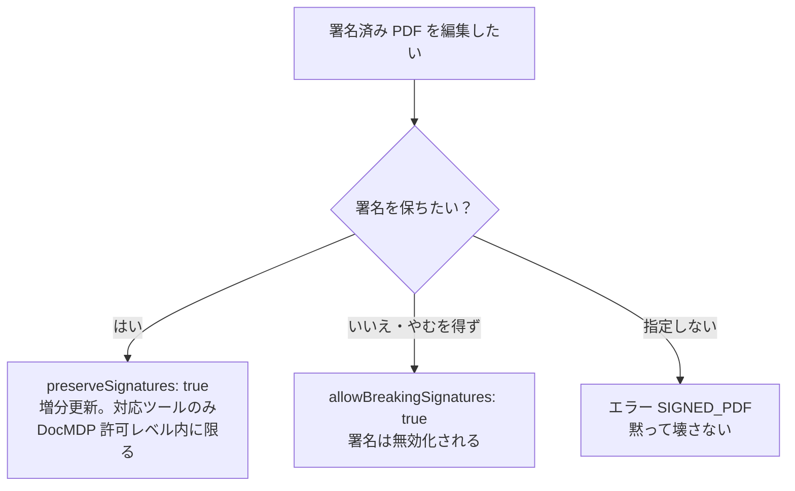

# pdf-writer-mcp

> **生成の層 (production)** — このサーバーは PDF を**書く**。準拠の「宣言」は書けるが、準拠そのものを作ることはできない。宣言を書いたら必ず pdf-verify で測ること。

- npm: `@shuji-bonji/pdf-writer-mcp` / 現行 v0.18.0
- このページは責務と使いどころの**解説**。全ツールの引数・戻り値は[ツールリファレンス](/ja/reference/mcp/pdf-writer)（`tools/list` から自動生成）へ
- pdf-lib + fontkit。日本語フォント埋め込み（サブセット化）対応

## しないこと

- **署名しない**。署名付き PDF の編集は `preserveSignatures`（増分更新）か `allowBreakingSignatures` の明示が必要 — 黙って壊さない
- 準拠判定（→ pdf-verify）・仕様引用（→ pdf-spec）
- `ensure_pdfa` はフォント・透明・暗号化・JavaScript を修復しない（文書レベル要件の供給のみ）

## インストール

```jsonc
{
  "mcpServers": {
    "pdf-writer": {
      "command": "npx",
      "args": ["-y", "@shuji-bonji/pdf-writer-mcp@latest"],
      "env": { "PDF_WRITER_FONT": "/path/to/NotoSansJP-Regular.otf" }
    }
  }
}
```

## 共通引数

ほとんどのツールが以下を受け取る（各表では省略し、ツール固有の引数のみ記載する）。

| 引数 | 型 | 説明 |
|---|---|---|
| `inputPath` **必須**（編集系） | string | 編集対象 PDF の絶対パス |
| `outputPath` | string | 保存先（絶対パス）。**省略すると base64 で返り応答が溢れるため、必ず指定すること** |
| `returnBase64` | boolean | 保存に加えて base64 も返す。既定 false |
| `fontPath` | string | 埋め込むフォント（.ttf/.otf、.ttc 不可）。日本語には必須。env `PDF_WRITER_FONT` でも指定可 |
| `allowBreakingSignatures` | boolean | 署名済み PDF（/ByteRange 検知）は既定でエラー。true で**署名無効化を承知の上**続行 |
| `preserveSignatures` | boolean | 署名を無効化せず**増分更新（末尾追記）**で編集。元のバイト列に触れないため /ByteRange が保たれる。DocMDP の許可レベルに反する変更は拒否（対応ツールのみ） |

### 署名済み PDF の扱い（判断フロー）



## ツール一覧（20）

| 分類 | ツール |
|---|---|
| 作成 | [`create_text_pdf`](#create-text-pdf) / [`create_markdown_pdf`](#create-markdown-pdf) / [`create_table_pdf`](#create-table-pdf) |
| ページ操作 | [`merge_pdfs`](#merge-pdfs) / [`split_pdf`](#split-pdf) / [`extract_pages`](#extract-pages) / [`delete_pages`](#delete-pages) / [`reorder_pages`](#reorder-pages) / [`rotate_pages`](#rotate-pages) |
| 装飾・注釈 | [`add_bookmarks`](#add-bookmarks) / [`add_annotation`](#add-annotation) / [`add_watermark`](#add-watermark) / [`stamp_page_numbers`](#stamp-page-numbers) |
| メタ・添付 | [`set_metadata`](#set-metadata) / [`attach_file`](#attach-file) |
| フォーム | [`fill_form`](#fill-form) / [`flatten_form`](#flatten-form) / [`tag_form_fields`](#tag-form-fields) |
| 宣言 | [`ensure_tagged`](#ensure-tagged) / [`ensure_pdfa`](#ensure-pdfa) |

## ツール別マニュアル — 作成

create 系 3 ツールは共通で以下を受け取る。

| 引数 | 型 | 説明 |
|---|---|---|
| `fontSize` | number | 本文サイズ(pt)。既定 11（4〜96） |
| `pageSize` | `A4` / `A3` / `A5` / `LETTER` / `LEGAL` | 既定 A4 |
| `margin` | number | 上下左右マージン(pt)。既定 56 ≒ 20mm |
| `title` / `author` | string | メタデータ。title は本文冒頭にも見出し描画 |
| `onMissingGlyph` | `error` / `replace` / `ignore` | フォントに無い文字の扱い。既定 error（欠落文字を列挙してエラー）。replace = 〓 に置換して警告 |
| `tagged` | boolean | **タグ付き PDF（PDF/UA-1）として生成**。構造木・PDF/UA 宣言・/Lang・DisplayDocTitle を付与。PDF/UA はタイトル必須のため `title` が必須になる |
| `lang` | string | 文書言語（BCP 47。例 `"ja"`）。tagged 時に省略すると本文から推定し warnings で報告。誤った言語宣言はスクリーンリーダの誤読を招くため確実なら明示 |
| `pdfVersion` | `"1.7"` \| `"2.0"` | 出力する PDF の版。既定 `"1.7"`（バイト列は従来どおり）。`"2.0"`（ISO 32000-2）にすると版の宣言に加えて **trailer /ID を付与**（Table 15 で Required）し、**Info 辞書を CreationDate / ModDate だけに絞って**題名・作成者・Producer を XMP へ移す（§14.3.3）。**`tagged: true` とは併用不可** — 本サーバーが書ける宣言は PDF/UA-1（PDF 1.7 基盤）だけで、2.0 の器に載せると誰にも測れない宣言になるため |

### create_text_pdf

プレーンテキストから PDF を生成。`\n` を尊重し、空行を段落区切りに。長い行は自動折り返し。

| 引数 | 型 | 説明 |
|---|---|---|
| `text` **必須** | string | 本文テキスト |

### create_markdown_pdf

Markdown から PDF を生成。見出し・段落・リスト・コードブロック・引用・水平線・表に対応。単一フォントのため、インライン装飾（**強調**等）は記号を除去し字面のみ反映する。

| 引数 | 型 | 説明 |
|---|---|---|
| `markdown` **必須** | string | Markdown 文字列 |

### create_table_pdf

ヘッダと行データから罫線付き表 PDF を生成。列幅は内容から自動算出、セル内折り返し、改ページ時のヘッダ再描画に対応。

| 引数 | 型 | 説明 |
|---|---|---|
| `headers` **必須** | array\<string\> | 列見出し |
| `rows` **必須** | array\<array\> | データ行。headers と同じ列数を推奨 |

## ツール別マニュアル — ページ操作

::: warning ページ複製系は文書レベル情報を引き継がない
`merge_pdfs` / `split_pdf` / `extract_pages` / `delete_pages` / `reorder_pages` はページを新しい文書へ複製するため、**タグ付き構造・XMP・添付・AcroForm・しおり等は引き継がれない**。失われたものは warnings で報告されるので、必要なら出力に `attach_file` / `ensure_tagged` / `add_bookmarks` / `set_metadata` を後がけしてください。
:::

### merge_pdfs

複数 PDF を指定順に結合。メタデータは先頭ファイルから引き継ぎ。

| 引数 | 型 | 説明 |
|---|---|---|
| `inputPaths` **必須** | array\<string\> | 結合する PDF の絶対パス（結合順・2 件以上） |

### split_pdf

ページ範囲ごとに複数ファイルへ分割。`ranges` の各要素が 1 ファイルに。

| 引数 | 型 | 説明 |
|---|---|---|
| `ranges` **必須** | array\<string\> | `"1-3"` / `"5"` / `"7-"` / `"-2"` 形式（1 始まり） |
| `outputDir` **必須** | string | 出力先ディレクトリ（絶対パス） |
| `prefix` | string | 出力名接頭辞。既定 `<入力名>-part` |

### extract_pages

指定ページだけの新 PDF を作成。**指定順が出力順**になるため並べ替えを兼ねた抽出も可能。

| 引数 | 型 | 説明 |
|---|---|---|
| `pages` **必須** | string | `"1,3-5,8-"` 形式（1 始まり） |

### delete_pages

指定ページを削除した新 PDF を作成。全ページ削除はエラー。

| 引数 | 型 | 説明 |
|---|---|---|
| `pages` **必須** | string | 削除ページ。`"1,3-5,8-"` 形式 |

### reorder_pages

ページの並べ替え。`order` には全ページを新順序で 1 回ずつ列挙。

| 引数 | 型 | 説明 |
|---|---|---|
| `order` **必須** | array\<integer\> | 新しいページ順（1 始まり）。例: 5 ページの逆順 `[5,4,3,2,1]` |

### rotate_pages

時計回りに回転（90/180/270 度）。

| 引数 | 型 | 説明 |
|---|---|---|
| `rotation` **必須** | `90` / `180` / `270` | 回転角（度） |
| `pages` | string | 対象ページ。省略時は全ページ |

## ツール別マニュアル — 装飾・注釈

### add_bookmarks

しおり（アウトライン）を設定。**既存のしおりは置換**。`children` で入れ子化（最大 8 階層・計 2000 件）。`preserveSignatures` 対応。

| 引数 | 型 | 説明 |
|---|---|---|
| `bookmarks` **必須** | array | `{ title, page, open?, children? }` の配列。page は 1 始まり |

### add_annotation

注釈を 1 つ追加: 付箋（text）/ ハイライト（highlight）/ 矩形（square）。座標は **PDF 座標系（左下原点・pt）**。タグ付き文書では Annot 構造要素への内包（PDF/UA 7.18.1-1）も行い、`preserveSignatures` 時は増分に含めて PDF/UA 準拠を維持する（DocMDP では P=3 のときのみ許可）。

| 引数 | 型 | 説明 |
|---|---|---|
| `page` **必須** | integer | 対象ページ（1 始まり） |
| `type` **必須** | `text` / `highlight` / `square` | 注釈種別 |
| `rect` **必須** | object | 矩形（左下原点・pt）。x1\<x2 かつ y1\<y2 |
| `contents` | string | 本文（日本語可） |
| `alt` | string | 支援技術向け代替テキスト（タグ付き PDF で Annot 要素の /Alt に） |
| `color` / `interiorColor` | string | #rrggbb。interiorColor は square の塗り |
| `icon` | string | text のアイコン（Note / Comment / Key / Help / NewParagraph / Paragraph / Insert） |
| `open` | boolean | text を開いた状態に。既定 false |

### add_watermark

各ページ中央に斜めの透かし（「社外秘」「DRAFT」等）。既定は本文の**背面**に薄く。タグ付き PDF では Artifact として囲み PDF/UA 準拠を維持。日本語の透かしにはフォント必須。

| 引数 | 型 | 説明 |
|---|---|---|
| `text` **必須** | string | 透かし文字 |
| `fontSize` | number | 既定 60 |
| `opacity` | number | 0〜1。既定 0.15 |
| `angle` | number | 反時計回りの角度。既定 45 |
| `behind` | boolean | 背面に敷くか。既定 true |
| `pages` | string | 対象ページ。省略時は全ページ |

### stamp_page_numbers

ページ番号を刻印。タグ付き PDF では Artifact として囲み PDF/UA 準拠を維持。日本語書式にはフォント必須。

| 引数 | 型 | 説明 |
|---|---|---|
| `format` | string | `{n}`=現在頁・`{total}`=総頁。既定 `"{n}"`。例 `"{n} / {total}"` / `"{n} ページ"` |
| `position` | string | bottom-left 〜 top-right の 6 種。既定 bottom-center。/Rotate 考慮 |
| `pages` | string | 対象ページ。表紙を除くなら `"2-"` |
| `startAt` | integer | 開始番号。既定 1 |
| `margin` / `fontSize` / `color` | — | 余白 24pt / 9pt / #666666 が既定 |

## ツール別マニュアル — メタ・添付

### set_metadata

Info 辞書の更新（指定フィールドのみ変更）。title / author / subject / keywords / creator のうち最低 1 つが必要。**XMP を持つ文書では dc:title 等も同期**して不整合を防ぐ。`preserveSignatures` 対応。

### attach_file

ファイルを埋め込み（/Names /EmbeddedFiles + catalog /AF、AFRelationship 付与）。PDF/A-3 や電帳法の「人が読む請求書 PDF + 機械可読データ（CSV/XML）」を 1 ファイルに束ねる用途。

| 引数 | 型 | 説明 |
|---|---|---|
| `attachmentPath` **必須** | string | 埋め込むファイル |
| `name` | string | PDF 内での表示名。既存添付と同名不可 |
| `description` | string | /Desc（日本語可） |
| `mimeType` | string | 省略時は拡張子から推定 |
| `relationship` | `Source` / `Data` / `Alternative` / `Supplement` / `Unspecified` | 本文との関係（PDF/A-3 §6.8）。**PDF/A-3 では意味のある値が必須**（省略すると警告） |

## ツール別マニュアル — フォーム

### fill_form

AcroForm にフィールド値を流し込み。**フィールド名が分からないときは、存在しない名前を指定するとエラーに全フィールド名と型が列挙される**という調査法が使える。XFA 非対応。

| 引数 | 型 | 説明 |
|---|---|---|
| `fields` **必須** | object | フィールド名 → 値。text=文字列/数値、checkbox=真偽、dropdown/optionlist=文字列（配列可）、radio=文字列 |
| `flatten` | boolean | 記入後にフラット化。既定 false |
| `allowBreakingTags` | boolean | タグ付き PDF でのフラット化を許可（**PDF/UA 準拠が壊れる**）。既定 false |

### flatten_form

記入済みの見た目を保ったまま AcroForm を非対話化。配布前の値固定に。タグ付き PDF では Widget 注釈が消えて Form 構造要素が宙に浮くため既定で拒否（`allowBreakingTags: true` で強行可）。日本語フォームは外観再生成に備えてフォント指定を。

### tag_form_fields

タグ付き PDF のフォームを **PDF/UA-1 準拠へ修復**: Widget を Form 構造要素へ内包（7.18.4-1）、対象ページに /Tabs S（7.18.3-1）、フィールドに代替名 /TU（7.18.1-3）。**冪等**（構造木に結ばれた Widget はスキップ）。タグ無し文書は対象外（create 系の `tagged: true` で作り直すか `ensure_tagged` を先に）。

| 引数 | 型 | 説明 |
|---|---|---|
| `labels` | object | フィールド名 → スクリーンリーダが読む名前。例 `{"user.name": "氏名"}`。省略フィールドは名前を代用し warnings で報告 |

## ツール別マニュアル — 宣言

::: danger 宣言を書いたら必ず測る
`ensure_tagged` / `ensure_pdfa` は XMP に pdfuaid / pdfaid を書く — これは**宣言**であって準拠ではない。適合していない文書に適用すると**嘘を名乗る PDF** ができる（適用時は常に警告が返る）。書いたら必ず pdf-verify の `validate_conformance` で測ること（flavour は `ensure_pdfa` に渡したものと同じ文字列 — `pdfua-1` / `pdfa-3b` / `pdfa-4` / `pdfa-4f`）。**測れないなら宣言を書かない。**
:::

### ensure_tagged

既存 PDF を PDF/UA-1 の「器」に載せる。タグ付きなら構造木に触らず欠落した文書レベル要件（MarkInfo / Lang / DisplayDocTitle / XMP の pdfuaid・dc:title）のみ補い、タグ無しなら最小構造木（各ページ = 1 つの P 要素）を新設する。

**機械は意味を推定できない**ため、見出し・表・リスト・読み順・図の代替テキストは作られない。新設は「足場」であって「アクセシブルな文書」ではなく、人手のレビューが要る。最初から正しく作れるなら create 系の `tagged: true` を。

| 引数 | 型 | 説明 |
|---|---|---|
| `title` | string | 文書タイトル（PDF/UA-1 7.1 で必須）。省略時は既存 Info の Title |
| `lang` | string | 文書言語（PDF/UA-1 7.2 で必須。例 `"ja"`） |

### ensure_pdfa

既存 PDF を PDF/A の「器」に載せる（ensure_tagged の PDF/A 版）。`flavour` で **`"pdfa-3b"`（既定）/ `"pdfa-4"` / `"pdfa-4f"`** を選ぶ。補うのは trailer /ID（ISO 32000-1 14.4）・sRGB OutputIntent（ICC プロファイル生成・埋め込み）・XMP pdfaid で、**本文・構造木・フォントには触らない**。フォント未埋め込み・暗号化・JavaScript・LZW などの違反は直らない。

**-4 系はさらにヘッダを PDF 2.0 にし、Info 辞書を削除する。** PDF/A-4 は catalog に `/PieceInfo` が無い限り Info を許さず（veraPDF `ISO 19005-4:2020 6.1.3-4`）、これは ISO 32000-2 §14.3.3 より厳しい要求である。作成日時は `xmp:CreateDate` が持つので情報は失われない。`pdfaid:rev` を書き、`pdfaid:conformance` は書かない（-4 は conformance level を持たないため）。

::: warning 添付があるなら `"pdfa-4f"`
素の `"pdfa-4"` は**添付ファイル自身が PDF/A であること**を要求する（`6.9-3`）。CSV や JSON を同梱する電帳法の使い方では非適合になるため、**`"pdfa-4f"`** を使ってください。実測: 同一文書が `pdfa-4` で 108/109、`pdfa-4f` で **109/109 COMPLIANT**。
:::

`preserveSignatures` との併用は、-4 系では**入力が既に PDF 2.0 でない限り拒否**される。増分更新はファイル先頭のヘッダを書き換えられず、書き換えれば守るはずの署名が壊れるためである。

電帳法の文脈では `attach_file` で機械可読データを添付した**後**に適用する。判定は veraPDF が下すため、「veraPDF はこう判定した」までしか言えない（ISO 19005 は条文を引けない）。

## エラーコード

構造化エラー（`code` / `next_actions` / `retryable`）で返る。メッセージ文字列をパースしないこと。

| コード | 対処 |
|---|---|
| `SIGNED_PDF` | `preserveSignatures` か `allowBreakingSignatures` を明示 |
| `TAGGED_PDF` | `allowBreakingTags` を明示（PDF/UA が壊れることを承知の上で） |
| `FONT_REQUIRED` | `fontPath` / `PDF_WRITER_FONT` を指定 |
| `MISSING_GLYPH` | `onMissingGlyph` で扱いを指定 |
| `ENCRYPTED_PDF` | 暗号化 PDF は編集不可 |
| `UNSUPPORTED_PDF_FEATURE` | XFA 等の非対応機能 |
| その他 | `INVALID_ARGUMENT` / `DOC_NOT_FOUND` / `FONT_NOT_FOUND` / `INVALID_PDF` / `FILE_TOO_LARGE` / `INTERNAL_ERROR` |
