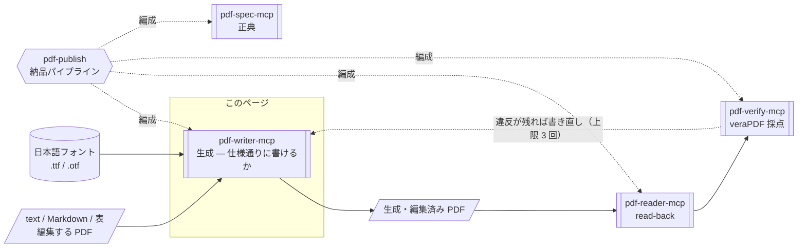
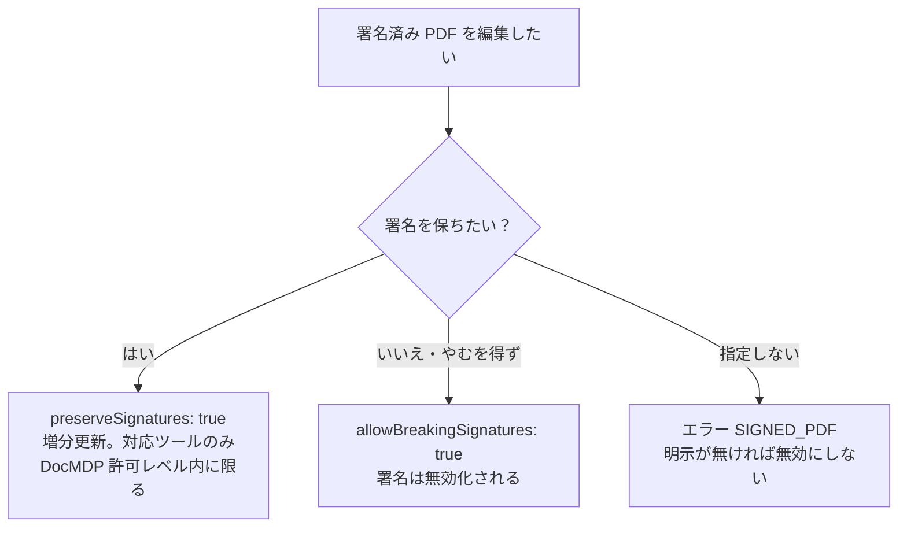

# pdf-writer-mcp

**PDF を作る・編集するサーバーです。** テキスト・Markdown・表から PDF を生成し、ページ操作（結合・分割・並べ替え）、しおり・注釈・透かし・ページ番号の付与、フォーム記入、ファイル添付ができます。日本語フォントの埋め込み（サブセット化）に対応しています。

- npm: [`@shuji-bonji/pdf-writer-mcp`](https://www.npmjs.com/package/@shuji-bonji/pdf-writer-mcp) / 現行 v0.21.0 / [GitHub](https://github.com/shuji-bonji/pdf-writer-mcp)
- このページは責務と使いどころの解説です。全ツールの引数・戻り値は[ツールリファレンス](/ja/reference/mcp/pdf-writer)（`tools/list` から自動生成）へ
- 内部実装は pdf-lib + fontkit

## これ 1 台でできること

「この内容で請求書 PDF を作って」「この 3 つの PDF をまとめて」「全ページに社外秘の透かしを入れて」といった作成・編集はここで完結します。スクリーンリーダーで読めるタグ付き PDF（PDF/UA-1）の生成にも対応しており、AI に文書を作らせてそのまま納品する用途に向きます。

## Skill 連携でできること

このサーバーは 4 層のうち**生成**（= 新規・編集済み PDF を返す）の層にあり、書くことだけをします。書いたものが規格どおりかは、このサーバーでは測れません。測るのは pdf-verify、読み戻すのは pdf-reader です。この 3 つを **write → read-back → verify** のループに組むのが [pdf-publish](/ja/skills/pdf-publish) です。



図中の形は要素の種別を表します（→ [図の読み方](/ja/reference/glossary#図の読み方-形の凡例)）。

| Skill | このサーバーの役割 | 必須か |
|---|---|---|
| [pdf-publish](/ja/skills/pdf-publish) | パイプラインの基盤。書く側を担い、読み戻しと採点は他の 2 つに渡す | **必須** |

::: danger 測れないなら適合宣言を書かない
`ensure_pdfa` / `ensure_tagged` を使う案件では、pdf-publish は水準にかかわらず pdf-verify を必須とします。検査できないなら適合宣言も書きません。
:::

## できないこと

- **適合宣言は書けますが、規格適合そのものは保証しません。** `ensure_pdfa` / `ensure_tagged` は「この文書は PDF/A です」という**宣言**をメタデータに書くツールです。フォント未埋め込みなどの違反は直りません。非適合の文書に適用すると、適合していないのに適合を名乗ったファイルができてしまいます。宣言を書いたら必ず pdf-verify で測ってください
- **機械は意味を推定できません。** `ensure_tagged` が新設するのは最小限の構造木であって、アクセシブルな文書ではありません。見出し・表・リスト・読み順・図の代替テキストは作られないため、人手のレビューが必要です
- **`ensure_pdfa` はフォント・透明・暗号化・JavaScript を修復しません**（文書レベル要件の供給のみ）
- 暗号化 PDF は編集できません（`ENCRYPTED_PDF`）。XFA には対応していません

## しないこと

- **署名しない**。署名付き PDF の編集には `preserveSignatures`（増分更新）か `allowBreakingSignatures` の明示が必要です。明示されない限り、署名を破壊する編集は行いません
- 準拠判定（→ pdf-verify）・仕様引用（→ pdf-spec）

## インストール

```jsonc
{
  "mcpServers": {
    "pdf-writer": {
      "command": "npx",
      "args": ["-y", "@shuji-bonji/pdf-writer-mcp@latest"],
      "env": { "PDF_WRITER_FONT": "/path/to/NotoSansJP-Regular.otf" }
    }
  }
}
```

## 共通引数

ほとんどのツールが以下を受け取ります。

| 引数 | 型 | 説明 |
|---|---|---|
| `inputPath` **必須**（編集系） | string | 編集対象 PDF の絶対パス |
| `outputPath` | string | 保存先（絶対パス）。**省略すると base64 で返り、応答が巨大になって会話が破綻しやすいため、必ず指定すること** |
| `returnBase64` | boolean | 保存に加えて base64 も返す。既定 false |
| `fontPath` | string | 埋め込むフォント（.ttf/.otf、.ttc 不可）。日本語には必須。env `PDF_WRITER_FONT` でも指定可 |
| `allowBreakingSignatures` | boolean | 署名済み PDF（/ByteRange 検知）は既定でエラー。true で**署名無効化を承知の上**続行 |
| `preserveSignatures` | boolean | 署名を無効化せず**増分更新（末尾追記）**で編集。元のバイト列に触れないため /ByteRange が保たれる。DocMDP の許可レベルに反する変更は拒否（対応ツールのみ） |

### 署名済み PDF の扱い（判断フロー）

署名付き PDF を編集する場合の判断は次のとおりです。

- 既定はエラー（署名を無効にしない）
- 署名を維持したい場合は `preserveSignatures`（増分更新）
- 署名が無効になってもよい場合のみ `allowBreakingSignatures`



## ツール一覧（20）

引数・型・既定値は[ツールリファレンス](/ja/reference/mcp/pdf-writer)にあります（`tools/list` から自動生成）。

| 分類 | ツール |
|---|---|
| 作成 | [`create_text_pdf`](/ja/reference/mcp/pdf-writer#create-text-pdf) / [`create_markdown_pdf`](/ja/reference/mcp/pdf-writer#create-markdown-pdf) / [`create_table_pdf`](/ja/reference/mcp/pdf-writer#create-table-pdf) |
| ページ操作 | [`merge_pdfs`](/ja/reference/mcp/pdf-writer#merge-pdfs) / [`split_pdf`](/ja/reference/mcp/pdf-writer#split-pdf) / [`extract_pages`](/ja/reference/mcp/pdf-writer#extract-pages) / [`delete_pages`](/ja/reference/mcp/pdf-writer#delete-pages) / [`reorder_pages`](/ja/reference/mcp/pdf-writer#reorder-pages) / [`rotate_pages`](/ja/reference/mcp/pdf-writer#rotate-pages) |
| 装飾・注釈 | [`add_bookmarks`](/ja/reference/mcp/pdf-writer#add-bookmarks) / [`add_annotation`](/ja/reference/mcp/pdf-writer#add-annotation) / [`add_watermark`](/ja/reference/mcp/pdf-writer#add-watermark) / [`stamp_page_numbers`](/ja/reference/mcp/pdf-writer#stamp-page-numbers) |
| メタ・添付 | [`set_metadata`](/ja/reference/mcp/pdf-writer#set-metadata) / [`attach_file`](/ja/reference/mcp/pdf-writer#attach-file) |
| フォーム | [`fill_form`](/ja/reference/mcp/pdf-writer#fill-form) / [`flatten_form`](/ja/reference/mcp/pdf-writer#flatten-form) / [`tag_form_fields`](/ja/reference/mcp/pdf-writer#tag-form-fields) |
| 宣言 | [`ensure_tagged`](/ja/reference/mcp/pdf-writer#ensure-tagged) / [`ensure_pdfa`](/ja/reference/mcp/pdf-writer#ensure-pdfa) |

## 使い方の要点

### 作成 — タグ付きにするなら最初から

`create_text_pdf` / `create_markdown_pdf` / `create_table_pdf` は共通で `tagged: true` を受け取ります。指定すると**タグ付き PDF（PDF/UA-1）として生成**し、構造木・PDF/UA 宣言・`/Lang`・DisplayDocTitle を付与します。PDF/UA はタイトル必須のため `title` も必須になります。

- `lang`（BCP 47。例 `"ja"`）を省略すると本文から推定し warnings で報告します。**誤った言語宣言はスクリーンリーダの誤読を招く**ので、確実なら明示してください
- 既存の PDF に後から `ensure_tagged` を掛けるより、最初から `tagged: true` で作るほうが良い文書になります
- フォントに無い文字の扱いは `onMissingGlyph` で決めます。既定は `error`（欠落文字を列挙してエラー）です

`pdfVersion` の既定は `"1.7"` です。`"2.0"`（ISO 32000-2）にすると、版の宣言に加えて **trailer `/ID` を付与**し（Table 15 で Required）、**Info 辞書を CreationDate / ModDate だけに絞って**題名・作成者・Producer を XMP へ移します（§14.3.3）。

**`tagged: true` とは併用できません。** 本サーバーが書ける適合宣言は PDF/UA-1（PDF 1.7 が基盤）だけで、PDF 2.0 の文書に載せると、誰にも測れない宣言になるためです。

### ページ操作は文書レベル情報を引き継がない

::: warning
`merge_pdfs` / `split_pdf` / `extract_pages` / `delete_pages` / `reorder_pages` はページを新しい文書へ複製するため、**タグ付き構造・XMP・添付・AcroForm・しおり等は引き継がれません**。失われたものは warnings で報告されるので、必要なら出力に `attach_file` / `ensure_tagged` / `add_bookmarks` / `set_metadata` を後がけしてください。
:::

`extract_pages` は**指定順が出力順**になるため、並べ替えを兼ねた抽出もできます。`add_bookmarks` は**既存のしおりを置換**します。

### 注釈・透かし・ページ番号はタグ付き構造を保つ

`add_annotation` の座標は **PDF 座標系（左下原点・pt）**で、[pdf-reader](/ja/mcp/pdf-reader) の `locate_objects` / `extract_structured_text`（`include_bbox`）が返す矩形をそのまま渡せます。タグ付き文書では Annot 構造要素への内包（PDF/UA 7.18.1-1）も行い、`preserveSignatures` 時は増分に含めて PDF/UA 準拠を維持します（DocMDP では P=3 のときのみ許可）。支援技術向けの代替テキストは `alt` で渡します。

`add_watermark` と `stamp_page_numbers` はタグ付き PDF では Artifact として囲むため、PDF/UA 準拠が保たれます。どちらも日本語の文字列にはフォントが必須です。

### フォーム — 名前が分からないときの調べ方

`fill_form` は、**存在しないフィールド名を指定するとエラーに全フィールド名と型が列挙される**という調査法が使えます。XFA には対応していません。

`flatten_form` はタグ付き PDF では Widget 注釈が消えて Form 構造要素が宙に浮くため、既定で拒否します（`allowBreakingTags: true` で強行できますが、**PDF/UA 準拠でなくなります**）。

`tag_form_fields` はタグ付き PDF のフォームを **PDF/UA-1 準拠へ修復**します: Widget を Form 構造要素へ内包（7.18.4-1）、対象ページに `/Tabs S`（7.18.3-1）、フィールドに代替名 `/TU`（7.18.1-3）。**何度実行しても結果は同じ**です。タグ無し文書は対象外です。

### 宣言 — 書いたら必ず測る

::: danger 適合宣言を書いたら必ず測る
`ensure_tagged` / `ensure_pdfa` は XMP に pdfuaid / pdfaid を書きます。これはファイルが自分について書いた宣言であって、規格に適合していることの証明ではありません。適合していない文書に適用すると、**適合していないのに適合を名乗った PDF** ができてしまいます（適用時は常に警告が返ります）。

書いたら必ず pdf-verify の `validate_conformance` で測ってください。flavour には `ensure_pdfa` に渡したものと同じ文字列（`pdfua-1` / `pdfa-3b` / `pdfa-4` / `pdfa-4f`）を指定します。**測れないなら適合宣言を書かないでください。**
:::

`ensure_tagged` は、タグ付きなら構造木に触らず欠落した文書レベル要件（MarkInfo / Lang / DisplayDocTitle / XMP の pdfuaid・dc:title）だけを補い、タグ無しなら最小構造木（各ページ = 1 つの P 要素）を新設します。

`ensure_pdfa` が補うのは trailer `/ID`（ISO 32000-1 14.4）・sRGB OutputIntent（ICC プロファイル生成・埋め込み）・XMP pdfaid で、**本文・構造木・フォントには触りません**。`flavour` で `"pdfa-3b"`（既定）/ `"pdfa-4"` / `"pdfa-4f"` を選びます。

**PDF/A-4 系（`pdfa-4` / `pdfa-4f`）はさらにヘッダを PDF 2.0 にし、Info 辞書を削除します。** PDF/A-4 は catalog に `/PieceInfo` が無い限り Info を許さず（veraPDF `ISO 19005-4:2020 6.1.3-4`）、これは ISO 32000-2 §14.3.3 より厳しい要求です。作成日時は `xmp:CreateDate` が持つので情報は失われません。`pdfaid:rev` を書き、`pdfaid:conformance` は書きません（PDF/A-4 は conformance level を持たないため）。

::: warning 添付があるなら `"pdfa-4f"`
素の `"pdfa-4"` は**添付ファイル自身が PDF/A であること**を要求します（`6.9-3`）。CSV や JSON を同梱する電帳法の使い方では非適合になるため、**`"pdfa-4f"`** を使ってください。実測: 同一文書が `pdfa-4` で 108/109、`pdfa-4f` で **109/109 COMPLIANT**。
:::

`preserveSignatures` との併用は、PDF/A-4 系では**入力が既に PDF 2.0 でない限り拒否**されます。増分更新はファイル先頭のヘッダを書き換えられません。書き換えれば、守るはずの署名が無効になるためです。

電帳法の文脈では `attach_file` で機械可読データを添付した**後**に適用します。`attach_file` は `relationship`（`Source` / `Data` / `Alternative` / `Supplement` / `Unspecified`）で本文との関係を宣言します。**PDF/A-3 では意味のある値が必須**です（§6.8。省略すると警告が返ります）。

## エラーコード

構造化エラー（`code` / `next_actions` / `retryable`）で返ります。**メッセージ文字列をパースしないでください。** 全コードと対処は[エラーコード一覧](/ja/reference/error-codes)にあります。

| よく出るコード | 対処 |
|---|---|
| `SIGNED_PDF` | `preserveSignatures` か `allowBreakingSignatures` を明示 |
| `TAGGED_PDF` | `allowBreakingTags` を明示（PDF/UA 準拠でなくなることを承知の上で） |
| `FONT_REQUIRED` | `fontPath` / `PDF_WRITER_FONT` を指定 |
| `MISSING_GLYPH` | `onMissingGlyph` で扱いを指定 |
