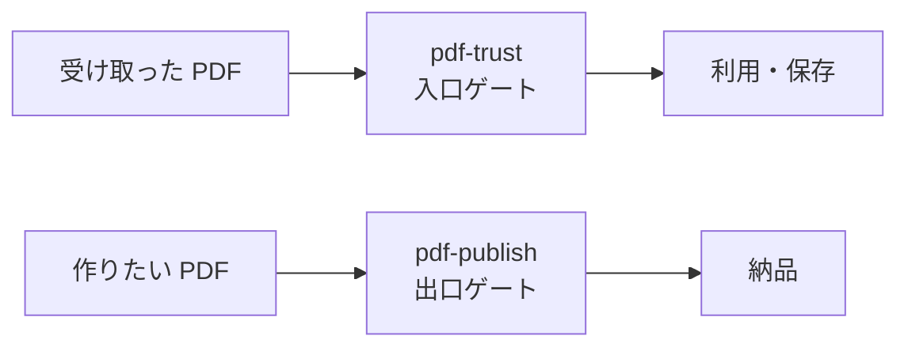

# Skill 一覧

MCP が「決定論的計算・暗号」を担うのに対し、Skill は「手順・知識・編成」を担います。判定はコード、ナラティブは LLM — この分業が family の設計原則です。

| Skill | 役割 | 前提 MCP |
|---|---|---|
| [pdf-trust](/ja/skills/pdf-trust) | 受入監査を編成し Trust Report を返す | pdf-verify **必須** (v0.7.0+) / reader・spec・houki 系は任意 |
| [pdf-publish](/ja/skills/pdf-publish) | write → read-back → verify の納品パイプライン | pdf-writer / pdf-reader / pdf-verify |
