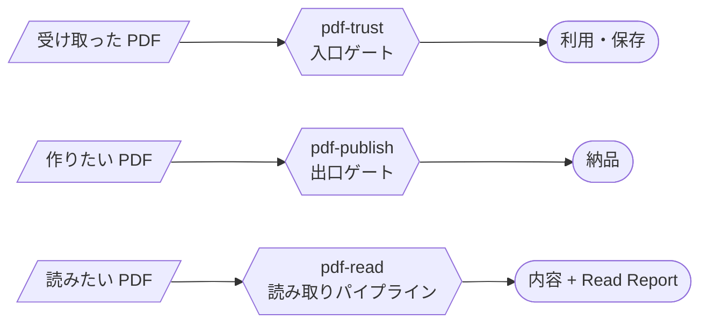

# Skill 一覧

MCP が「決定論的計算（同じ入力なら常に同じ結果になる計算）・暗号」を担うのに対し、Skill は「手順・知識・編成」を担います。判定はコード、ナラティブ（説明の文章）は LLM — この分業が PDF Agent Stack の設計原則です。

| Skill | 役割 | 前提 MCP |
|---|---|---|
| [pdf-trust](/ja/skills/pdf-trust) | 受入監査を編成し Trust Report を返す | pdf-verify **必須** (v0.7.0+) / reader・spec・houki 系は任意 |
| [pdf-publish](/ja/skills/pdf-publish) | write → read-back → verify の納品パイプライン | pdf-writer / pdf-reader / pdf-verify |
| [pdf-read](/ja/skills/pdf-read) | 大きな PDF・読めない PDF から必要な箇所を取り出し、読めなかった箇所を申告する | pdf-reader **必須** (v0.14.0+ 推奨) / spec は任意 |
