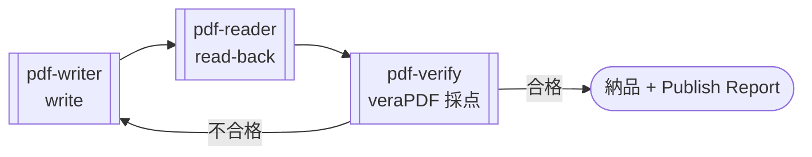

# pdf-publish — 納品パイプライン

PDF の生成・編集から納品までを品質ゲート付きで編成する Skill。pdf-writer で書き、pdf-reader で読み戻し、pdf-verify（veraPDF）で機械採点する **write → read-back → verify ループ**を回し、**Publish Report** 付きで納品する。



## 対応シナリオ

- PDF/UA 準拠（タグ付き）PDF の生成
- 電帳法対応: PDF/A-3b + 添付ファイル（`attach_file`）。PDF/A-4 を求められた場合は **`pdfa-4f`**（素の `pdfa-4` は添付自身が PDF/A であることを要求するため、CSV/XML の同梱と両立しない）
- フォームの PDF/UA 化（`tag_form_fields`）
- 品質保証付き一般納品

## 品質ゲート水準

どこまで確認してから納品するかを 3 水準から選ぶ。この Skill の中心的な設定である。

| 水準 | 内容 | 必須 MCP |
|---|---|---|
| `none` | 生成のみ。ゲートなし（下書き・使い捨て向け） | writer |
| `readback` | reader で読み戻し、意図どおり出力されたかを観測するまで | writer + reader |
| `conformance(flavour)` | veraPDF の採点で COMPLIANT になるまで。flavour は測る規格（`pdfa-3b` / `pdfa-4f` / `pdfua-1` など） | writer + verify（veraPDF 推奨） |

## 要点

- 宣言（`ensure_pdfa` / `ensure_tagged`）を書いたら必ず対応する flavour で `validate_conformance` を実行 — **測れないなら宣言を書かない**
- 判定は veraPDF のもの。「veraPDF が COMPLIANT と判定」と報告し「ISO 19005 準拠」とは書かない

## 実測例 — Publish Report 要旨（2026-08-11）

請求書デモ（日本語・タグ付き・CSV 添付の電帳法パターン）を水準 `conformance(pdfa-3b + pdfua-1)` で納品した実走記録:

| Phase | 実施内容 | 結果 |
|---|---|---|
| 1 生成 | `create_markdown_pdf`（tagged, lang: ja）→ `attach_file`（CSV, **Data**）→ `ensure_pdfa`（**必ず最後**） | 初回 `FONT_REQUIRED` で失敗 → 構造化エラーの `next_actions` に従い fontPath 指定で復帰 |
| 2 読み戻し | read_text / extract_structured_text / inspect_fonts / inspect_tags / inspect_structure | 識別子・数値すべて残存。H1 は 1 つ。フォント埋め込み + サブセット。catalog に **Names / AF / OutputIntents** 実在 |
| 3 品質ゲート | identify_conformance + validate_conformance ×2 | **veraPDF が PDF/A-3b COMPLIANT（146/146）・PDF/UA-1 COMPLIANT（106/106）と判定** |
| 4 修正ループ | — | **0 回**（初回通過） |

`ensure_pdfa` は成功時にも必ず warning を返す:

> This file now **CLAIMS** PDF/A-3b …, but conformance was **NOT checked** here. … Verify before
> relying on it: pdf-verify-mcp validate_conformance(flavour: "pdfa-3b")

これは異常ではなく設計である。宣言を書いた瞬間に検証が省略不能になる —
この warning を Report に転記し、対応する flavour を測ってから納品する。

## ループ打ち切り条件

- 修正ループは**上限 3 回**。超えたら停止し、残違反リスト + 条文根拠（pdf-spec があれば）を添えて人手レビューへ引き渡す
- **同じ違反が 2 回続いたら即座に人手へ** — その修正は効いていない
- 前段が失敗したら後段は「失敗」ではなく「**スキップ**」と記録する（原因の誤読を防ぐ）
- native エンジンでの `compliant: null` は「検査サブセットで違反なし」であって適合ではない — conformance 水準の判定は保留し、veraPDF の導入を提案する

## インストール

```sh
/plugin marketplace add shuji-bonji/claude-plugins
/plugin install pdf-writer-mcp@shuji-bonji   # 必須基盤
/plugin install pdf-verify-mcp@shuji-bonji   # conformance 水準では必須
/plugin install pdf-publish@shuji-bonji
# 推奨: pdf-reader-mcp（読み戻し）
```

リポジトリ: [shuji-bonji/pdf-publish-skill](https://github.com/shuji-bonji/pdf-publish-skill)（SKILL.md 本体・エラーコード対応表）

## ツールが足りないときの動き（縮退動作）

- pdf-writer 未接続 → 成立しない。接続を案内して停止する
- pdf-verify 未接続 → `conformance` 水準は**中止**（`readback` に下げる合意が取れれば続行）。`ensure_pdfa` / `ensure_tagged` を使う案件は水準にかかわらず verify 必須 — 検査できないなら宣言も書かない
- pdf-reader 未接続 → 読み戻しを「未実施（ツール未接続）」と明記し、できる範囲で続行
- 日本語を含むのに埋め込みフォントが無い → `FONT_REQUIRED`（構造化エラー）。`fontPath` か環境変数 `PDF_WRITER_FONT` で解決する
