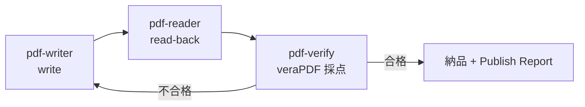

# pdf-publish — 納品パイプライン

PDF の生成・編集から納品までを品質ゲート付きで編成する Skill。pdf-writer で書き、pdf-reader で読み戻し、pdf-verify（veraPDF）で機械採点する **write → read-back → verify ループ**を回し、**Publish Report** 付きで納品する。

## 対応シナリオ

- PDF/UA 準拠（タグ付き）PDF の生成
- 電帳法対応: PDF/A-3b + 添付ファイル（`attach_file`）。PDF/A-4 を求められた場合は **`pdfa-4f`**（素の `pdfa-4` は添付自身が PDF/A であることを要求するため、CSV/XML の同梱と両立しない）
- フォームの PDF/UA 化（`tag_form_fields`）
- 品質保証付き一般納品

## 要点

- 宣言（`ensure_pdfa` / `ensure_tagged`）を書いたら必ず対応する flavour で `validate_conformance` を実行 — **測れないなら宣言を書かない**
- 判定は veraPDF のもの。「veraPDF が COMPLIANT と判定」と報告し「ISO 19005 準拠」とは書かない

<!-- TODO: Publish Report サンプル・ループ打ち切り条件（Phase 3） -->
