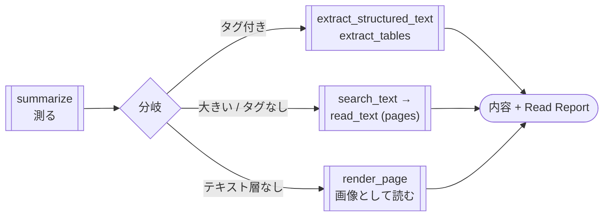

# pdf-read — 読み取りパイプライン

最頻の仕事 — **PDF から内容を取り出す** — を編成する Skill です。[pdf-trust](/ja/skills/pdf-trust) が「受け取った PDF を監査する」、[pdf-publish](/ja/skills/pdf-publish) が「送り出す PDF を保証する」のに対し、pdf-read は 3 本目の経路を担います。500 ページの文書から必要な章を取り出す、スキャンされたページを画像として読む — そして**読んだ範囲と読めなかった箇所**を **Read Report** で申告します。



## 中核原則

**空の抽出結果は「テキストが無い」の証拠ではありません。** ISO 32000-2 §9.10.1 は「表示はできるが Unicode に変換できない」状態を定義しており、pdf-reader-mcp v0.12.0 はそれをページごとに申告します: `extracted` / `no_text_layer`（スキャン — テキストは画素）/ `not_extractable`（Unicode への経路を持たないフォントがある。原因フォント名付き）/ `not_observed`（暗号化・読めない）。この Skill は本文より先にこの状態を読み、読めていないページの上で「文書に無い」とは結論しません。

## Phase 構成

| Phase | 内容 |
|---|---|
| 0 測る | `summarize`（JSON）: ページ数・タグ・暗号化・ページごとの抽出可能性・reader 自身の `next` 提案 |
| 1 分岐 | 暗号化 → 停止（reader は復号しない）/ 読めないページ → Phase 4 / タグ付き → Phase 2 / それ以外 → Phase 3 |
| 2 構造経路 | `extract_structured_text`（論理順・本物の見出し）・`extract_tables`（ページ跨ぎの表も 1 つ） |
| 3 絞り込み経路 | 50 ページ超は `search_text` で絞ってから、明示の pages で `read_text`。タグなし多段組は `split_columns`、帳票は `compact_whitespace` |
| 4 画像経路 | `render_page`（PDFium-WASM）でページを描画し、視覚で読む。Report には「ページ画像からの読み取り」と明記 |
| 5 Read Report | 読んだ範囲・使った経路・抽出可能性の集計・**読めなかった箇所とその理由**・切り詰めの有無 |

## Read Report

```markdown
## Read Report
- 対象: report.pdf（412 ページ）
- 読んだ範囲: 12-18, 301 / 経路: 絞り込み（search_text → read_text）
- テキスト抽出可能性: extracted 410 / no_text_layer 2（87, 88 ページ）
- 読めなかった箇所: 87-88 ページは画像のみ（render_page で読み取り。その旨明記）
- 切り詰め: なし
```

「読めなかった箇所」を既定で空欄にしません — 確認して本当に無かったときだけ「なし」と書きます。未確認の空欄は「確認して問題なし」と誤読されるためです。

## インストール

```sh
/plugin marketplace add shuji-bonji/claude-plugins
/plugin install pdf-reader-mcp@shuji-bonji   # 必須基盤 (v0.12.0+)
/plugin install pdf-read@shuji-bonji
```

`render_page` は reader の optionalDependencies `@hyzyla/pdfium`（PDFium の WebAssembly 版）を使います。未導入でも他のツールはすべて動き、Skill は該当ページを「未読」として、インストール方法とともに申告します。

リポジトリ: [shuji-bonji/pdf-read-skill](https://github.com/shuji-bonji/pdf-read-skill)

## やらないこと

- OCR — render + 視覚読み取りで代替し、その旨を Report に明記
- 真正性・改ざんの監査 → [pdf-trust](/ja/skills/pdf-trust)
- PDF の生成・編集 → [pdf-publish](/ja/skills/pdf-publish)
- URL 上の PDF への構造検査 — `read_url` はテキストのみ。先にダウンロードしてローカルパスで渡す
