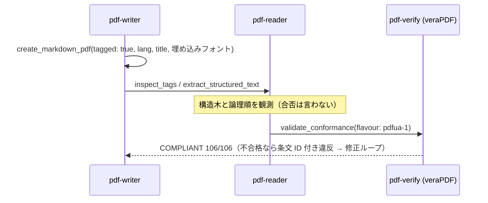

# アクセシビリティ (PDF/UA)

## シナリオ

スクリーンリーダーで読める PDF を**作る**（タグ付き生成 → 採点）、あるいは受け取った PDF が
読める構造か**測る**。PDF/UA-1（ISO 14289-1）は仕様コーパスに原文があるため、
違反は**条文を引いて**言い切れる（T1 — PDF/A との大きな違い）。

以下は **2026-08-11 の実測**（タグ付き請求書デモ = 通過側 / インターネット官報 = 不合格側）である。

## 登場 MCP / Skill

| 役者 | 役割 |
|---|---|
| [pdf-writer](/ja/mcp/pdf-writer) | `tagged: true` での生成・`tag_form_fields`・`ensure_tagged`（宣言のみ） |
| [pdf-verify](/ja/mcp/pdf-verify) | `validate_conformance(pdfua-1)` — veraPDF 委譲・条文 ID 付き違反 |
| [pdf-reader](/ja/mcp/pdf-reader) | `inspect_tags`（構造木）・`extract_structured_text`（論理順の本文） |
| [pdf-publish Skill](/ja/skills/pdf-publish) | 生成側の編成（`tagged` 指定時はゲート `pdfua-1` が既定） |

## シーケンス図

## プロンプト例

- 「このレポートをアクセシブルな PDF にして。検証まで」
- 「この PDF、スクリーンリーダーで読める？何が足りない？」
- 「このフォーム PDF を PDF/UA 準拠にして」（→ `tag_form_fields`）

## 実測例 — 両面

**作る側**（請求書デモ）: `tagged: true` + 埋め込みフォント + title + lang → 読み戻しで
H1×1・TH/TD の表構造を確認 → **veraPDF が PDF/UA-1 COMPLIANT（106/106）と判定**。

**測る側**（官報 2026-08-10 号）: **NOT COMPLIANT** — 106 検査中 10 規則違反。主要なもの:

| 条文（ISO 14289-1） | 違反 |
|---|---|
| 7.1-3 | タグ付けも Artifact 化もされていない実コンテンツ **236 件** |
| 7.1-11 | StructTreeRoot がない（構造木が存在しない） |
| 6.2-1 | MarkInfo/Marked がない |
| 7.21.7-1 | ToUnicode を欠くフォント 9 件 |

タグなしの実文書はここまで具体的に「何が読めないか」を条文 ID で列挙できる。

## 結果の読み方

- **PDF/UA-1 は T1** — 違反は「ISO 14289-1 7.1-3 が要求する」と条文を引いて断定できる
  （PDF/A の「veraPDF がこう判定した」より一段強い言い方が許される）
- native エンジンの違反には severity が付き、**error のみが非準拠を証明**する（warning は人手レビュー）
- `tagged: true` なら日本語が無くても**埋め込みフォントと title が必須**（標準 14 フォントは 7.21.4.1 で必ず違反）
- 機械検証が判定できるのは構造まで。**alt テキストの意味的な適切さ・読み順の自然さは人手レビュー**が残る
- `ensure_tagged` は宣言を書くだけ — 掛けたら必ず `pdfua-1` で測る
