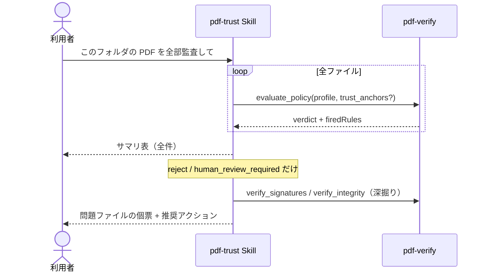

# 一括監査

## シナリオ

受領フォルダに溜まった PDF をまとめて監査し、**問題のあるものだけ**に人の目を割り当てます。
まず全件に `evaluate_policy` を回してトリアージし、reject / human_review_required だけを
深掘りします — 全件深掘りは時間と文脈の無駄遣いになります。

以下は **2026-09-04 の実測**です（pdf-verify-mcp v0.26.0。5 検体一括・4 値判定がすべて出た回）。

## 登場 MCP / Skill

| 役者 | 役割 |
|---|---|
| [pdf-trust Skill](/ja/skills/pdf-trust) | 一括の編成・サマリ表・個票は問題ファイルのみ |
| [pdf-verify](/ja/mcp/pdf-verify) | `evaluate_policy` を全件に適用（決定論的 = 再現可能） |

## シーケンス図



## プロンプト例

- 「`/受領/2026-08/` の PDF を全部受入監査して。請求書は financial で」
- 「取引先 A からの 30 通、CA 証明書はこれ。まとめて判定して」
- 「reject になったものだけ、何が壊れているか詳しく」

## 実測例 — 5 検体一括のサマリ

| 検体 | プロファイル | 判定 |
|---|---|---|
| `selfmade-pades-crl.pdf` + `selfmade-ca2.pem` | general | `trust_and_use`（発火ルールなし。失効 `good`、構造は B-LTA） |
| `kanpo-20260810-h01765-p1.pdf` | government | `use_with_caution` |
| `selfmade-pades-lta.pdf` + `selfmade-ca.pem` | general | `use_with_caution`（`POL-CAUTION-REVOCATION-UNKNOWN`。構造は B-T） |
| `publish-demo-invoice.pdf`（未署名） | contract | `human_review_required`（`POL-REVIEW-UNSIGNED-REQUIRED`） |
| `selfmade-tampered.pdf` | general | `reject`（`POL-REJECT-INVALID`。Sig1 と文書タイムスタンプがともに `invalid`） |

CRL 同梱検体は `selfmade-ca.pem` では `untrusted` のままです。`trust_and_use` になるのは `selfmade-ca2.pem` を渡したときです。

深掘りは 5 件中 2 件（review / reject）に絞れます。reject の facts では Sig1 と文書タイムスタンプの両方が `invalid` です。

::: details 呼び出し — evaluate_policy × 5
標本は `docs/specimens/`（呼び出すときは絶対パス）。`response_format`: `"json"`。

```jsonc
// trust_and_use
{ "file_path": "…/selfmade-pades-crl.pdf", "profile": "general",
  "trust_anchors": ["…/selfmade-ca2.pem"], "response_format": "json" }

// use_with_caution（官報）
{ "file_path": "…/kanpo-20260810-h01765-p1.pdf", "profile": "government", "response_format": "json" }

// use_with_caution（CRL なし）
{ "file_path": "…/selfmade-pades-lta.pdf", "profile": "general",
  "trust_anchors": ["…/selfmade-ca.pem"], "response_format": "json" }

// human_review_required
{ "file_path": "…/publish-demo-invoice.pdf", "profile": "contract", "response_format": "json" }

// reject
{ "file_path": "…/selfmade-tampered.pdf", "profile": "general", "response_format": "json" }
```

返る `verdict` は上の表のとおりです。同じファイルと、同じ `profile`（とアンカー）からは、いつも同じ判定です。
:::

## 結果の読み方

- **同じファイル・同じプロファイルなら常に同じ判定**です。モデルにも実行日にも依りません —
  監査の再現性はルールエンジン側が担保します
- サマリ表の判定だけで仕分けし、**個票は問題ファイルにのみ付けます**（レポートの読み手も楽になります）
- プロファイルはファイル種別ごとに変えてかまいません（請求書 = financial・契約書 = contract）
- 全件 `use_with_caution` に寄るときは、trust_anchors 未指定が原因のことが多いです —
  CA 証明書を一度入手すれば全件が identity 評価付きに変わります
