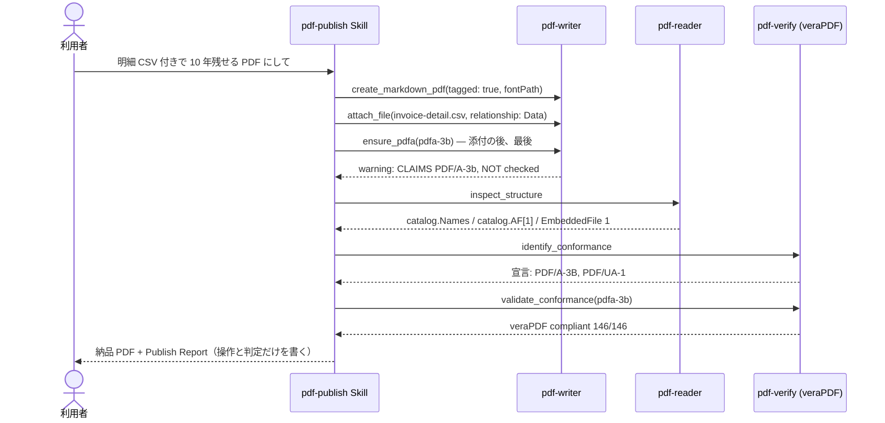

# 電帳法を意識した請求書

::: warning このページが扱う範囲
ここで行うのは PDF の形式操作（添付・PDF/A-3b の器付け・veraPDF による採点）だけです。
電子帳簿保存法の保存要件を満たすかどうかは診断しません。「電帳法に対応した」とも書きません。
法令の要件は [houki 系 MCP](/ja/guide/agents) の原文から引き、判断は人が行います。
:::

## シナリオ

「この請求書を、明細 CSV 付きで 10 年残せる PDF にして。検証まで通して納品して」という依頼を受けます。
pdf-publish Skill が write → read-back → verify の順に回し、明細 CSV を `attach_file` で同梱し、`ensure_pdfa` を最後に掛け、
veraPDF の判定を Publish Report に書きます。「10 年残せる」を PAdES の LTV（署名の長期検証）にまで広げません。署名はしません。

以下は **2026-09-15 の実測**です（pdf-writer-mcp v0.21.0 / pdf-verify-mcp v0.26.0 / veraPDF 1.30.0。ホストは Grok Build 1.0.30。
検体は架空の請求書。登録番号は `T0000000000000` で、明らかに偽の値です）。

## 登場 MCP / Skill

| 役者 | 役割 |
|---|---|
| [pdf-publish Skill](/ja/skills/pdf-publish) | write → read-back → verify の編成。Publish Report |
| [pdf-writer](/ja/mcp/pdf-writer) | `create_markdown_pdf`（tagged）→ `attach_file`（CSV、relationship: Data）→ `ensure_pdfa`（pdfa-3b、**必ず最後**） |
| [pdf-reader](/ja/mcp/pdf-reader) | `inspect_structure` で catalog の `AF` / `Names` を読み戻す |
| [pdf-verify](/ja/mcp/pdf-verify) | `identify_conformance`（宣言）→ `validate_conformance`（veraPDF の採点） |

## シーケンス図



## プロンプト例

- 「この請求書を、明細 CSV 付きで 10 年残せる PDF にして。検証まで通して納品して。署名はしない」
- 「添付付きの PDF/A-3b で。veraPDF の結果も付けて」
- 「添付が catalog に本当に入っているか、読み戻して確かめて」

## 実測例 — ダミー請求書 + 明細 CSV

| ステップ | ツール | 実測 |
|---|---|---|
| 1 | `create_markdown_pdf`（tagged、fontPath 指定） | pageCount 1 |
| 2 | `attach_file`（`relationship: "Data"`） | `text/csv`、151 バイト |
| 3 | `ensure_pdfa`（pdfa-3b、最後） | warning: **CLAIMS PDF/A-3b … conformance was NOT checked**。flavour は 3b のまま（1b に落ちていない） |
| 4 | `inspect_structure` | catalog に `Names`（dict）、`AF`（Array[1]）。`EmbeddedFile` 1、`Filespec` 1 |
| 5 | `identify_conformance` | 宣言は PDF/A part 3 conformance B、PDF/UA part 1（宣言であって合否ではない） |
| 6 | `validate_conformance`（pdfa-3b） | engine `verapdf`、`compliant: true`、146/146 |
| — | `detect_pades_level` | **未実施**。署名が無いので呼ばない。「10 年残せる」を LTV に伸ばしていない |

::: details 呼び出し — attach_file / ensure_pdfa / validate_conformance
```jsonc
{ "inputPath": "/absolute/path/to/denshi-step1.pdf", "attachmentPath": "/absolute/path/to/invoice-detail.csv",
  "relationship": "Data", "outputPath": "/absolute/path/to/denshi-attached.pdf" }
```

```jsonc
{ "inputPath": "/absolute/path/to/denshi-attached.pdf", "flavour": "pdfa-3b",
  "outputPath": "/absolute/path/to/denshi-invoice.pdf" }
```

```jsonc
{ "file_path": "/absolute/path/to/denshi-invoice.pdf", "flavour": "pdfa-3b", "response_format": "json" }
```

```jsonc
{ "engine": "verapdf", "flavour": "PDF/A-3b", "compliant": true,
  "checkedRules": 146, "passedRules": 146, "failedRules": 0 }
```
:::

**Publish Report の結語**（引用）: CSV を添付し、veraPDF が PDF/A-3b を COMPLIANT と判定した（146/146）。電帳法に準拠した、とは書かない。

## 結果の読み方

- **書いてよいのは、行った操作と veraPDF の判定だけです。** 「CSV を Data として添付した」「veraPDF が PDF/A-3b を COMPLIANT と判定した（146/146）」と書き、
  「電帳法対応済み」「ISO 19005 準拠」とは書きません
- `ensure_pdfa` の warning（CLAIMS … NOT checked）は省略しません。ラベルを書いたことと、採点に通ったことは別です（→ [長期保存 (PDF/A)](/ja/use-cases/pdfa-archive)）
- 添付は `inspect_structure` で **catalog のフィールド名**（`Names`、`AF`、`EmbeddedFile`）で確かめます。writer が成功を返したことは、添付が入った証拠ではありません
- 「10 年残せる」という依頼文から、署名や LTV の作業を勝手に足しません。署名が無いファイルでは `detect_pades_level` は呼びません
- 添付があるときの PDF/A-4 は **`pdfa-4f`** です。素の `pdfa-4` は添付自身が PDF/A であることを要求します

評価キットと報告書の全文: [eval/grok-eval/reports/UC08.md](https://github.com/shuji-bonji/pdf-agent-stack/blob/main/eval/grok-eval/reports/UC08.md)
