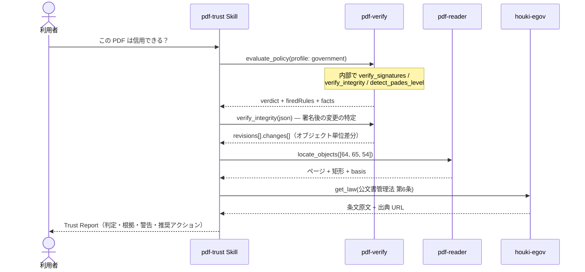

# 受入監査

## シナリオ

取引先・行政・患者から受け取った PDF（契約書・請求書・公文書・診療文書）を業務に載せる前に、
「本物か・改ざんされていないか・信用してよいか」を判定します。判定は LLM の印象ではなく、
pdf-verify の決定論的ルールエンジン（`evaluate_policy`）が下します — 同じファイル・同じプロファイルなら
常に同じ判定になります。

以下の実行例はすべて **2026-09-04 の実測**です（pdf-verify-mcp v0.26.0 / pdf-reader-mcp v0.15.0。インターネット官報 2026-08-10 号本紙ほか、`docs/specimens/` の検体）。

## 登場 MCP / Skill

| 役者 | 役割 |
|---|---|
| [pdf-trust Skill](/ja/skills/pdf-trust) | 手順の編成・firedRules の解説・推奨アクション。**判定はしない** |
| [pdf-verify](/ja/mcp/pdf-verify)（必須） | `evaluate_policy`（4 値判定）・署名検証・改ざん検知・PAdES 観測 |
| [pdf-reader](/ja/mcp/pdf-reader)（任意） | `locate_objects` — 変更されたオブジェクトを「ページ + 矩形」に落とす |
| houki 系 MCP（任意） | プロファイルが指定する法令根拠の原文取得 |

## シーケンス図



## プロンプト例

- 「この PDF は信用できる？受入監査して: `/path/to/kanpo-20260810.pdf`」
- 「取引先から届いた契約書を監査して。CA 証明書は `/path/to/partner-ca.pem`」（→ profile: contract + trust_anchors）
- 「署名のあと誰かが何か書き足していないか調べて」（→ Phase 2.5 の深掘り）

## 実測例 — インターネット官報（profile: government）

`evaluate_policy` の判定は **use_with_caution** です。発火したのは 2 ルールです。

| 発火ルール | 意味 |
|---|---|
| POL-CAUTION-TRUST-NOT-EVALUATED | 暗号学的完全性は確認。**署名者の身元は未評価**（trust_anchors 未指定） |
| POL-CAUTION-REVOCATION-UNKNOWN | 失効情報が文書内に無く「失効していない」とは言えない |

facts: `Signature1`（内閣府）= **valid** / `e-timing EVIDENCE3161_1`（文書タイムスタンプ）= **valid** / PAdES 構造 = B-B（T3 の観測）。政府プロファイル向けの PDF/A 検査は「未実施」と記録されます（暗号化のため veraPDF に渡せない）。

`verify_integrity`: ファイル 139,503 バイト、増分 1 回。`Signature1` の署名済み範囲のあとに **+9,938 バイト**。最後の署名（文書タイムスタンプ）はファイル全体を覆うので、`objectChangesAfterLastSignature` は空です。+9,938 バイト側の変更は次です。

| オブジェクト | 変更 | 役割 |
|---|---|---|
| 64 | added | form field widget（`locate_objects`: p.1、`annotation-rect` が 0×0） |
| 65 | added | **DocTimeStamp**（ページ上の位置は無い） |
| 54 | modified | AcroForm 辞書（ページ上の位置は無い） |

署名後の変更は **文書タイムスタンプの付与そのもの**です。増分更新は PDF として認められた書き方です（ISO 32000-2 §7.5.6）。この表は「見るべき場所」であって、改ざんの証明ではありません。

::: details 呼び出し — evaluate_policy（government、アンカー無し）
- 実測: pdf-verify-mcp v0.26.0
- 標本: `docs/specimens/kanpo-20260810-h01765-p1.pdf`（呼び出すときは絶対パス）
- `profile`: `"government"`
- `response_format`: `"json"`

**パラメータ**

```jsonc
{
  "file_path": "/absolute/path/to/docs/specimens/kanpo-20260810-h01765-p1.pdf",
  "profile": "government",
  "response_format": "json"
}
```

**返る JSON**（`scope` と `notes` は省略）

```jsonc
{
  "profile": "government",
  "verdict": "use_with_caution",
  "firedRules": [
    { "ruleId": "POL-CAUTION-TRUST-NOT-EVALUATED", "verdict": "use_with_caution" },
    { "ruleId": "POL-CAUTION-REVOCATION-UNKNOWN", "verdict": "use_with_caution" }
  ],
  "facts": {
    "signatureCount": 1,
    "signatures": [
      { "fieldName": "Signature1", "verdict": "valid", "trust": "not_evaluated", "revocation": "unknown" },
      { "fieldName": "e-timing EVIDENCE3161_1", "verdict": "valid", "isDocumentTimestamp": true }
    ],
    "padesLevels": [{ "fieldName": "Signature1", "level": "B-B", "normativeBasis": "T3" }]
  }
}
```
:::

::: details 呼び出し — verify_integrity と locate_objects
`verify_integrity` の `revisions[1].changes` からオブジェクト番号を取り、`locate_objects` に渡します。

```jsonc
{
  "file_path": "/absolute/path/to/docs/specimens/kanpo-20260810-h01765-p1.pdf",
  "object_numbers": [64, 65, 54],
  "response_format": "json"
}
```

```jsonc
{
  "objects": [
    { "objectNumber": 64, "found": true, "type": "Annot", "subtype": "Widget",
      "locations": [{ "page": 1, "rect": { "x1": 0, "y1": 0, "x2": 0, "y2": 0 }, "basis": "annotation-rect" }] },
    { "objectNumber": 65, "found": true, "type": "DocTimeStamp", "locations": [],
      "reason": "No page references this object, so it has no place on any page." },
    { "objectNumber": 54, "found": true, "locations": [],
      "reason": "No page references this object, so it has no place on any page." }
  ],
  "isEncrypted": true
}
```

暗号化文書なので、座標と型は取れますがフィールド名は `null` です（ISO 32000-1 §7.6.2）。
:::

## 結果の読み方

- **判定はコードが下します。** `use_with_caution` は「疑わしい」ではありません — 完全性は確認済みで、
  身元評価と失効確認が未達というだけです。CA 証明書を trust_anchors で渡し、失効確認が good になれば
  `trust_and_use` に上がります（[実測: CRL の有無だけで判定が分かれた対検体](/ja/skills/pdf-trust)）
- **「無い」と「分からない」を混ぜないでください。** revocation: unknown は「失効していない」ではありません。
  PDF/A が測れなかった検査は「未実施」と明記されます — passed ではありません
- PAdES レベルは**構造の観測**です（T3）。「B-B に一致する」とは言えますが「PAdES 準拠」とは言いません
- 法令根拠は houki 系 MCP の**原文**から引きます（記憶からの条文引用はしません）
