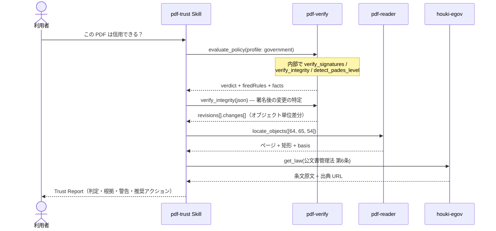

# 受入監査

## シナリオ

取引先・行政・患者から受け取った PDF（契約書・請求書・公文書・診療文書）を業務に載せる前に、
「本物か・改ざんされていないか・信用してよいか」を判定する。判定は LLM の印象ではなく、
pdf-verify の決定論的ルールエンジン（`evaluate_policy`）が下す — 同じファイル・同じプロファイルなら
常に同じ判定になる。

以下の実行例はすべて **2026-08-11 の実測**（インターネット官報 2026-08-10 号本紙ほか実在検体）である。

## 登場 MCP / Skill

| 役者 | 役割 |
|---|---|
| [pdf-trust Skill](/ja/skills/pdf-trust) | 手順の編成・firedRules の解説・推奨アクション。**判定はしない** |
| [pdf-verify](/ja/mcp/pdf-verify)（必須） | `evaluate_policy`（4 値判定）・署名検証・改ざん検知・PAdES 観測 |
| [pdf-reader](/ja/mcp/pdf-reader)（任意） | `locate_objects` — 変更されたオブジェクトを「ページ + 矩形」に落とす |
| houki 系 MCP（任意） | プロファイルが指定する法令根拠の原文取得 |

## シーケンス図

## プロンプト例

- 「この PDF は信用できる？受入監査して: `/path/to/kanpo-20260810.pdf`」
- 「取引先から届いた契約書を監査して。CA 証明書は `/path/to/partner-ca.pem`」（→ profile: contract + trust_anchors）
- 「署名のあと誰かが何か書き足していないか調べて」（→ Phase 2.5 の深掘り）

## 実測例 — インターネット官報（profile: government）

判定は **use_with_caution**。発火は 2 ルール:

| 発火ルール | 意味 |
|---|---|
| POL-CAUTION-TRUST-NOT-EVALUATED | 暗号学的完全性は確認。**署名者の身元は未評価**（trust_anchors 未指定） |
| POL-CAUTION-REVOCATION-UNKNOWN | 失効情報が文書内に無く「失効していない」とは言えない |

facts: 内閣府署名 = **valid**（SECOM チェーン・SHA-256・digest 一致）/ AMANO DocTimeStamp = **valid** / PAdES 構造 = B-B。

さらに Phase 2.5 が「署名後の +9,938 バイト」の正体を特定する:

| オブジェクト | 変更 | 役割 |
|---|---|---|
| 64 | added | form field widget（不可視・p.1） |
| 65 | added | **/DocTimeStamp 署名辞書** |
| 54 | modified | AcroForm 辞書 |

→ 署名後の変更は **AMANO タイムスタンプの付与そのもの**。増分更新は合法（ISO 32000-2 §7.5.6）であり、
この表は「見るべき場所」であって改ざんの証明ではない。

## 結果の読み方

- **判定はコードが下す。** `use_with_caution` は「疑わしい」ではない — 完全性は確認済みで、
  身元評価と失効確認が未達というだけ。CA 証明書を trust_anchors で渡し、失効確認が good になれば
  `trust_and_use` に上がる（[実測: CRL の有無だけで判定が分かれた対検体](/ja/skills/pdf-trust)）
- **「無い」と「分からない」を混ぜない。** revocation: unknown は「失効していない」ではない。
  PDF/A が測れなかった検査は「未実施」と明記される — passed ではない
- PAdES レベルは**構造の観測**（T3）。「B-B に一致する」とは言えるが「PAdES 準拠」とは言わない
- 法令根拠は houki 系 MCP の**原文**から引く（記憶からの条文引用はしない）
