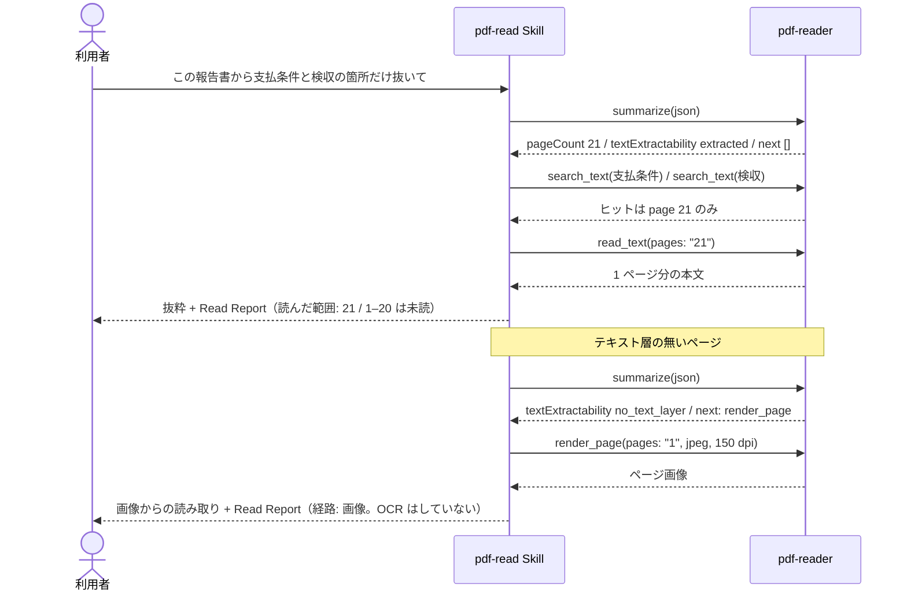

# 大きい PDF・読めない PDF

## シナリオ

数十ページの報告書から「支払条件」と「検収」に関する箇所だけを取り出します。全文をコンテキストに流し込まず、
まず `summarize` で文書の性質を測り、`search_text` でヒットしたページだけを `read_text` で読みます。
テキスト層の無いスキャン相当のページは、空の抽出結果を「テキストが無い」とはせず、`render_page` の画像から読みます。
OCR はしません。読んだ範囲と読めなかった箇所は **Read Report** で申告します。

以下は **2026-09-16 の実測**です（pdf-reader-mcp v0.15.1 / pdf-read Skill v0.2.2。ホストは Grok Build 1.0.30。
検体は 21 ページの自作報告書と、画像 XObject だけのスキャン相当 PDF）。

## 登場 MCP / Skill

| 役者 | 役割 |
|---|---|
| [pdf-read Skill](/ja/skills/pdf-read) | 測る → 分岐 → 経路の選択 → Read Report。空の `next` でも箇所抽出なら `search_text` に入る |
| [pdf-reader](/ja/mcp/pdf-reader) | `summarize`・`search_text`・`read_text`（pages 指定）・`render_page` |

## シーケンス図



## プロンプト例

- 「この報告書から支払条件と検収に関する箇所だけ抜いて。読めないページは理由を書いて」
- 「500 ページあるから、必要なところだけ読んで。全文は流し込まないで」
- 「スキャンした契約書を読んで。OCR はしないで」

## 実測例 — 21 ページの報告書（絞り込み経路）

`summarize` は `pageCount: 21`、`isTagged: false`、`isEncrypted: false`、`textExtractability: "extracted"`、`unreadablePages: []` を返しました。
`next` は空でした（reader が `search_text` を案内するのは 50 ページ超のときです）。Skill v0.2.2 は、空の `next` でも箇所抽出の依頼なら `search_text` に入ります。

| `search_text` の query | totalMatches | ヒットしたページ |
|---|---|---|
| 支払条件 | 2 | 21 |
| 検収 | 3 | 21 |
| 再委託の禁止 | 2 | 21 |

`read_text` は `pages: "21"` の 1 ページだけ呼びました。1〜20 ページは**読んでいません**（読めないのではありません）。

::: details 呼び出し — summarize / search_text / read_text
```jsonc
{ "file_path": "/absolute/path/to/long-report.pdf", "response_format": "json" }
```

```jsonc
{ "pageCount": 21, "isTagged": false, "isEncrypted": false,
  "textExtractability": "extracted", "unreadablePages": [], "next": [] }
```

```jsonc
{ "file_path": "/absolute/path/to/long-report.pdf", "query": "検収", "response_format": "json" }
```

```jsonc
{ "totalMatches": 3, "pages": [21], "truncated": false }
```

```jsonc
{ "file_path": "/absolute/path/to/long-report.pdf", "pages": "21", "compact_whitespace": true }
```
:::

**Read Report**（Skill が返した申告）:

- 対象: long-report.pdf（21 ページ）
- 読んだ範囲: 21（search_text のヒット。1–20 はフィラーで未読） / 経路: 絞り込み
- テキスト抽出可能性: extracted（unreadablePages 空）
- 読めなかった箇所: なし
- 切り詰め: なし（search_text は truncated=false）

## 実測例 — テキスト層の無いページ（画像経路）

`summarize` は `textExtractability: "no_text_layer"`、`hasText: false`、`imageCount: 1`、`textShowingOperators: 0`、`imageOperators: 1` を返し、`next` に `render_page` を挙げました。
`read_text` の `text` は空文字で、`extractability.state` は `no_text_layer` です。空文字は抽出の失敗ではなく、テキスト層が無いことの申告です。

`render_page`（pages "1"、jpeg、150 dpi）は 136,247 バイトの画像を返し、条項は画素から読めました。OCR はしていません。

::: details 呼び出し — render_page
```jsonc
{ "file_path": "/absolute/path/to/scan-no-text-layer.pdf", "pages": "1", "format": "jpeg", "dpi": 150 }
```
`pages` は必須です。画像はページ単位で返ります。
:::

**Read Report**:

- 対象: scan-no-text-layer.pdf（1 ページ）
- 読んだ範囲: 1 / 経路: 画像（render_page の視覚読み）
- テキスト抽出可能性: **no_text_layer**（read_text の text は空。これを「テキストが無い」とはしない）
- 注: OCR はしていない。render_page のページ画像からの読み取りである

## 結果の読み方

- **`summarize` を先に呼びます。** ページ数・タグ・暗号化・ページごとの抽出可能性が分かってから経路を選びます
- **空の抽出結果は「テキストが無い」の証拠ではありません。** `extractability.state` が `no_text_layer` なら画素にだけ本文があり、
  `not_extractable` なら表示はできるが Unicode に変換できないフォントがあります（ISO 32000-2 §9.10.1）
- **「読んでいない」と「読めない」を分けて申告します。** 上の 21 ページ検体では、1〜20 ページは読んでいないだけです
- `render_page` からの読み取りは OCR ではありません。Read Report には「画像経路」と書き、OCR したとは書きません
- reader の `next` が `search_text` を案内するのは 50 ページ超のときです。それ未満でも、箇所抽出の依頼なら Skill が `search_text` に入ります

評価キットと報告書の全文: [eval/hosts/grok-build/reports/UC07.md](https://github.com/shuji-bonji/pdf-agent-stack/blob/main/eval/hosts/grok-build/reports/UC07.md)
