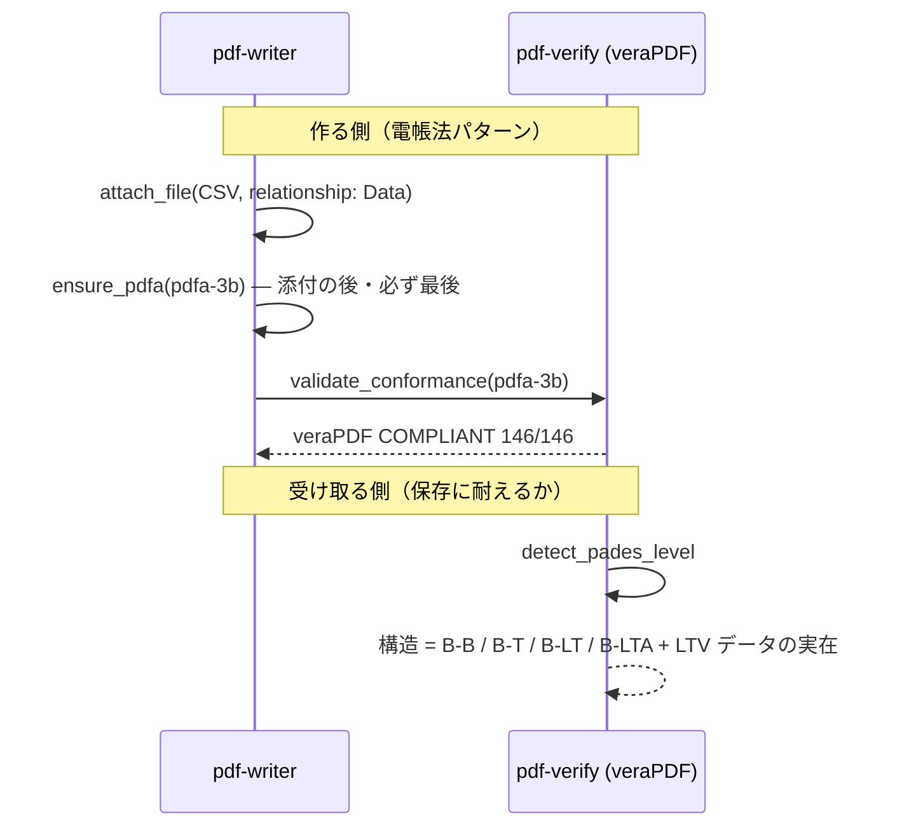

# 長期保存 (PDF/A)

## シナリオ

10 年後にも「開ける・読める・検証できる」PDF を残します。電帳法（機械可読データの同梱）や
公文書の保存文脈で、**作る側**は PDF/A の器に載せて veraPDF で採点し、**受け取る側**は
その文書が長期保存に耐える構造か（LTV データの実在）を確認します。

以下は **2026-09-04 の実測**です（pdf-verify-mcp v0.26.0 / veraPDF 1.30.0。請求書デモ・インターネット官報・自作検体）。

## 登場 MCP / Skill

| 役者 | 役割 |
|---|---|
| [pdf-writer](/ja/mcp/pdf-writer) | `attach_file`（機械可読データ同梱）→ `ensure_pdfa`（器付け・**ラベルを書くだけ**） |
| [pdf-verify](/ja/mcp/pdf-verify) | `validate_conformance`（veraPDF 委譲）・`detect_pades_level`（LTV 構造の観測） |
| [pdf-trust](/ja/skills/pdf-trust) / [pdf-publish](/ja/skills/pdf-publish) | 受入側 / 送り出し側の編成 |

## シーケンス図



## プロンプト例

- 「この請求書、CSV ごと電帳法対応の保存形式にして」（→ attach_file + ensure_pdfa(pdfa-3b)）
- 「この契約書、10 年保存に耐える？署名は失効後も検証できる形？」（→ detect_pades_level + DSS 確認）
- 「PDF/A-4 で」（→ 添付があるなら **`pdfa-4f`**。素の `pdfa-4` は添付自身が PDF/A であることを要求する）

## 実測例

**作る側**（`publish-demo-invoice.pdf`）: catalog に Names / AF / OutputIntents あり。**veraPDF 1.30.0 が PDF/A-3b COMPLIANT（146/146）と判定**しました。同じファイルの PDF/UA-1 も 106/106 です。

**受け取る側**（`detect_pades_level`、3 検体）:

| 検体 | 構造の観測 | 根拠 |
|---|---|---|
| 官報 2026-08-10 号 | **B-B** | 署名 TS なし・DSS なし・DocTS あり |
| `selfmade-pades-lta.pdf`（CRL なし） | **B-T** | DSS はあるが `revocationDataCoversSigner: false`（dssCrlCount 0） |
| `selfmade-pades-crl.pdf`（CRL を DSS に同梱） | **B-LTA** | `revocationDataCoversSigner: true`（dssCrlCount 1） |

`detect_pades_level` は DSS の失効データが**署名者証明書を実際に覆っているか**まで見ます。覆っていなければ B-T 止まりです。これは T3 の観測であって、「PAdES に準拠」ではありません。

::: details 呼び出し — validate_conformance と detect_pades_level
- 実測: pdf-verify-mcp v0.26.0、veraPDF 1.30.0

```jsonc
{
  "file_path": "/absolute/path/to/docs/specimens/publish-demo-invoice.pdf",
  "flavour": "pdfa-3b",
  "response_format": "json"
}
```

```jsonc
{
  "engine": "verapdf",
  "flavour": "PDF/A-3b",
  "compliant": true,
  "checkedRules": 146,
  "passedRules": 146,
  "failedRules": 0
}
```

```jsonc
{
  "file_path": "/absolute/path/to/docs/specimens/selfmade-pades-crl.pdf",
  "response_format": "json"
}
```

```jsonc
{
  "levels": [
    {
      "fieldName": "Sig1",
      "level": "B-LTA",
      "normativeBasis": "T3",
      "evidence": { "hasSignatureTimestamp": true, "hasDss": true, "hasDocumentTimestamp": true },
      "ltv": { "dssCrlCount": 1, "revocationDataCoversSigner": true }
    }
  ]
}
```
:::

## 結果の読み方

- **PDF/A の判定者は veraPDF**です（T2）。「veraPDF が COMPLIANT と判定（146/146）」と書き、
  「ISO 19005 準拠」とは書きません
- **PAdES レベルは構造の観測**です（T3）。「構造が B-LTA に一致する」と書き、「B-LTA 準拠」とは書きません
- `ensure_pdfa` は**ラベルを書く道具**であって、規格どおりにさせる道具ではありません。フォント未埋め込み・暗号化・
  JavaScript は直りません — 非適合の文書に掛ければ「自分について嘘をつくファイル」ができてしまいます
- 暗号化 PDF は veraPDF が PDF/A を採点できないことがあります（官報で実測）。その検査は「未実施」と
  記録されます — passed ではありません
