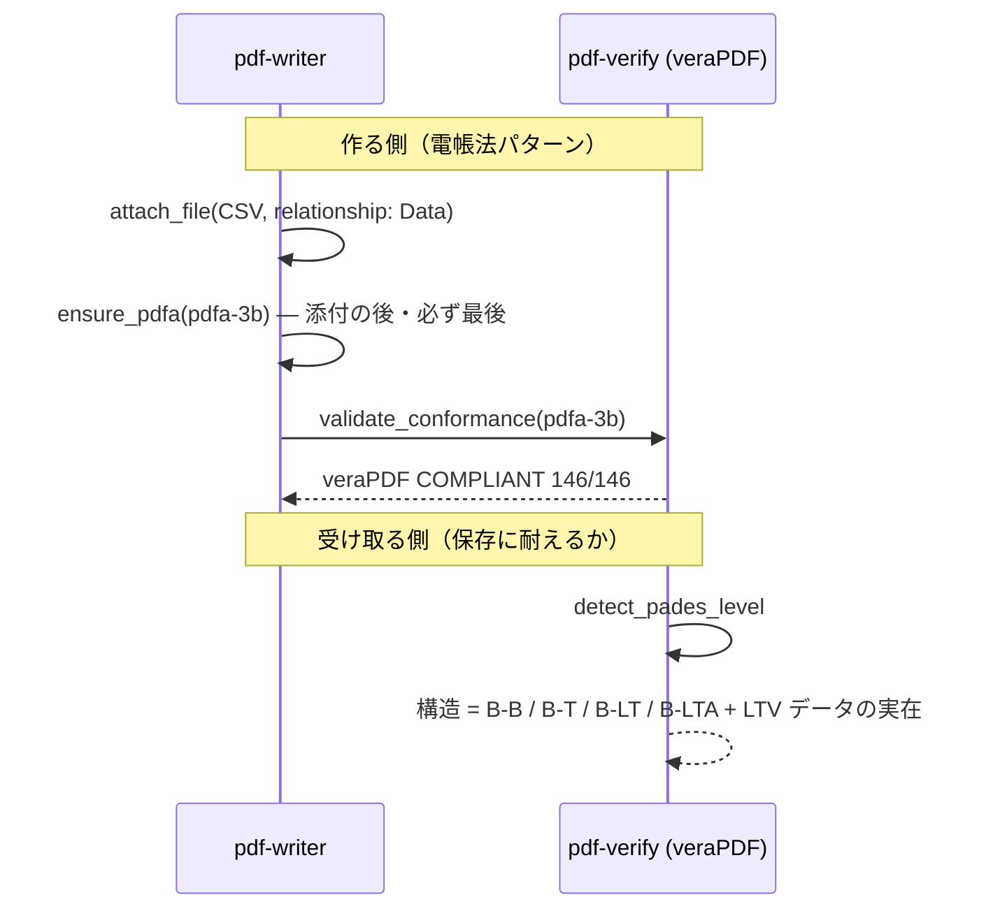

# 長期保存 (PDF/A)

## シナリオ

10 年後にも「開ける・読める・検証できる」PDF を残す。電帳法（機械可読データの同梱）や
公文書の保存文脈で、**作る側**は PDF/A の器に載せて veraPDF で採点し、**受け取る側**は
その文書が長期保存に耐える構造か（LTV データの実在）を確認する。

以下は **2026-08-11 の実測**（請求書デモ・インターネット官報・自作 known-good 検体）である。

## 登場 MCP / Skill

| 役者 | 役割 |
|---|---|
| [pdf-writer](/ja/mcp/pdf-writer) | `attach_file`（機械可読データ同梱）→ `ensure_pdfa`（器付け・**宣言を書くだけ**） |
| [pdf-verify](/ja/mcp/pdf-verify) | `validate_conformance`（veraPDF 委譲）・`detect_pades_level`（LTV 構造の観測） |
| [pdf-trust](/ja/skills/pdf-trust) / [pdf-publish](/ja/skills/pdf-publish) | 受入側 / 送り出し側の編成 |

## シーケンス図

## プロンプト例

- 「この請求書、CSV ごと電帳法対応の保存形式にして」（→ attach_file + ensure_pdfa(pdfa-3b)）
- 「この契約書、10 年保存に耐える？署名は失効後も検証できる形？」（→ detect_pades_level + DSS 確認）
- 「PDF/A-4 で」（→ 添付があるなら **`pdfa-4f`**。素の `pdfa-4` は添付自身が PDF/A であることを要求する）

## 実測例

**作る側**（請求書デモ）: CSV 添付 → `ensure_pdfa(pdfa-3b)` → **veraPDF が COMPLIANT（146/146）と判定**。
`ensure_pdfa` は「宣言を書いただけで適合は未検査」という warning を必ず返す — 測らずに納品しない。

**受け取る側**（署名済み文書の保存性・3 検体の対比）:

| 検体 | 構造の観測 | 意味 |
|---|---|---|
| 官報 2026-08-10 号 | **B-B**（署名 TS なし・DSS なし・DocTS あり） | 証明書の失効・期限後に**検証不能になるリスク**。入手経路の記録で補強 |
| 自作検体（CRL なし） | B-T | 失効確認は文書の外に依存したまま |
| 自作検体（**CRL を DSS に同梱**） | **B-LTA** | 検証材料が文書内で完結 — 差分は CRL の有無だけ |

`detect_pades_level` は DSS の失効情報が**署名者を実際にカバーしているか**まで見る —
「宣言だけの B-LT」は B-T に切り詰められる。

## 結果の読み方

- **PDF/A の判定者は veraPDF**（T2）。「veraPDF が COMPLIANT と判定（146/146）」と書き、
  「ISO 19005 準拠」とは書かない
- **PAdES レベルは構造の観測**（T3）。「構造が B-LTA に一致する」と書き、「B-LTA 準拠」とは書かない
- `ensure_pdfa` は**宣言を書く道具**であって適合させる道具ではない。フォント未埋め込み・暗号化・
  JavaScript は直らない — 非適合の文書に掛ければ「自分について嘘をつくファイル」ができる
- 暗号化 PDF は veraPDF が PDF/A を採点できないことがある（官報で実測）。その検査は「未実施」と
  記録される — passed ではない
