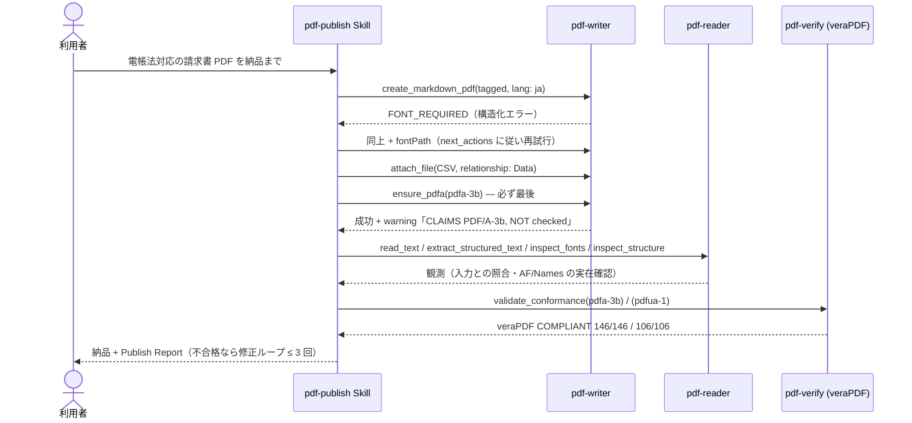

# 納品パイプライン

## シナリオ

「PDF を作って納品する」を、**作りっぱなしにしません**。pdf-writer で書き、pdf-reader で読み戻して
意図どおりかを観測し、pdf-verify（veraPDF）で機械採点してから納品します。合否は verify のみが下し、
writer の正常終了は「要求どおり出力された」の証拠にしません。

書き込み列（`FONT_REQUIRED` → fontPath 再試行）は **2026-08-11** の Publish Report です。成果物 `publish-demo-invoice.pdf` の読み戻しとゲートは **2026-09-04** に取り直しました（pdf-writer-mcp v0.21.0 / pdf-reader-mcp v0.15.0 / pdf-verify-mcp v0.26.0 / veraPDF 1.30.0）。

## 登場 MCP / Skill

| 役者 | 役割 |
|---|---|
| [pdf-publish Skill](/ja/skills/pdf-publish) | 手順の編成・warnings の転記・Publish Report |
| [pdf-writer](/ja/mcp/pdf-writer)（必須） | 生成・添付・器付け（`ensure_pdfa`） |
| [pdf-reader](/ja/mcp/pdf-reader)（推奨） | 読み戻し観測（合否は言わない） |
| [pdf-verify](/ja/mcp/pdf-verify)（conformance 水準で必須） | `validate_conformance`（veraPDF 委譲） |

## シーケンス図



## プロンプト例

- 「この請求書データを電帳法対応の PDF にして。明細の CSV も同梱、検証まで通して納品して」
- 「このレポートをアクセシブルな PDF（PDF/UA）で。品質保証付きで」
- 「下書きでいいから PDF に」（→ 水準 `none`。ゲートなしと明記される）

## 実測例 — 請求書デモの Publish Report 要旨

| Phase | 結果 |
|---|---|
| 生成（2026-08-11） | `FONT_REQUIRED` → 構造化エラーの `next_actions` に従い fontPath 指定で復帰。attach（Data）→ ensure_pdfa（最後） |
| 読み戻し（2026-09-04） | `inspect_tags`: タグ付き、H1×1、TH 5 / TD 15 / TR 4。catalog に StructTreeRoot・MarkInfo・Lang・Names・AF・OutputIntents |
| 品質ゲート（2026-09-04） | **veraPDF 1.30.0 が PDF/A-3b COMPLIANT（146/146）・PDF/UA-1 COMPLIANT（106/106）と判定** |
| 修正ループ | 0 回 |

::: details 呼び出し — 成果物のゲート（取り直し）
- 実測: pdf-verify-mcp v0.26.0、veraPDF 1.30.0
- 標本: `docs/specimens/publish-demo-invoice.pdf`

```jsonc
{
  "file_path": "/absolute/path/to/docs/specimens/publish-demo-invoice.pdf",
  "flavour": "pdfa-3b",
  "response_format": "json"
}
```

```jsonc
{
  "engine": "verapdf",
  "flavour": "PDF/A-3b",
  "compliant": true,
  "checkedRules": 146,
  "passedRules": 146,
  "failedRules": 0
}
```

`flavour: "pdfua-1"` では `checkedRules` / `passedRules` が 106、`compliant: true` です。
:::

`ensure_pdfa` は成功時にも必ず warning を返します（「CLAIMS … NOT checked」）。これは設計であり、
**ラベルを書いた瞬間に検証が省略不能になる**ことを機械側が言い続けています。生成列そのものは 2026-08-11 のログのままです（日本語フォントの `.otf` がこの環境に無く、書き込みは再実行していません）。

## 結果の読み方

- 合否の言い方は規範の層で変わります: PDF/A は「**veraPDF が COMPLIANT と判定**」（T2 — ISO 19005 準拠とは書きません）、
  PDF/UA-1 は ISO 14289-1 の条文を引けます（T1）
- `engine: native` の `compliant: null` は「検査サブセットで違反なし」であって適合ではありません —
  conformance 水準の判定は保留し veraPDF を入れてください
- 機械検証は alt テキストや読み順の**意味的**な適切さまでは判定できません。人手レビューの残る範囲を
  Report に明記してください
- 修正ループは上限 3 回・同じ違反が 2 回続いたら即人手へ（[打ち切り条件](/ja/skills/pdf-publish#ループ打ち切り条件)）
