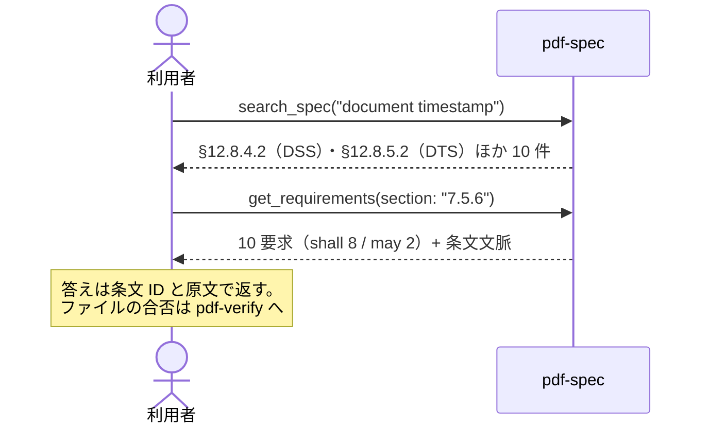

# 仕様調査

## シナリオ

「増分更新って仕様上なにが要求される？」「DocTimeStamp はどこで定義されている？」——
実装や監査の判断を、記憶や検索エンジンではなく **ISO 32000 の原文**に着地させます。
pdf-spec が開くのは手元に置いた仕様コーパスだけで、**検証対象の PDF は開きません**。仕様が**何を要求するか**に答え、ファイルが**それを満たすか**は pdf-verify の仕事です。

以下は **2026-09-04 の実測クエリ**です（pdf-spec-mcp v0.6.0。受入監査で見つけた「署名後の増分更新」を条文に降ろした例。コーパスは手元の `PDF_SPEC_DIR`）。

## 登場 MCP / Skill

| 役者 | 役割 |
|---|---|
| [pdf-spec](/ja/mcp/pdf-spec) | `search_spec`（横断検索）・`get_section`（条文本文）・`get_requirements`（shall/should/may の構造化抽出）・`compare_versions` |
| [pdf-verify](/ja/mcp/pdf-verify) | ファイル側の合否（仕様調査の結果を検査に接続するとき） |

## シーケンス図



## プロンプト例

- 「増分更新は仕様上なにが要求される？条文で」
- 「DocTimeStamp の定義はどこ？DSS との関係も」
- 「PDF 1.7 と 2.0 でこの節はどう変わった？」（→ `compare_versions`）

## 実測例

`search_spec("document timestamp")`（`max_results`: 10）→ **10 件**。先頭は **§12.8.4.2**（DSS 導入・DTS への参照）、§12.8.4.3（DSS 辞書）、§12.8.1（署名の全体像）、§12.8.2.2.1（DocMDP と DSS/DTS 増分更新）。DTS 本体は §12.8.5.2 / §12.8.5.3 にも当たります。

`get_requirements(section: "7.5.6")` → **10 要求（shall 8 / may 2）**。

::: details 呼び出し — search_spec と get_requirements
- 実測: pdf-spec-mcp v0.6.0
- 既定 spec: `iso32000-2`

**パラメータ**

```jsonc
{ "query": "document timestamp", "max_results": 10 }
```

```jsonc
{ "section": "7.5.6" }
```

**返る JSON**（検索は先頭 4 件、要求は 1 件目だけ）

```jsonc
{
  "query": "document timestamp",
  "totalResults": 10,
  "results": [
    { "section": "12.8.4.2", "title": "Introduction to the document security store (DSS)", "page": 600, "score": 18 },
    { "section": "12.8.4.3", "title": "Document Security Store (DSS)", "page": 601, "score": 10 },
    { "section": "12.8.1", "title": "General", "page": 583, "score": 9 },
    { "section": "12.8.2.2.1", "title": "General", "page": 588, "score": 9 }
  ]
}
```

```jsonc
{
  "totalRequirements": 10,
  "statistics": { "shall": 8, "may": 2 },
  "requirements": [
    {
      "id": "R-7.5.6-1",
      "level": "shall",
      "text": "When updating a PDF file incrementally, changes shall be appended to the end of the file, leaving its original contents intact.",
      "section": "7.5.6"
    }
  ]
}
```
:::

受入監査で観測した「署名後に 9,938 バイト追加」が、この条文の認められた形
（原本無傷・末尾追記 = タイムスタンプ付与）であることを原文で確認できます。

## 結果の読み方

- **ヒットなし = 「このコーパスは答えられない」であって「要求が存在しない」ではありません。**
  ISO 19005（PDF/A）と ETSI PAdES はコーパス外です（`list_specs` の coverage.gaps を読んでください）
- `get_requirements` の shall / should / may は要求の強さそのものです — 実装判断は shall を落とさない
  ことから始まります
- 条文を読んで分かるのは**仕様が何を要求するか**までです。目の前のファイルが満たすかは
  `validate_clauses` / `validate_conformance`（pdf-verify）で測ります
- 宣言・適合・検証は別物です — 条文の「shall」を引用しても、目の前のファイルが規格どおりであることは証明できません
