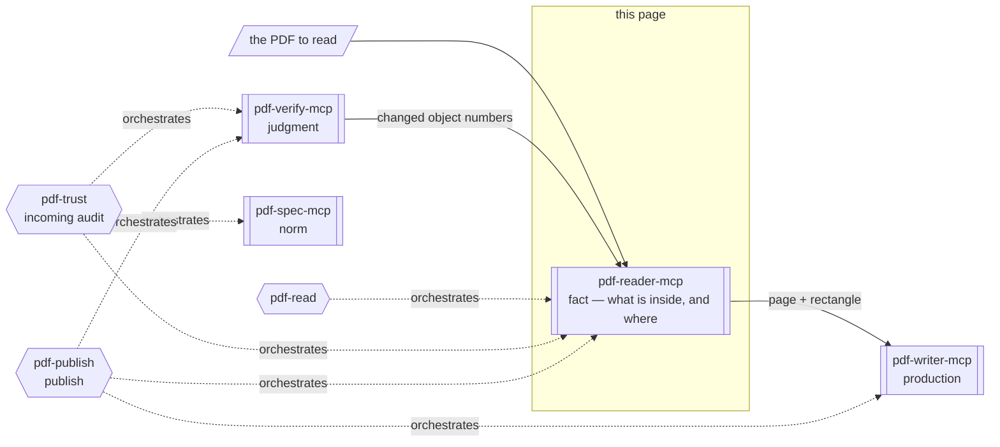

# pdf-reader-mcp

**The server that reports what a PDF says and where on the page it says it.** It extracts text, tables, the structure tree, fonts, annotations and signature fields, and returns the coordinates at which each of them is drawn. Everything it returns is an observed fact; it never judges whether that fact is correct.

- npm: [`@shuji-bonji/pdf-reader-mcp`](https://www.npmjs.com/package/@shuji-bonji/pdf-reader-mcp) / current v0.15.0 / [GitHub](https://github.com/shuji-bonji/pdf-reader-mcp)
- This page is the guide — responsibilities and boundaries. For every tool's parameters and returns, see the [tools reference](/reference/mcp/pdf-reader) (generated from `tools/list`)
- Works with no environment variables

## What this one server gives you

**If all you need is to read PDFs, this server alone is enough.** "Summarize this PDF", "turn this table into CSV", "which fonts are embedded?" — all of it finishes here. Unlike plain text extraction, a tagged PDF can be read in **logical reading order**, so multi-column layouts and tables do not come out scrambled.

Beyond "what is inside", it also reports **where it is drawn on the page**. Rectangles come back in exactly the form [pdf-writer-mcp](/mcp/pdf-writer)'s `add_annotation` takes (PDF default user space, origin bottom-left, pt, normalised), so no coordinate system has to be reinterpreted in between.

| Question | Tool |
|---|---|
| "Where is **object 27**?" | `locate_objects` |
| "Where is **this paragraph / this heading**?" | `extract_structured_text` with `include_bbox` |

## What it gives you together with a Skill

This server sits in the **fact** layer of the four: it returns observations and nothing else. How far to read, and how to declare what could not be read, is a Skill's job.



Shapes carry meaning (→ [legend](/reference/glossary#how-to-read-the-diagrams-shape-legend)).

| Skill | What this server does there | Required? |
|---|---|---|
| [pdf-read](/skills/pdf-read) | The foundation. The Skill picks the reading path and makes the server declare what it could not read | **Required** (v0.14.0+ recommended) |
| [pdf-publish](/skills/pdf-publish) | The read-back stage of write → read-back → verify | Recommended |
| [pdf-trust](/skills/pdf-trust) | Observation of signature-field structure, tags and metadata; locating changed objects | Optional |

**Pointing at a tampered region with an annotation** runs through three servers in one line: `verify_integrity` returns the object numbers, `locate_objects` turns them into pages and rectangles, and pdf-writer's `add_annotation` takes those rectangles as-is.

## What it cannot do

- **It cannot say whether a signature is valid.** `inspect_signatures` reads the structure of signature fields; no cryptographic verification happens here
- **It cannot say whether a file conforms.** Verdicts belong to pdf-verify
- **It does not OCR.** Characters drawn as pixels are not readable. A page whose text cannot be extracted comes back not as an empty string but with the reason (no text layer / a font with no path to Unicode / could not be read)
- **It never guesses logical reading order from coordinates.** For an untagged PDF `extract_structured_text` returns `isTagged: false` and nothing more. If you need a scaffold, run pdf-writer's `ensure_tagged` first
- An encrypted document whose key cannot be derived does not open (counting functions return `null`; listing functions raise)

## What it does not do

- Cryptographic verification (→ pdf-verify's `verify_signatures`)
- Conformance judgment (the `validate_*` tools are deprecated → pdf-verify's `validate_conformance`)
- Incremental-update history (→ pdf-verify's `verify_integrity`)

## Installation

```jsonc
{
  "mcpServers": {
    "pdf-reader": {
      "command": "npx",
      "args": ["-y", "@shuji-bonji/pdf-reader-mcp@latest"]
    }
  }
}
```

## Common parameters

Almost every tool accepts these.

| Parameter | Type | Description |
|---|---|---|
| `file_path` **required** | string | Absolute path to a local PDF |
| `response_format` | `markdown` / `json` | Output format. Default markdown |
| `pages` | string | Page range `"1-5"` / `"3"` / `"1,3,5-7"`. All pages when omitted (where supported) |

## Tools

Parameters, types and defaults are in the [tools reference](/reference/mcp/pdf-reader) (generated from `tools/list`).

| Tier | Tool | One-liner |
|---|---|---|
| 1 | [`read_text`](/reference/mcp/pdf-reader#read-text) | Reading-order text extraction (resolves /ActualText) |
| 1 | [`read_url`](/reference/mcp/pdf-reader#read-url) | Read a PDF straight from a URL |
| 1 | [`read_images`](/reference/mcp/pdf-reader#read-images) | Image extraction (base64) |
| 1 | [`search_text`](/reference/mcp/pdf-reader#search-text) | Case-insensitive search |
| 1 | [`get_metadata`](/reference/mcp/pdf-reader#get-metadata) | Metadata |
| 1 | [`get_page_count`](/reference/mcp/pdf-reader#get-page-count) | Page count (lightweight) |
| 1 | [`summarize`](/reference/mcp/pdf-reader#summarize) | Overview report |
| 1 | [`render_page`](/reference/mcp/pdf-reader#render-page) | Rasterise a page to PNG / JPEG (for documents that cannot be read as text) |
| 2 | [`extract_structured_text`](/reference/mcp/pdf-reader#extract-structured-text) | Text in logical content order (tagged PDFs) |
| 2 | [`extract_tables`](/reference/mcp/pdf-reader#extract-tables) | Structured extraction of `<Table>` subtrees |
| 2 | [`inspect_structure`](/reference/mcp/pdf-reader#inspect-structure) | Internal object structure |
| 2 | [`inspect_tags`](/reference/mcp/pdf-reader#inspect-tags) | Observation of the structure tree |
| 2 | [`inspect_fonts`](/reference/mcp/pdf-reader#inspect-fonts) | Fonts and embedding status |
| 2 | [`inspect_annotations`](/reference/mcp/pdf-reader#inspect-annotations) | Annotation classification and inventory |
| 2 | [`inspect_signatures`](/reference/mcp/pdf-reader#inspect-signatures) | **Structural** observation of signature fields |
| 2 | [`locate_objects`](/reference/mcp/pdf-reader#locate-objects) | Object number → page + rectangle |
| 3 | [`compare_structure`](/reference/mcp/pdf-reader#compare-structure) | Structural comparison of two PDFs |
| 3 | [`validate_metadata`](/reference/mcp/pdf-reader#validate-metadata) | **deprecated** |
| 3 | [`validate_tagged`](/reference/mcp/pdf-reader#validate-tagged) | **deprecated** |

## How to use it

### Start with `summarize`

It combines metadata, text presence, image count and a page-1 preview — **the right first move before deciding which detailed tool to use**. If all you need is the page count, `get_page_count` is lighter.

### There are three paths to the body text

| Document | Tool | Why |
|---|---|---|
| Tagged PDF | `extract_structured_text` | Logical content order (the depth-first traversal of ISO 32000-2 §14.8.2.5). The only tool that can answer "what is the text of the H1?" |
| Tables in a tagged PDF | `extract_tables` | `<TR>` → `<TH>`/`<TD>` structure, with kerning whitespace removed (「消 費 税 法」→「消費税法」) |
| Untagged | `read_text` | Y-coordinate reading order. Multi-column documents split by X coordinate with `split_columns: 2` / `3` |

`read_text` resolves `/ActualText` replacements (ISO 32000-2 §14.9.4) on both paths the clause defines — structure elements and `Span` marked content — so ligature-substituted and hyphenation-fixed words come back spelled the way a viewer shows them. `search_text` runs over that same text, so hits use the post-replacement spelling. Japanese forms indented with fullwidth spaces benefit from `compact_whitespace: true` (cuts tokens 20–40%).

When `read_text` reports `no_text_layer` (a scan) or `not_extractable`, or the content is vector art, a form, handwriting or a seal impression, switch to `render_page` and look at the page as an image. Where `read_images` only pulls out the image XObjects a page embeds, `render_page` draws **the page itself — everything on it**. Rendering uses PDFium compiled to WebAssembly, **a different engine** from the pdf.js this server reads text with: when the two behave differently on a broken file, neither output is evidence for the other. `pages` is required — rendering every page never happens implicitly.

Elements from `extract_structured_text` form a flat list with `role` / `depth` / `text` / `pages` (pre-order + depth encodes the tree exactly). An element spanning pages stays **one element** — paragraphs are not split. `alt` is kept out of `text` (§14.9.3), `Lbl` (list bullets) goes to `label`, and Artifacts (page numbers, running heads) are excluded.

### Two paths to position, with different strengths of claim

Both `locate_objects` and `extract_structured_text` (`include_bbox: true`) attach a **`basis`** to every rectangle: was it measured, is it the file's own claim, or does it merely point at the whole page — a mechanism for **never returning claims of different strength with the same face**.

`basis` in `extract_structured_text`:

| `basis` | What it is |
|---|---|
| `layout-attribute-bbox` | The `/BBox` the file **declares** (ISO 32000-2 Table 379). The producer's self-description, not a measurement. **The only possible basis for content with no text (an image-only Figure, say)** |
| `text-extent` | **Measured** from the element's own text: baseline origin plus the font's ascent/descent — the line box, not glyph outlines. Images and vector art contribute nothing |

`basis` in `locate_objects`:

| `basis` | Meaning |
|---|---|
| `annotation-rect` | The object's own `/Rect`. **Exact** |
| `page-box` | The object is a page; its crop / media box |
| `page-content-stream` | The object draws the page. The rectangle is **the whole page**, not the changed part |
| `page-resource` | A font, image or other resource. **No rectangle exists** (`rect: null`) |

- **An element spanning pages gets one rectangle per page.** Collapsing them would put a rectangle on a page where the element does not exist
- **Declared values are returned as-is, then cross-checked** against the page box (§7.7.3.3) and the element's own text; disagreements are reported in `boxNote`. Files lie without blushing — the cover Figure of *Well-Tagged PDF 1.0* declares `/BBox [-32768 -32768 32767 32767]` (an int16 sentinel where a rectangle should be)
- **An element with no derivable rectangle never gets a zero-size box** — it carries a `boxNote` explaining why
- A nonexistent object number returns `found: false` (not "coordinates unknown"). Freed numbers arrive here from diffs, and mixing the two would read as "exists but position unknown"
- In an encrypted document, coordinates and types are returned but `/T` is `null` (numbers and names are unencrypted per §7.6.2; strings stay ciphertext)

::: tip Checked against an independent ground truth
The 166 measured rectangles of *Well-Tagged PDF 1.0*'s `Link` structure elements were compared with the 173 `/Rect` values the producer put on the same links as `Link` **annotations**: median IoU **0.972**, zero complete misses.
:::

::: warning "Where is this paragraph?" and "where is object 27?" are different paths
For content streams, `locate_objects` can only say "the whole page". To point at a paragraph or heading, use `extract_structured_text` with `include_bbox`.
:::

### Signatures: structure only

`inspect_signatures` returns the signature-field count, signed/unsigned breakdown and each field's details (signer name, reason, location, signing time, filter/subFilter). **No cryptographic verification is performed** — whether a signature is mathematically valid is pdf-verify's answer (`verify_signatures` / `verify_integrity`).

### The two deprecated tools

`validate_metadata` and `validate_tagged` will be removed in the next major version; pdf-verify's `validate_conformance` supersedes both. For structure-tree **facts** use `inspect_tags` (which is NOT deprecated); to just read metadata, use `get_metadata`.
