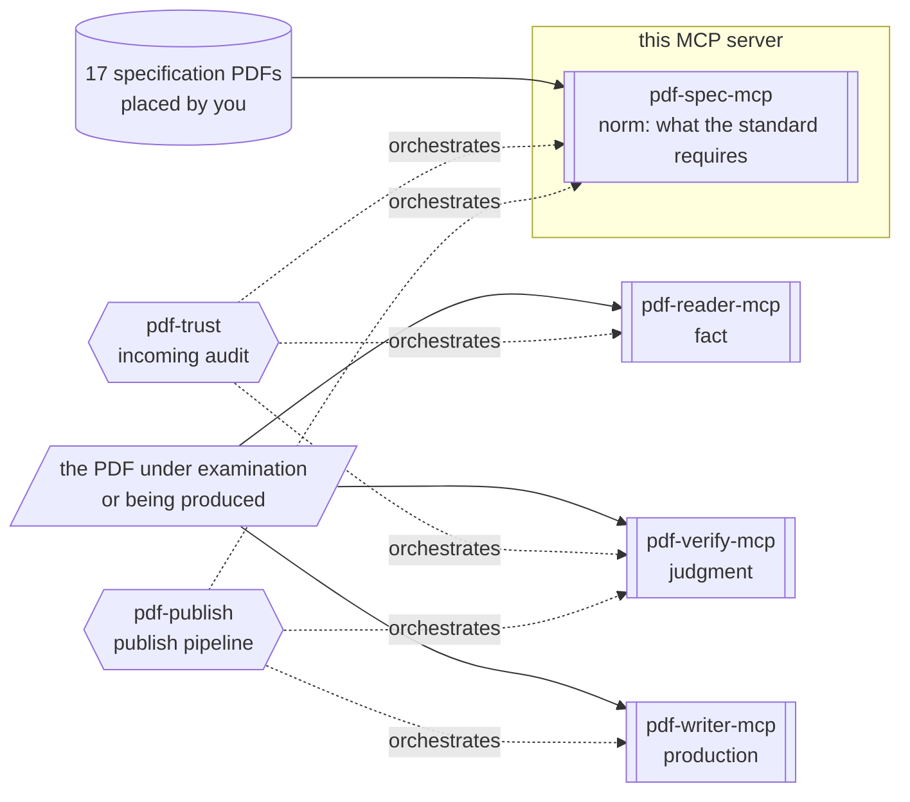

# pdf-spec-mcp

**The server that lets an AI look things up in the PDF specification.** ISO 32000-1/-2, ISO TS 32001–32005, PDF/UA-1/-2, the Tagged PDF guide and more — 17 documents — are cross-searched, and clauses, requirements (shall/should/may), definitions and tables come back in structured form.

- npm: [`@shuji-bonji/pdf-spec-mcp`](https://www.npmjs.com/package/@shuji-bonji/pdf-spec-mcp) / current v0.6.0 / [GitHub](https://github.com/shuji-bonji/pdf-spec-mcp)
- This page is the guide — responsibilities and boundaries. For every tool's parameters and returns, see the [tools reference](/reference/mcp/pdf-spec) (generated from `tools/list`)

::: warning The specification PDFs are not bundled
Place the freely available originals in `PDF_SPEC_DIR` yourself (→ [Getting started, Step 2](/guide/getting-started))
**Every core document that makes up the corpus is available at no cost through legitimate channels.**
Without that corpus this server cannot search.
:::

## What this one server gives you

Questions like "what does PDF 2.0 require of incremental updates?" or "which clause defines reading order in tagged PDF?" become answerable **by an LLM looking up the original text**.
Instead of a person hunting through a thousand pages of ISO standards, the AI cites them with clause IDs.
Use it whenever the grounds for an implementation or audit decision should be the specification text rather than memory or a search engine.

## What it gives you together with a Skill

This MCP server sits in the **norm** layer of the four MCP servers (norm = the original text that defines what is correct): it supplies only what the standard requires.
Verdicts belong to pdf-verify, observation to pdf-reader, production to pdf-writer.



Shapes carry meaning (→ [legend](/reference/glossary#how-to-read-the-diagrams-shape-legend))
**The PDF under examination is not passed to this server.**
The only input is the specification PDFs you placed in `PDF_SPEC_DIR`.

| Skill | What this server does there | Required? |
|---|---|---|
| [pdf-trust](/skills/pdf-trust) | When a deviation is found, cites the ISO 32000 clause ID behind it | Optional |
| [pdf-publish](/skills/pdf-publish) | When the repair loop hits its limit, attaches clause grounds to the remaining violations | Optional |

On its own, the main use case is [spec research](/use-cases/spec-research).

## What it cannot do

- **It cannot look up anything outside the specification-PDF corpus.
  For example,** ISO 19005 (PDF/A) and ETSI PAdES are not included.
- **It can say nothing about files the user created.**
  What comes back is the text of the standard; whether a given PDF satisfies it is pdf-verify's answer.
- `compare_versions` needs **both** PDF 1.7 (`PDF32000_2008.pdf`) and PDF 2.0 present.

## What it does not do

- File inspection, conformance verdicts, business-rule definitions

## Installation

```jsonc
{
  "mcpServers": {
    "pdf-spec": {
      "command": "npx",
      "args": ["-y", "@shuji-bonji/pdf-spec-mcp@latest"],
      "env": { "PDF_SPEC_DIR": "/path/to/pdf-specs" }
    }
  }
}
```

Place the PDF Association's sponsored-edition specification PDFs in `PDF_SPEC_DIR` (required). Files are recognized by name pattern. See [Getting started, Step 2](/guide/getting-started) for the sources.

## Corpus cache

Since v0.5.0 the two whole-document operations — the search index behind `search_spec` and the full scan behind `get_requirements` without a `section` — are cached on disk after their first build, so every later process answers them in well under a second instead of 6–14 s.

The default location is `${XDG_CACHE_HOME:-~/.cache}/pdf-spec-mcp`, about 18 MB for the whole corpus. The key includes the server version, the pdfjs version and the PDF's SHA-256, so an upgrade or a replaced file rebuilds. The cache is derived from your own copy of the PDFs and stays on your machine; it is never distributed.

Warm every spec up front (about a minute)

```sh
npx -y @shuji-bonji/pdf-spec-mcp@latest --build-cache
```

To move the cache, or turn it off:

```jsonc
{
  "mcpServers": {
    "pdf-spec": {
      "command": "npx",
      "args": ["-y", "@shuji-bonji/pdf-spec-mcp@latest"],
      "env": {
        "PDF_SPEC_DIR": "/path/to/pdf-specs",
        "PDF_SPEC_CACHE_DIR": "/path/to/cache",
        "PDF_SPEC_CACHE": "off"
      }
    }
  }
}
```

## Common parameter

Most tools take `spec` (a Spec ID, e.g. `"iso32000-2"` / `"pdf17"`; defaults to ISO 32000-2).
Get the list of IDs from `list_specs`.

## Three kinds of output

The output falls into three kinds: **clauses**, **requirements**, and **definitions**.

| Kind | What it is |
|---|---|
| **Clauses** (`get_section` / `get_tables`) | A section's body as a **sequence of elements**: headings, paragraphs, lists, tables, notes. NOTE / EXAMPLE are separate elements, not body text |
| **Requirements** (`get_requirements`) | The normative sentences containing shall / shall not / should / should not / may, one sentence = one requirement. **Only shall is a condition of conformance** |
| **Definitions** (`get_definitions`) | Term definitions from Section 3 (Terms and definitions). Terms whose meaning in the standard differs from everyday usage should be settled here before arguing |

All of them are structured renderings of *what the standard says* — none of them say anything about your file. The JSON shape of each, and where each is easy to misread, is in [Reading pdf-spec Output](/reference/pdf-spec-output).

::: tip Background: ISO drafting conventions
NOTE (notes) and EXAMPLE (examples) are informative; they are not requirements. Requirement levels are shall / should / may / can, and only shall is a condition of conformance. Without these ISO-wide conventions the output is easy to misread. Read [How to Read ISO Specs](/reference/iso-reading-primer) first.
:::

## Tools

Parameters, types and defaults are in the [tools reference](/reference/mcp/pdf-spec) (generated from `tools/list`).

| Tool | One-liner |
|---|---|
| [`list_specs`](/reference/mcp/pdf-spec#list-specs) | List of discovered specs and coverage (including gaps) |
| [`get_structure`](/reference/mcp/pdf-spec#get-structure) | Table of contents |
| [`get_section`](/reference/mcp/pdf-spec#get-section) | Section body by clause number |
| [`search_spec`](/reference/mcp/pdf-spec#search-spec) | Keyword search across a spec |
| [`get_requirements`](/reference/mcp/pdf-spec#get-requirements) | Extraction of shall / should / may requirements |
| [`get_definitions`](/reference/mcp/pdf-spec#get-definitions) | Term definitions |
| [`get_tables`](/reference/mcp/pdf-spec#get-tables) | Structured tables from the standard |
| [`compare_versions`](/reference/mcp/pdf-spec#compare-versions) | PDF 1.7 ↔ 2.0 clause comparison |

## How to use it

**Start with `list_specs`.** See what is present and what is not (`coverage.gaps`) before anything else. Always read the gaps before concluding that a requirement does not exist.

**Know the section number? `get_section`. Don't? `search_spec`.** `get_section` on **a parent section returns its whole subtree** (all subsections in document order), so top-level clauses can return very large responses — use the most specific section number you know. `search_spec` matches as an exact phrase first, then as AND over the words. The corpus is English, so search terms should be the specification's English.

::: warning What zero hits mean
"This corpus cannot answer" — **not** "no such requirement exists". PDF/A and PAdES are outside the corpus.
:::

**Want only the requirements? `get_requirements`.** Filter with `level` (shall / shall not / should / should not / may). This tool **reads the standard, not your file.** Whether a given PDF satisfies it is pdf-verify's `validate_conformance` / `evaluate_policy`.

**Comparing versions? `compare_versions`.** It matches sections between 1.7 and 2.0 by their titles and returns three kinds:

- **matched** — the same section, or a moved one
- **added** — new in 2.0
- **removed** — absent from 2.0

Both PDF 1.7 and PDF 2.0 must be in `PDF_SPEC_DIR`.

Worked examples of the four points above, as prompt → tool arguments → returned JSON, follow. How to read the JSON shape is in [Reading pdf-spec Output](/reference/pdf-spec-output). The full scenario is [spec research](/use-cases/spec-research).

### Worked examples

v0.6.0, default `iso32000-2` (ISO 32000-2:2020 Errata Collection 3). `spec` is omitted. Long arrays are trimmed to the first items; hard wraps from the PDF are folded to spaces.

#### Example 1 — see what is outside the corpus first (`list_specs`)

> Quote the PDF/A conformance requirements from the clauses

ISO 19005 is not in the corpus, so read the gaps before searching clauses.

**Tool** `list_specs`

**Parameters** an empty object is enough.

```jsonc
{}
```

**Returned JSON** (`specs` — 17 entries — omitted; `coverage.gaps` is the point):

```jsonc
{
  "totalSpecs": 17,
  "coverage": {
    "note": "These normative areas are outside this corpus. A search returning no hits for them means \"cannot answer\", not \"no such requirement\".",
    "gaps": [
      {
        "area": "PDF/A — archival conformance",
        "standards": ["ISO 19005-1", "ISO 19005-2", "ISO 19005-3", "ISO 19005-4"],
        "consequence": "Requirements specific to PDF/A cannot be quoted or verified here. … A search returning nothing is not evidence that no requirement exists."
      },
      {
        "area": "PAdES — signature profiles",
        "standards": ["ETSI EN 319 142-1", "ETSI EN 319 142-2"],
        "consequence": "Baseline signature levels (B-B / B-T / B-LT / B-LTA) are defined by ETSI, not by ISO 32000-2. … ISO 32000-2 §12.8 covers signatures in general and is available."
      }
    ]
  }
}
```

From here the job belongs to pdf-verify's `validate_conformance` (flavour `"pdfa-*"`). Calling `search_spec("PDF/A")` on this server and getting zero hits does not mean "no such requirement".

#### Example 2 — section number unknown (`search_spec` → `get_requirements`)

> What does PDF 2.0 require of incremental updates?

Search with an English phrase first, then take only the shall / may from the section that hits.

**Tool** `search_spec`

**Parameters**

```jsonc
{
  "query": "incremental update",
  "max_results": 5
}
```

**Returned JSON**

```jsonc
{
  "query": "incremental update",
  "totalResults": 5,
  "results": [
    {
      "section": "7.5.6",
      "title": "Incremental updates",
      "page": 75,
      "score": 12,
      "snippet": "7.5.6 Incremental updates The contents of a PDF file can be updated incrementally without rewriting…"
    },
    {
      "section": "12.7.8.3.1",
      "title": "General",
      "page": 576,
      "score": 12,
      "snippet": "…A stream containing all the bytes in all incremental updates made to the underlying PDF document…"
    }
    // … 3 more (7.5.4 / 12.8.1 / 7.5.1)
  ]
}
```

The top hit is §7.5.6, so pass that section to `get_requirements` when you want requirements only. Omitting `level` returns shall / may mixed together.

**Tool** `get_requirements`

**Parameters**

```jsonc
{
  "section": "7.5.6"
}
```

**Returned JSON**

```jsonc
{
  "filter": { "section": "7.5.6", "level": "all" },
  "totalRequirements": 10,
  "statistics": { "shall": 8, "may": 2 },
  "requirements": [
    {
      "id": "R-7.5.6-1",
      "level": "shall",
      "section": "7.5.6",
      "sectionTitle": "Incremental updates",
      "text": "When updating a PDF file incrementally, changes shall be appended to the end of the file, leaving its original contents intact."
    },
    {
      "id": "R-7.5.6-2",
      "level": "shall",
      "section": "7.5.6",
      "sectionTitle": "Incremental updates",
      "text": "A cross-reference section for an incremental update shall contain entries only for objects that have been changed, replaced, or deleted."
    }
    // … 8 more. Only shall is a condition of conformance
  ]
}
```

`text` is verbatim, so it can be quoted. This is a requirement of the standard, not a verdict on whether a file in hand satisfies it.

#### Example 3 — search in the specification's own words (`search_spec` → `get_section`)

> Which clause defines reading order in tagged PDF?

Everyday English `reading order` surfaces other clauses first (how streams are read, vertex order in shadings, and so on). The specification's terms are **logical content order** / **page content order**.

**Tool** `search_spec`

**Parameters**

```jsonc
{
  "query": "content order",
  "max_results": 5
}
```

**Returned JSON**

```jsonc
{
  "query": "content order",
  "totalResults": 5,
  "results": [
    {
      "section": "14.8.2.5.1",
      "title": "General",
      "page": 764,
      "score": 39,
      "snippet": "14.8.2.5.1 General Page content order shall be defined by the sequencing of graphics objects within …"
    }
    // … 4 more
  ]
}
```

When you want the body, call `get_section` with the most specific section number you now have. That is `14.8.2.5.1`, not the parent `14.8.2.5`.

**Tool** `get_section`

**Parameters**

```jsonc
{
  "section": "14.8.2.5.1"
}
```

**Returned JSON**

```jsonc
{
  "sectionNumber": "14.8.2.5.1",
  "title": "General",
  "pageRange": { "start": 764, "end": 764 },
  "content": [
    { "type": "heading", "level": 5, "text": "14.8.2.5.1 General" },
    {
      "type": "paragraph",
      "text": "Page content order shall be defined by the sequencing of graphics objects within a page’s content stream."
    },
    {
      "type": "paragraph",
      "text": "Logical content order – the ordering for semantic purposes – shall be defined by a depth-first traversal of the document’s logical structure hierarchy."
    },
    {
      "type": "paragraph",
      "text": "The page content order in a tagged PDF should coincide with the logical content order."
    },
    {
      "type": "note",
      "label": "NOTE 1",
      "text": "Page content order is constrained by the need to render objects in an order that produces the desired visual appearance. …"
    }
  ]
}
```

shall in a `paragraph` is a requirement, should is a recommendation, and `note` is informative. Do not write "specification violation" on the strength of a NOTE.

#### Example 4 — version difference (`compare_versions`)

> How did the incremental-update clause change between PDF 1.7 and 2.0?

**Tool** `compare_versions`

**Parameters**

```jsonc
{
  "section": "7.5.6"
}
```

**Returned JSON**

```jsonc
{
  "totalMatched": 1,
  "totalAdded": 0,
  "totalRemoved": 0,
  "matched": [
    {
      "section17": "7.5.6",
      "section20": "7.5.6",
      "title": "Incremental updates",
      "status": "same"
    }
  ],
  "added": [],
  "removed": []
}
```

Section number and title are the same in 1.7 and 2.0. The tool does not return a body diff. To see the requirements themselves, take `get_requirements` on that section for both specs (`spec: "pdf17"` and the default `iso32000-2`), as in example 2.
