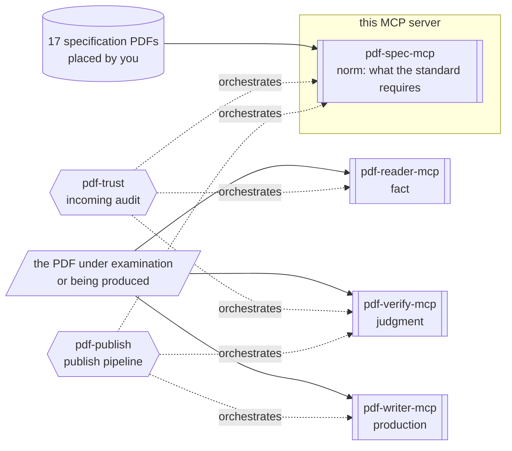

# pdf-spec-mcp

**The server that lets an AI look things up in the PDF specification.** ISO 32000-1/-2, ISO TS 32001–32005, PDF/UA-1/-2, the Tagged PDF guide and more — 17 documents — are cross-searched, and clauses, requirements (shall/should/may), definitions and tables come back in structured form.

- npm: [`@shuji-bonji/pdf-spec-mcp`](https://www.npmjs.com/package/@shuji-bonji/pdf-spec-mcp) / current v0.6.0 / [GitHub](https://github.com/shuji-bonji/pdf-spec-mcp)
- This page is the guide — responsibilities and boundaries. For every tool's parameters and returns, see the [tools reference](/reference/mcp/pdf-spec) (generated from `tools/list`)

::: warning The specification PDFs are not bundled
Place the freely available originals in `PDF_SPEC_DIR` yourself (→ [Getting started, Step 2](/guide/getting-started))
**Every core document that makes up the corpus is available at no cost through legitimate channels.**
Without that corpus this server cannot search.
:::

## What this one server gives you

Questions like "what does PDF 2.0 require of incremental updates?" or "which clause defines reading order in tagged PDF?" become answerable **by an LLM looking up the original text**.
Instead of a person hunting through a thousand pages of ISO standards, the AI cites them with clause IDs.
Use it whenever the grounds for an implementation or audit decision should be the specification text rather than memory or a search engine.

## What it gives you together with a Skill

This MCP server sits in the **norm** layer of the four MCP servers (norm = the original text that defines what is correct): it supplies only what the standard requires.
Verdicts belong to pdf-verify, observation to pdf-reader, production to pdf-writer.



Shapes carry meaning (→ [legend](/reference/glossary#how-to-read-the-diagrams-shape-legend))
**The PDF under examination is not passed to this server.**
The only input is the specification PDFs you placed in `PDF_SPEC_DIR`.

| Skill | What this server does there | Required? |
|---|---|---|
| [pdf-trust](/skills/pdf-trust) | When a deviation is found, cites the ISO 32000 clause ID behind it | Optional |
| [pdf-publish](/skills/pdf-publish) | When the repair loop hits its limit, attaches clause grounds to the remaining violations | Optional |

On its own, the main use case is [spec research](/use-cases/spec-research).

## What it cannot do

- **It cannot look up anything outside the specification-PDF corpus.
  For example,** ISO 19005 (PDF/A) and ETSI PAdES are not included.
- **It can say nothing about files the user created.**
  What comes back is the text of the standard; whether a given PDF satisfies it is pdf-verify's answer.
- `compare_versions` needs **both** PDF 1.7 (`PDF32000_2008.pdf`) and PDF 2.0 present.

## What it does not do

- File inspection, conformance verdicts, business-rule definitions

## Installation

```jsonc
{
  "mcpServers": {
    "pdf-spec": {
      "command": "npx",
      "args": ["-y", "@shuji-bonji/pdf-spec-mcp@latest"],
      "env": { "PDF_SPEC_DIR": "/path/to/pdf-specs" }
    }
  }
}
```

Place the PDF Association's sponsored-edition specification PDFs in `PDF_SPEC_DIR` (required). Files are recognized by name pattern. See [Getting started, Step 2](/guide/getting-started) for the sources.

## Corpus cache

Since v0.5.0 the two whole-document operations — the search index behind `search_spec` and the full scan behind `get_requirements` without a `section` — are cached on disk after their first build, so every later process answers them in well under a second instead of 6–14 s.

The default location is `${XDG_CACHE_HOME:-~/.cache}/pdf-spec-mcp`, about 18 MB for the whole corpus. The key includes the server version, the pdfjs version and the PDF's SHA-256, so an upgrade or a replaced file rebuilds. The cache is derived from your own copy of the PDFs and stays on your machine; it is never distributed.

Warm every spec up front (about a minute)

```sh
npx -y @shuji-bonji/pdf-spec-mcp@latest --build-cache
```

To move the cache, or turn it off:

```jsonc
{
  "mcpServers": {
    "pdf-spec": {
      "command": "npx",
      "args": ["-y", "@shuji-bonji/pdf-spec-mcp@latest"],
      "env": {
        "PDF_SPEC_DIR": "/path/to/pdf-specs",
        "PDF_SPEC_CACHE_DIR": "/path/to/cache",
        "PDF_SPEC_CACHE": "off"
      }
    }
  }
}
```

## Common parameter

Most tools take `spec` (a Spec ID, e.g. `"iso32000-2"` / `"pdf17"`; defaults to ISO 32000-2).
Get the list of IDs from `list_specs`.

## Three kinds of output

The output falls into three kinds: **clauses**, **requirements**, and **definitions**.

| Kind | What it is |
|---|---|
| **Clauses** (`get_section` / `get_tables`) | A section's body as a **sequence of elements**: headings, paragraphs, lists, tables, notes. NOTE / EXAMPLE are separate elements, not body text |
| **Requirements** (`get_requirements`) | The normative sentences containing shall / shall not / should / should not / may, one sentence = one requirement. **Only shall is a condition of conformance** |
| **Definitions** (`get_definitions`) | Term definitions from Section 3 (Terms and definitions). Terms whose meaning in the standard differs from everyday usage should be settled here before arguing |

All of them are structured renderings of *what the standard says* — none of them say anything about your file. The JSON shape of each, and where each is easy to misread, is in [Reading pdf-spec Output](/reference/pdf-spec-output).

::: tip Background: ISO drafting conventions
NOTE (notes) and EXAMPLE (examples) are informative; they are not requirements. Requirement levels are shall / should / may / can, and only shall is a condition of conformance. Without these ISO-wide conventions the output is easy to misread. Read [How to Read ISO Specs](/reference/iso-reading-primer) first.
:::

## Tools

Parameters, types and defaults are in the [tools reference](/reference/mcp/pdf-spec) (generated from `tools/list`).

| Tool | One-liner |
|---|---|
| [`list_specs`](/reference/mcp/pdf-spec#list-specs) | List of discovered specs and coverage (including gaps) |
| [`get_structure`](/reference/mcp/pdf-spec#get-structure) | Table of contents |
| [`get_section`](/reference/mcp/pdf-spec#get-section) | Section body by clause number |
| [`search_spec`](/reference/mcp/pdf-spec#search-spec) | Keyword search across a spec |
| [`get_requirements`](/reference/mcp/pdf-spec#get-requirements) | Extraction of shall / should / may requirements |
| [`get_definitions`](/reference/mcp/pdf-spec#get-definitions) | Term definitions |
| [`get_tables`](/reference/mcp/pdf-spec#get-tables) | Structured tables from the standard |
| [`compare_versions`](/reference/mcp/pdf-spec#compare-versions) | PDF 1.7 ↔ 2.0 clause comparison |

## How to use it

Prompt → parameters → returned JSON for each tool is at the end of that tool on the [tools reference](/reference/mcp/pdf-spec). How to read the JSON shape is in [Reading pdf-spec Output](/reference/pdf-spec-output). The full scenario is [spec research](/use-cases/spec-research).

### See what the corpus holds first

Start with `list_specs`. What is present and what is not is in `coverage.gaps`. PDF/A and PAdES are outside the corpus. Read the gaps before saying a requirement does not exist.

### Get the clause text

If you know the section number, use `get_section`. If you do not, search with `search_spec`.

Passing a parent section to `get_section` returns every subsection in document order. A chapter number alone can make a very large response — use the most specific number you know.

`search_spec` matches as an exact phrase first, then as AND over the words. The corpus is English, so search terms should be the specification's English.

::: warning When there are zero hits
That means "this corpus cannot answer" — **not** "no such requirement exists". PDF/A and PAdES are outside the corpus.
:::

### Extract only the requirements

If you want shall / should / may only, use `get_requirements` and filter with `level`. It **reads the standard, not your file.** Whether a given PDF satisfies it is pdf-verify's `validate_conformance` / `evaluate_policy`.

### Compare 1.7 and 2.0

`compare_versions` matches sections between PDF 1.7 and 2.0 by their titles and returns three kinds:

| Kind | Meaning |
| --- | --- |
| matched | the same section, or one that moved |
| added | new in 2.0 |
| removed | absent from 2.0 |

Both the PDF 1.7 and PDF 2.0 files must be in `PDF_SPEC_DIR`.
