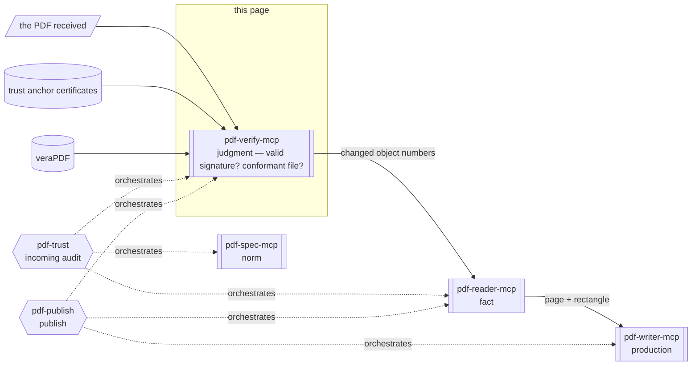

# pdf-verify-mcp

**The server that judges whether a signature is cryptographically valid and whether the file meets the standard.** It verifies electronic signatures cryptographically, detects changes made after signing, and scores conformance to PDF/A (archiving) and PDF/UA (accessibility).

- npm: [`@shuji-bonji/pdf-verify-mcp`](https://www.npmjs.com/package/@shuji-bonji/pdf-verify-mcp) / current v0.26.0 / [GitHub](https://github.com/shuji-bonji/pdf-verify-mcp)
- This page is the guide — responsibilities and boundaries. For every tool's parameters and returns, see the [tools reference](/reference/mcp/pdf-verify) (generated from `tools/list`)

## What this one server gives you

"Is the signature on this contract valid?" "Was it changed after signing?" "Will this PDF survive as PDF/A?" — all answerable here. Verdicts come from cryptography and rule tables, so **the same file yields the same result every time**. Deciding whether an incoming PDF may be used in a business process (incoming audit) centres on this server.

### What it can decide

| Question | What is measured | Tool | [Assertion strength](/guide/architecture#assertion-strength-t1-t2-t3) |
|---|---|---|---|
| Is the signature cryptographically valid? | ByteRange digest recomputation, CMS messageDigest comparison, signature value verification, RFC 3161 timestamps | `verify_signatures` | T1 |
| Is the signer trustworthy? | Certificate chain against trust anchors, revocation (OCSP / CRL) | `verify_signatures` (needs `trust_anchors`) | T1 |
| Was it changed after signing? | Incremental revisions, signed-range coverage, DocMDP permissions and violations, **which objects changed** | `verify_integrity` | T1 |
| Does it breach the ISO 32000 body? | The constraint tables of [pdf-constraints](/reference/pdf-constraints) (where veraPDF does not look) | `validate_clauses` | T1 |
| Does it conform to PDF/UA (accessibility)? | ISO 14289, via veraPDF or 12 built-in rules | `validate_conformance` | T1 |
| Does it conform to PDF/A (archiving)? | ISO 19005, via veraPDF or 15 built-in rules | `validate_conformance` | T2 |
| Does it carry long-term-preservation structure? | PAdES B-B / B-T / B-LT / B-LTA-matching structure | `detect_pades_level` | T3 (observation only) |
| Does it **claim** to be PDF/A or PDF/UA? | The pdfaid / pdfuaid declarations in XMP | `identify_conformance` | Reading a declaration |
| May it be used in the business process? | The facts above applied to a fixed rule table and reduced to 4 values | `evaluate_policy` | Aggregation of facts |

## What it gives you together with a Skill

This MCP server sits in the **judgment** layer of the four (judgment = pass or fail over observed facts): it decides pass or fail over the facts observed. What to measure in which order, how to explain the verdict and which legal grounds to attach are a Skill's job.



Shapes carry meaning (→ [legend](/reference/glossary#how-to-read-the-diagrams-shape-legend)).

| Skill | What this server does there | Required? |
|---|---|---|
| [pdf-trust](/skills/pdf-trust) | The axis of the audit. `evaluate_policy` decides the 4-value verdict; the Skill explains firedRules, recommends actions and cites legal grounds | **Required** (v0.7.0+) |
| [pdf-publish](/skills/pdf-publish) | The exit gate: machine-scores the produced PDF with veraPDF. At the `conformance` level the pipeline aborts without it | **Required** at `conformance` |

::: warning The judge is code, the narrative is the LLM
Use the returned `firedRules` / `advisories` **to explain the outcome, never to override it**. Do not read an advisory as a failure. Do not read the absence of advisories as a pass.
:::

## What it cannot do

- **It never proves conformance.** What it does is look for demonstrable errors. Finding one lets you state that the file does not meet the standard; finding none does not prove that it does
- **Without trust anchors it cannot speak to identity.** Without `trust_anchors` (or the env var), `valid` means only that **the cryptography checks out** (`trust: not_evaluated`). Likewise for revocation: if it could not be checked, you may not say "not revoked"
- **PDF/UA cannot be fully decided by machine.** Whether alt text *exists* is checkable; whether it is *meaningful* is not
- **PAdES never becomes a conformance verdict.** ETSI EN 319 142 is not in the spec corpus and there is no third-party validator, so the result is "the structure matches B-LT", never "conforms to PAdES B-LT" (every report carries `normativeBasis: "T3"`)

## What it does not do

- Judging whether the content is true (a properly signed document can still state something untrue)
- Observation (→ pdf-reader), citing the spec (→ pdf-spec), production (→ pdf-writer)

## Installation

```jsonc
{
  "mcpServers": {
    "pdf-verify": {
      "command": "npx",
      "args": ["-y", "@shuji-bonji/pdf-verify-mcp@latest"],
      "env": {
        "PDF_VERIFY_VERAPDF": "/usr/local/bin/verapdf",
        "PDF_VERIFY_TRUST_ANCHORS": "/path/to/trust-anchors"
      }
    }
  }
}
```

Both environment variables are optional; the built-in rules work without veraPDF.

## Common parameters

Every tool accepts these.

| Parameter | Type | Description |
|---|---|---|
| `file_path` **required** | string | Absolute path to a local PDF |
| `response_format` | `markdown` / `json` | Output format. Default markdown |
| `password` | string | Password for an encrypted PDF. Permissions encryption (empty user password) is tried automatically (where supported) |

## Tools

Parameters, types and defaults are in the [tools reference](/reference/mcp/pdf-verify) (generated from `tools/list`).

| Tool | One-liner |
|---|---|
| [`verify_signatures`](/reference/mcp/pdf-verify#verify-signatures) | Cryptographic signature verification (chain, revocation, timestamps) |
| [`verify_integrity`](/reference/mcp/pdf-verify#verify-integrity) | Analysis of changes after signing (incremental updates, coverage, DocMDP) |
| [`detect_pades_level`](/reference/mcp/pdf-verify#detect-pades-level) | **Observation** of PAdES B-B / B-T / B-LT / B-LTA-matching structure |
| [`identify_conformance`](/reference/mcp/pdf-verify#identify-conformance) | Reading XMP declarations (pdfaid / pdfuaid) — the entry point of judgment |
| [`validate_conformance`](/reference/mcp/pdf-verify#validate-conformance) | PDF/A / PDF/UA validation. Delegates to veraPDF, or built-in rules |
| [`validate_clauses`](/reference/mcp/pdf-verify#validate-clauses) | Constraint checks against the **ISO 32000 body** (where veraPDF does not look) |
| [`evaluate_policy`](/reference/mcp/pdf-verify#evaluate-policy) | Deterministic 4-value verdict from the facts |

## How to use it

Per-tool cautions and prompt → parameters → returned JSON are at the end of each tool on the [tools reference](/reference/mcp/pdf-verify).

### Check the signatures

`verify_signatures` returns three values per signature. They are independent.

| Field | Values | What it looks at |
| --- | --- | --- |
| `verdict` | `valid` / `invalid` / `indeterminate` | whether the cryptography matched |
| `trust` | `trusted` / `untrusted` / `not_evaluated` | the certificate chain |
| revocation | `good` / `revoked` / `unknown` / `not_checked` | OCSP / CRL |

Without trust anchors (`trust_anchors` or `PDF_VERIFY_TRUST_ANCHORS`), `trust` stays `not_evaluated`. That `valid` means the digest matched; it does not prove the signer is who they claim to be. `evaluate_policy` then stops at `use_with_caution`.

Revocation checking defaults to `embedded` (data inside the PDF and CMS). `online` queries OCSP and CRL over HTTP.

### When the file grew after signing

What `verify_integrity` returns is what to look at — not an automatic finding of tampering. Adding a signature, DSS or a document timestamp is a permitted way to write PDF. Per ISO 32000-2 §12.8.2.2, DSS / document-timestamp increments after a P=1 certification are **not** reported as violations (flagged `laterChangesAppearLtvOnly`).

Since v0.10.0 it also returns which objects were written after signing (`revisions` / `objectChangesAfterLastSignature`), walking the xref chain over raw bytes (table / xref stream / hybrid). That diff does not move the signature verdict.

::: warning Not being able to walk the xref chain is not the same as nothing having changed
When the chain cannot be walked, the result is `null`, not an empty array. Three things go wrong in a naive implementation:

- A linearized file has two xref sections for one save. Without merging them, every object looks "added"
- A full save reports an inflated change count (224,065 in one measurement)
- Reading "could not walk" as "unchanged" states as settled a fact that was never established

All three were fixed against real measurements.
:::

### A claim in the file is not a measurement

`identify_conformance` only **reads** whether the XMP wrote "I am PDF/A". Writing it is not evidence. Rule checking is `validate_conformance`.

`validate_conformance` delegates to veraPDF when it is present (authoritative), and otherwise runs the built-in rules. `flavour` accepts `"pdfa-1b"`–`"pdfa-3b"` / `"pdfa-4"` / `"pdfa-4e"` / `"pdfa-4f"` (v0.11.0+) / `"pdfua-1"` / `"pdfua-2"`. When omitted it follows the XMP declaration (PDF/A wins when both are declared; otherwise `pdfa-2b`). **PDF/A-4 has no conformance level, so `"pdfa-4b"` does not exist** — `e` / `f` are variants, not levels.

Read `compliant` as follows. Under veraPDF it is true / false. Under the built-in rules, false means a decisive violation, and `null` means "no violation in the subset that was checked" (not a certificate). Native PDF/UA violations carry a severity: only `error` can prove non-conformance; `warning` needs a person to review.

### Check against ISO 32000 clauses

`validate_clauses` looks at constraints mapped from the ISO 32000-1/-2 body. A file can pass PDF/A or PDF/UA and still violate ISO 32000 (example: embedding a CFF font program under `/FontFile2`, which Table 124 forbids). The mapping and its evaluator live in [pdf-constraints](/reference/pdf-constraints), and the output names the version that decided.

| State | Meaning |
| --- | --- |
| `pass` | nothing in this constraint could be disproved |
| `fail` | disproved, with the fact and measured value |
| `not_applicable` | the clause does not apply to this document |
| `needs_external_fact` | a fact outside the file was missing, so no decision was made (never defaulted to pass) |

Failures marked `trace` mean the clause binds the PDF **processor** — evidence that someone broke it, not necessarily the last writer.

### Observe PAdES structure

`detect_pades_level` observes structure. Do not write "conforms to PAdES". Levels are added in this order.

| Level | Structure (each row adds to the one above) | Meaning |
| --- | --- | --- |
| B-B | CAdES signature | signature only |
| B-T | + signature timestamp (RFC 3161) | a third party attests the signing time |
| B-LT | + DSS with validation data (certificates, OCSP/CRL) | revocation-checking material is self-contained in the document |
| B-LTA | + document timestamp | the validation material itself is sealed for long-term preservation |

B-LT and B-LTA also require that the DSS revocation data actually covers the signer certificate. Otherwise the level stops at B-T. Legacy `adbe.pkcs7.detached` is reported as non-PAdES.

### Ask whether it may be used in the process

`evaluate_policy` runs `verify_signatures`, `verify_integrity` and `detect_pades_level` internally (plus `validate_conformance` for long-term-preservation profiles). It then applies those facts to a fixed rule table and reduces them to one of four values. The same facts and the same `profile` always yield the same verdict.

Choose `profile` from `general` / `contract` (signature required, identity-focused) / `financial` and `government` (long-term-preservation checks) / `legal` / `medical` (most conservative — caution escalates to review).

It returns `verdict`, `firedRules` (fired rule IDs and reasons), `advisories` (recommendations that do not move the verdict) and a facts summary. The Skill that builds a whole audit around this verdict is [pdf-trust](/skills/pdf-trust).

## Assertion strength

How strongly a verdict may be stated depends on whether the normative text is at hand → the [T1/T2/T3 rule](/guide/architecture#assertion-strength-t1-t2-t3). ETSI PAdES (T3) stays a structural observation, PDF/A (T2) goes as far as "veraPDF judged it", ISO 32000 / PDF/UA (T1) can quote the clause and state it plainly.
