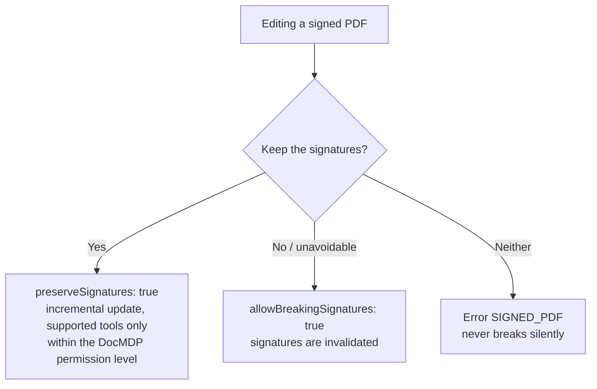

# pdf-writer-mcp

**The server that creates and edits PDFs.** It generates PDFs from text, Markdown or tables, and handles page operations (merge, split, reorder), bookmarks, annotations, watermarks, page numbers, form filling and file attachments. CJK font embedding (with subsetting) is supported.

- npm: [`@shuji-bonji/pdf-writer-mcp`](https://www.npmjs.com/package/@shuji-bonji/pdf-writer-mcp) / current v0.20.1 / [GitHub](https://github.com/shuji-bonji/pdf-writer-mcp)
- This page is the guide — responsibilities and boundaries. For every tool's parameters and returns, see the [tools reference](/reference/mcp/pdf-writer) (generated from `tools/list`)
- Built on pdf-lib + fontkit

### What this one server gives you

"Make an invoice PDF with this content", "merge these three PDFs", "stamp CONFIDENTIAL across every page" — creation and editing finish here. It can also produce tagged PDFs (PDF/UA-1) that screen readers can follow, which suits having an AI author a document and deliver it directly.

### A caution — it writes a label, it cannot make the file meet the standard

`ensure_pdfa` and `ensure_tagged` write a **label** into the metadata: "this document is PDF/A". Existing violations such as unembedded fonts are not repaired, so applying them to a non-conforming file produces a PDF that lies about itself. Whatever you label, measure it with pdf-verify.

## What it does not do

- **It does not sign.** Editing a signed PDF requires an explicit `preserveSignatures` (incremental update) or `allowBreakingSignatures` — it never breaks silently
- Conformance verdicts (→ pdf-verify), quoting the spec (→ pdf-spec)
- `ensure_pdfa` does not repair fonts, transparency, encryption or JavaScript (it supplies document-level requirements only)

## Installation

```jsonc
{
  "mcpServers": {
    "pdf-writer": {
      "command": "npx",
      "args": ["-y", "@shuji-bonji/pdf-writer-mcp@latest"],
      "env": { "PDF_WRITER_FONT": "/path/to/NotoSansJP-Regular.otf" }
    }
  }
}
```

## Common parameters

Most tools accept these (omitted from the per-tool tables, which list tool-specific parameters only).

| Parameter | Type | Description |
|---|---|---|
| `inputPath` **required** (editing tools) | string | Absolute path of the PDF to edit |
| `outputPath` | string | Where to save (absolute). **Omitting it returns base64 and floods the response — always set it** |
| `returnBase64` | boolean | Also return base64 in addition to saving. Default false |
| `fontPath` | string | Font to embed (.ttf/.otf; .ttc unsupported). Required for CJK. Env `PDF_WRITER_FONT` works too |
| `allowBreakingSignatures` | boolean | A signed PDF (detected via /ByteRange) errors by default. true = proceed **knowing the signatures break** |
| `preserveSignatures` | boolean | Edit via **incremental update (appending)** without invalidating signatures. Original bytes are untouched, so /ByteRange holds. Changes beyond the DocMDP permission level are refused (supported tools only) |

### Handling signed PDFs (decision flow)



## Tools (20)

| Category | Tools |
|---|---|
| Creation | [`create_text_pdf`](#create-text-pdf) / [`create_markdown_pdf`](#create-markdown-pdf) / [`create_table_pdf`](#create-table-pdf) |
| Page operations | [`merge_pdfs`](#merge-pdfs) / [`split_pdf`](#split-pdf) / [`extract_pages`](#extract-pages) / [`delete_pages`](#delete-pages) / [`reorder_pages`](#reorder-pages) / [`rotate_pages`](#rotate-pages) |
| Decoration & annotation | [`add_bookmarks`](#add-bookmarks) / [`add_annotation`](#add-annotation) / [`add_watermark`](#add-watermark) / [`stamp_page_numbers`](#stamp-page-numbers) |
| Metadata & attachments | [`set_metadata`](#set-metadata) / [`attach_file`](#attach-file) |
| Forms | [`fill_form`](#fill-form) / [`flatten_form`](#flatten-form) / [`tag_form_fields`](#tag-form-fields) |
| Declarations | [`ensure_tagged`](#ensure-tagged) / [`ensure_pdfa`](#ensure-pdfa) |

## Per-tool manual — Creation

The three create tools share these parameters.

| Parameter | Type | Description |
|---|---|---|
| `fontSize` | number | Body size (pt). Default 11 (4–96) |
| `pageSize` | `A4` / `A3` / `A5` / `LETTER` / `LEGAL` | Default A4 |
| `margin` | number | Margin on all sides (pt). Default 56 ≒ 20 mm |
| `title` / `author` | string | Metadata. title is also drawn as the opening heading |
| `onMissingGlyph` | `error` / `replace` / `ignore` | What to do with characters the font lacks. Default error (lists the missing characters). replace = substitute 〓 with a warning |
| `tagged` | boolean | **Generate as tagged PDF (PDF/UA-1)**: structure tree, PDF/UA declaration, /Lang, DisplayDocTitle. PDF/UA requires a title, so `title` becomes required |
| `lang` | string | Document language (BCP 47, e.g. `"ja"`). When omitted with tagged, it is inferred from the text and reported in warnings. A wrong language declaration makes screen readers misread — set it explicitly when you know it |
| `pdfVersion` | `"1.7"` \| `"2.0"` | Output PDF version. Default `"1.7"` (bytes as before). `"2.0"` (ISO 32000-2) adds, beyond the version claim, a **trailer /ID** (Required per Table 15) and **trims the Info dictionary to CreationDate / ModDate**, moving title/author/Producer to XMP (§14.3.3). **Cannot be combined with `tagged: true`** — the only declaration this server can write is PDF/UA-1 (built on PDF 1.7), and putting it on a 2.0 vessel would make a declaration nobody can measure |

### create_text_pdf

Creates a PDF from plain text. Honours `\n`, treats blank lines as paragraph breaks, wraps long lines.

| Parameter | Type | Description |
|---|---|---|
| `text` **required** | string | Body text |

### create_markdown_pdf

Creates a PDF from Markdown. Supports headings, paragraphs, lists, code blocks, quotes, horizontal rules and tables. Being single-font, inline decoration (**bold** etc.) is stripped of its markers and rendered as plain text.

| Parameter | Type | Description |
|---|---|---|
| `markdown` **required** | string | Markdown string |

### create_table_pdf

Creates a ruled table PDF from headers and row data. Column widths are computed from content, cells wrap, and the header is redrawn after page breaks.

| Parameter | Type | Description |
|---|---|---|
| `headers` **required** | array\<string\> | Column headers |
| `rows` **required** | array\<array\> | Data rows. Same column count as headers recommended |

## Per-tool manual — Page operations

::: warning Page-copying tools do not carry document-level information
`merge_pdfs` / `split_pdf` / `extract_pages` / `delete_pages` / `reorder_pages` copy pages into a new document, so **tagged structure, XMP, attachments, AcroForm, bookmarks etc. are not carried over**. What was lost is reported in warnings — follow up on the output with `attach_file` / `ensure_tagged` / `add_bookmarks` / `set_metadata` as needed.
:::

### merge_pdfs

Merges PDFs in the given order. Metadata is carried from the first file.

| Parameter | Type | Description |
|---|---|---|
| `inputPaths` **required** | array\<string\> | Absolute paths of the PDFs (merge order, 2+) |

### split_pdf

Splits into multiple files by page range. Each element of `ranges` becomes one file.

| Parameter | Type | Description |
|---|---|---|
| `ranges` **required** | array\<string\> | `"1-3"` / `"5"` / `"7-"` / `"-2"` (1-based) |
| `outputDir` **required** | string | Output directory (absolute) |
| `prefix` | string | Output name prefix. Default `<input name>-part` |

### extract_pages

Creates a new PDF containing only the given pages. **The given order becomes the output order**, so extraction doubles as reordering.

| Parameter | Type | Description |
|---|---|---|
| `pages` **required** | string | `"1,3-5,8-"` (1-based) |

### delete_pages

Creates a new PDF with the given pages removed. Deleting all pages is an error.

| Parameter | Type | Description |
|---|---|---|
| `pages` **required** | string | Pages to delete, `"1,3-5,8-"` |

### reorder_pages

Reorders pages. `order` lists every page exactly once in the new order.

| Parameter | Type | Description |
|---|---|---|
| `order` **required** | array\<integer\> | New page order (1-based). E.g. reversing 5 pages: `[5,4,3,2,1]` |

### rotate_pages

Rotates clockwise (90/180/270 degrees).

| Parameter | Type | Description |
|---|---|---|
| `rotation` **required** | `90` / `180` / `270` | Rotation (degrees) |
| `pages` | string | Target pages. All when omitted |

## Per-tool manual — Decoration & annotation

### add_bookmarks

Sets bookmarks (the outline). **Existing bookmarks are replaced.** Nest with `children` (max 8 levels, 2000 total). Supports `preserveSignatures`.

| Parameter | Type | Description |
|---|---|---|
| `bookmarks` **required** | array | Array of `{ title, page, open?, children? }`. page is 1-based |

### add_annotation

Adds one annotation: sticky note (text) / highlight / rectangle (square). Coordinates are in **PDF space (origin bottom-left, pt)**. In tagged documents it also encloses the annotation in an Annot structure element (PDF/UA 7.18.1-1); with `preserveSignatures` that enclosure rides the incremental update too, keeping PDF/UA conformance (under DocMDP, allowed only at P=3).

| Parameter | Type | Description |
|---|---|---|
| `page` **required** | integer | Target page (1-based) |
| `type` **required** | `text` / `highlight` / `square` | Annotation type |
| `rect` **required** | object | Rectangle (origin bottom-left, pt). x1\<x2 and y1\<y2 |
| `contents` | string | Body text (CJK fine) |
| `alt` | string | Alt text for assistive technology (becomes the Annot element's /Alt in tagged PDFs) |
| `color` / `interiorColor` | string | #rrggbb. interiorColor fills a square |
| `icon` | string | Icon for text (Note / Comment / Key / Help / NewParagraph / Paragraph / Insert) |
| `open` | boolean | Open the text note. Default false |

### add_watermark

A diagonal watermark across the middle of each page ("社外秘", "DRAFT", …). By default drawn faintly **behind** the content. In tagged PDFs it is wrapped as an Artifact, preserving PDF/UA conformance. CJK watermarks need a font.

| Parameter | Type | Description |
|---|---|---|
| `text` **required** | string | Watermark text |
| `fontSize` | number | Default 60 |
| `opacity` | number | 0–1. Default 0.15 |
| `angle` | number | Counter-clockwise angle. Default 45 |
| `behind` | boolean | Behind the content. Default true |
| `pages` | string | Target pages. All when omitted |

### stamp_page_numbers

Stamps page numbers. Wrapped as an Artifact in tagged PDFs, preserving PDF/UA conformance. CJK formats need a font.

| Parameter | Type | Description |
|---|---|---|
| `format` | string | `{n}` = current page, `{total}` = total. Default `"{n}"`. E.g. `"{n} / {total}"` |
| `position` | string | 6 positions bottom-left … top-right. Default bottom-center. Honours /Rotate |
| `pages` | string | Target pages. `"2-"` to skip a cover page |
| `startAt` | integer | First number. Default 1 |
| `margin` / `fontSize` / `color` | — | Defaults: 24 pt / 9 pt / #666666 |

## Per-tool manual — Metadata & attachments

### set_metadata

Updates the Info dictionary (only the given fields). At least one of title / author / subject / keywords / creator is required. **In documents with XMP, dc:title etc. are synchronized** to prevent divergence. Supports `preserveSignatures`.

### attach_file

Embeds a file (/Names /EmbeddedFiles + catalog /AF, with an AFRelationship). For PDF/A-3 and Japanese e-bookkeeping-law workflows that bundle "a human-readable invoice PDF + machine-readable data (CSV/XML)" into one file.

| Parameter | Type | Description |
|---|---|---|
| `attachmentPath` **required** | string | File to embed |
| `name` | string | Display name inside the PDF. Must not duplicate an existing attachment |
| `description` | string | /Desc (CJK fine) |
| `mimeType` | string | Inferred from the extension when omitted |
| `relationship` | `Source` / `Data` / `Alternative` / `Supplement` / `Unspecified` | Relation to the content (PDF/A-3 §6.8). **PDF/A-3 requires a meaningful value** (warns when omitted) |

## Per-tool manual — Forms

### fill_form

Fills AcroForm field values. **When you do not know the field names, pass a nonexistent one — the error lists every field name and type.** XFA unsupported.

| Parameter | Type | Description |
|---|---|---|
| `fields` **required** | object | Field name → value. text = string/number, checkbox = boolean, dropdown/optionlist = string (array ok), radio = string |
| `flatten` | boolean | Flatten after filling. Default false |
| `allowBreakingTags` | boolean | Allow flattening a tagged PDF (**breaks PDF/UA conformance**). Default false |

### flatten_form

Flattens the AcroForm, keeping the filled appearance but removing interactivity. For freezing values before distribution. In tagged PDFs the Widget annotations disappear and Form structure elements are left dangling, so it refuses by default (`allowBreakingTags: true` to force). Specify a font for Japanese forms in case appearances must be regenerated.

### tag_form_fields

**Repairs a tagged PDF's form to PDF/UA-1**: encloses Widgets in Form structure elements (7.18.4-1), sets /Tabs S on the affected pages (7.18.3-1), gives fields alternate names /TU (7.18.1-3). **Idempotent** (Widgets already in the structure tree are skipped). Untagged documents are out of scope (rebuild with the create tools' `tagged: true`, or run `ensure_tagged` first).

| Parameter | Type | Description |
|---|---|---|
| `labels` | object | Field name → the name a screen reader speaks, e.g. `{"user.name": "氏名"}`. Omitted fields fall back to the field name, reported in warnings |

## Per-tool manual — Declarations

::: danger Whatever you label, measure
`ensure_tagged` / `ensure_pdfa` write pdfuaid / pdfaid into the XMP — a label the file wrote about itself, not proof it meets the standard. Applied to a non-conforming document they produce **a PDF that lies about itself** (a warning is always returned). After writing, always measure with pdf-verify's `validate_conformance` (flavour = the same string you passed — `pdfua-1` / `pdfa-3b` / `pdfa-4` / `pdfa-4f`). **If you cannot measure it, do not write the label.**
:::

### ensure_tagged

Puts an existing PDF onto the PDF/UA-1 "vessel". If already tagged, the structure tree is untouched and only missing document-level requirements are supplied (MarkInfo / Lang / DisplayDocTitle / XMP pdfuaid and dc:title); if untagged, a minimal structure tree is created (each page = one P element).

**Machines cannot infer meaning**: headings, tables, lists, reading order and figure alt text are not created. The new tree is a *scaffold*, not an accessible document — it needs human review. If you can build the structure right from the start, use the create tools' `tagged: true`.

| Parameter | Type | Description |
|---|---|---|
| `title` | string | Document title (required by PDF/UA-1 7.1). Falls back to the existing Info Title |
| `lang` | string | Document language (required by PDF/UA-1 7.2, e.g. `"ja"`) |

### ensure_pdfa

Puts an existing PDF onto the PDF/A "vessel" (the PDF/A counterpart of ensure_tagged). Choose with `flavour`: **`"pdfa-3b"` (default) / `"pdfa-4"` / `"pdfa-4f"`**. It supplies the trailer /ID (ISO 32000-1 14.4), an sRGB OutputIntent (generating and embedding an ICC profile) and XMP pdfaid — **it never touches content, structure tree or fonts**. Violations like unembedded fonts, encryption, JavaScript or LZW are not repaired.

**The -4 flavours additionally set the header to PDF 2.0 and delete the Info dictionary.** PDF/A-4 forbids Info unless the catalog has `/PieceInfo` (veraPDF `ISO 19005-4:2020 6.1.3-4`) — stricter than ISO 32000-2 §14.3.3. Nothing is lost: `xmp:CreateDate` holds the creation date. It writes `pdfaid:rev` and not `pdfaid:conformance` (-4 has no conformance level).

::: warning With attachments, use `"pdfa-4f"`
Plain `"pdfa-4"` requires **every attachment to be PDF/A itself** (`6.9-3`). That breaks the e-bookkeeping-law pattern of bundling CSV or JSON — use **`"pdfa-4f"`**. Measured: the same document scored 108/109 under `pdfa-4` and **109/109 COMPLIANT** under `pdfa-4f`.
:::

Combining with `preserveSignatures` is **refused for the -4 flavours unless the input is already PDF 2.0**: an incremental update cannot rewrite the file header, and rewriting it would break the very signatures being preserved.

In the e-bookkeeping-law context, apply it **after** attaching the machine-readable data with `attach_file`. The verdict belongs to veraPDF, so the strongest statement available is "veraPDF judged it so" (ISO 19005 clauses cannot be quoted).

## Error codes

Errors are structured (`code` / `next_actions` / `retryable`). Do not parse the message text.

| Code | What to do |
|---|---|
| `SIGNED_PDF` | State `preserveSignatures` or `allowBreakingSignatures` explicitly |
| `TAGGED_PDF` | State `allowBreakingTags` explicitly (knowing PDF/UA breaks) |
| `FONT_REQUIRED` | Set `fontPath` / `PDF_WRITER_FONT` |
| `MISSING_GLYPH` | Choose behaviour with `onMissingGlyph` |
| `ENCRYPTED_PDF` | Encrypted PDFs cannot be edited |
| `UNSUPPORTED_PDF_FEATURE` | Unsupported feature such as XFA |
| Others | `INVALID_ARGUMENT` / `DOC_NOT_FOUND` / `FONT_NOT_FOUND` / `INVALID_PDF` / `FILE_TOO_LARGE` / `INTERNAL_ERROR` |
