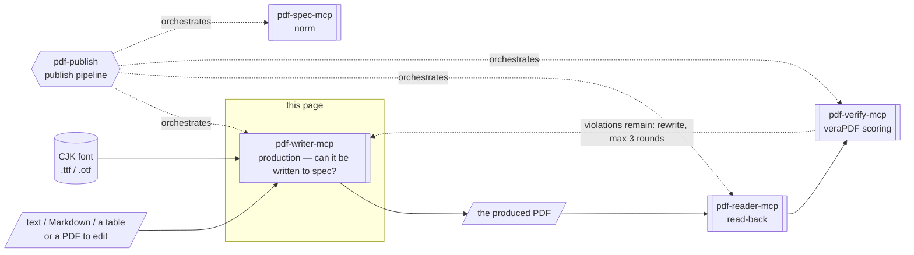
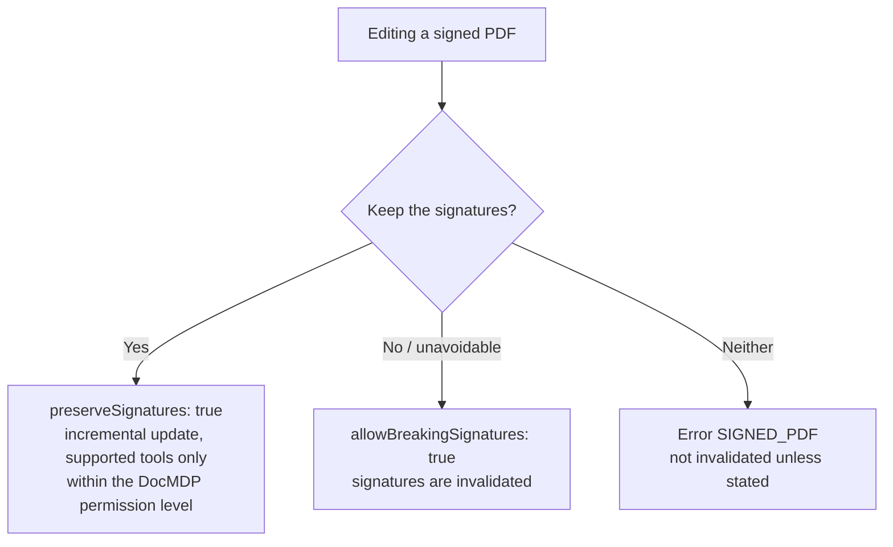

# pdf-writer-mcp

**The server that creates and edits PDFs.** It generates PDFs from text, Markdown or tables, and handles page operations (merge, split, reorder), bookmarks, annotations, watermarks, page numbers, form filling and file attachments. CJK font embedding (with subsetting) is supported.

- npm: [`@shuji-bonji/pdf-writer-mcp`](https://www.npmjs.com/package/@shuji-bonji/pdf-writer-mcp) / current v0.21.0 / [GitHub](https://github.com/shuji-bonji/pdf-writer-mcp)
- This page is the guide — responsibilities and boundaries. For every tool's parameters and returns, see the [tools reference](/reference/mcp/pdf-writer) (generated from `tools/list`)
- Built on [normativepdf](https://github.com/shuji-bonji/normativepdf) — a PDF library in which every behaviour is tied to an ISO 32000 clause — with CJK font embedding via harfbuzz subsetting

## What this one server gives you

"Make an invoice PDF with this content", "merge these three PDFs", "stamp CONFIDENTIAL across every page" — creation and editing finish here. It can also produce tagged PDFs (PDF/UA-1) that screen readers can follow, which suits having an AI author a document and deliver it directly.

## What it gives you together with a Skill

This server sits in the **production** layer of the four (production = returning a new or edited PDF): it writes, and only writes. It cannot measure what it wrote — pdf-verify measures, pdf-reader reads back. Wiring the three into a **write → read-back → verify** loop is what [pdf-publish](/skills/pdf-publish) does.



Shapes carry meaning (→ [legend](/reference/glossary#how-to-read-the-diagrams-shape-legend)).

| Skill | What this server does there | Required? |
|---|---|---|
| [pdf-publish](/skills/pdf-publish) | The foundation of the pipeline: the writing side, with read-back and scoring left to the other two | **Required** |

::: danger If you cannot measure it, do not write the declaration
Whenever a job uses `ensure_pdfa` / `ensure_tagged`, pdf-publish requires pdf-verify regardless of the quality level. If it cannot be checked, the declaration is not written.
:::

## What it cannot do

- **It writes a conformance declaration; it cannot guarantee conformance.** `ensure_pdfa` and `ensure_tagged` write a **declaration** into the metadata: "this document is PDF/A". Existing violations such as unembedded fonts are not repaired. Applying them to a non-conforming file produces a PDF claiming conformance it does not have. Whatever you declare, measure it with pdf-verify
- **Machines cannot infer meaning.** What `ensure_tagged` creates is a minimal structure tree, not an accessible document. Headings, tables, lists, reading order and figure alt text are not created, so human review is required
- **`ensure_pdfa` does not repair fonts, transparency, encryption or JavaScript** (it supplies document-level requirements only)
- Encrypted PDFs cannot be edited (`ENCRYPTED_PDF`). XFA is unsupported

## What it does not do

- **It does not sign.** Editing a signed PDF requires an explicit `preserveSignatures` (incremental update) or `allowBreakingSignatures`. Unless one of them is stated, no edit that would invalidate a signature is performed
- Conformance verdicts (→ pdf-verify), quoting the spec (→ pdf-spec)

## Installation

```jsonc
{
  "mcpServers": {
    "pdf-writer": {
      "command": "npx",
      "args": ["-y", "@shuji-bonji/pdf-writer-mcp@latest"],
      "env": { "PDF_WRITER_FONT": "/path/to/NotoSansJP-Regular.otf" }
    }
  }
}
```

## Common parameters

Most tools accept these.

| Parameter | Type | Description |
|---|---|---|
| `inputPath` **required** (editing tools) | string | Absolute path of the PDF to edit |
| `outputPath` | string | Where to save (absolute). **Omitting it returns base64, which makes the response enormous and is likely to break the conversation — always set it** |
| `returnBase64` | boolean | Also return base64 in addition to saving. Default false |
| `fontPath` | string | Font to embed (.ttf/.otf; .ttc unsupported). Required for CJK. Env `PDF_WRITER_FONT` works too |
| `allowBreakingSignatures` | boolean | A signed PDF (detected via /ByteRange) errors by default. true = proceed **knowing the signatures will be invalidated** |
| `preserveSignatures` | boolean | Edit via **incremental update (appending)** without invalidating signatures. Original bytes are untouched, so /ByteRange holds. Changes beyond the DocMDP permission level are refused (supported tools only) |

### Handling signed PDFs (decision flow)

The decision when editing a signed PDF goes like this.

- The default is an error (signatures are not invalidated)
- To keep the signatures, use `preserveSignatures` (incremental update)
- Only when breaking them is acceptable, use `allowBreakingSignatures`



## Tools (20)

Parameters, types and defaults are in the [tools reference](/reference/mcp/pdf-writer) (generated from `tools/list`).

| Category | Tools |
|---|---|
| Creation | [`create_text_pdf`](/reference/mcp/pdf-writer#create-text-pdf) / [`create_markdown_pdf`](/reference/mcp/pdf-writer#create-markdown-pdf) / [`create_table_pdf`](/reference/mcp/pdf-writer#create-table-pdf) |
| Page operations | [`merge_pdfs`](/reference/mcp/pdf-writer#merge-pdfs) / [`split_pdf`](/reference/mcp/pdf-writer#split-pdf) / [`extract_pages`](/reference/mcp/pdf-writer#extract-pages) / [`delete_pages`](/reference/mcp/pdf-writer#delete-pages) / [`reorder_pages`](/reference/mcp/pdf-writer#reorder-pages) / [`rotate_pages`](/reference/mcp/pdf-writer#rotate-pages) |
| Decoration & annotation | [`add_bookmarks`](/reference/mcp/pdf-writer#add-bookmarks) / [`add_annotation`](/reference/mcp/pdf-writer#add-annotation) / [`add_watermark`](/reference/mcp/pdf-writer#add-watermark) / [`stamp_page_numbers`](/reference/mcp/pdf-writer#stamp-page-numbers) |
| Metadata & attachments | [`set_metadata`](/reference/mcp/pdf-writer#set-metadata) / [`attach_file`](/reference/mcp/pdf-writer#attach-file) |
| Forms | [`fill_form`](/reference/mcp/pdf-writer#fill-form) / [`flatten_form`](/reference/mcp/pdf-writer#flatten-form) / [`tag_form_fields`](/reference/mcp/pdf-writer#tag-form-fields) |
| Declarations | [`ensure_tagged`](/reference/mcp/pdf-writer#ensure-tagged) / [`ensure_pdfa`](/reference/mcp/pdf-writer#ensure-pdfa) |

## How to use it

Per-tool cautions and prompt → parameters → returned JSON are at the end of each tool on the [tools reference](/reference/mcp/pdf-writer).

### Create a new PDF

`create_text_pdf` / `create_markdown_pdf` / `create_table_pdf` all take `tagged: true`. That builds a tagged PDF (PDF/UA-1), with a structure tree, the PDF/UA declaration, `/Lang` and DisplayDocTitle. PDF/UA requires a title, so `title` becomes required too.

- Omitting `lang` (BCP 47, e.g. `"ja"`) infers it from the text and reports it in warnings. A wrong language declaration makes screen readers misread — set it explicitly when you know it
- Building with `tagged: true` from the start beats applying `ensure_tagged` afterwards
- What happens to characters the font lacks is decided by `onMissingGlyph`. The default is `error`, which lists the missing characters and fails

`pdfVersion` defaults to `"1.7"`. Setting `"2.0"` (ISO 32000-2) adds a trailer `/ID` (Required per Table 15) and trims the Info dictionary to CreationDate / ModDate, moving title, author and Producer to XMP (§14.3.3).

`tagged: true` cannot be combined with `"2.0"`. The only declaration this server can write is PDF/UA-1 (built on PDF 1.7). Putting it on a PDF 2.0 document would make a declaration nobody can measure.

### Extract or merge pages

::: warning Document-level information is not carried over
`merge_pdfs` / `split_pdf` / `extract_pages` / `delete_pages` / `reorder_pages` copy pages into a new document. Tagged structure, XMP, attachments, AcroForm, bookmarks and similar are not carried over. What was lost is reported in warnings — follow up on the output with `attach_file` / `ensure_tagged` / `add_bookmarks` / `set_metadata`.
:::

`extract_pages` outputs in the order you list the pages, so it can reorder while extracting. `add_bookmarks` replaces the existing outline. It does not append.

### Add annotations, watermarks and page numbers

`add_annotation` takes coordinates in PDF space (origin bottom-left, pt) — exactly the rectangles [pdf-reader](/mcp/pdf-reader)'s `locate_objects` and `extract_structured_text` (`include_bbox`) return. In tagged documents it also encloses the annotation in an Annot structure element (PDF/UA 7.18.1-1). With `preserveSignatures` that enclosure rides the incremental update (under DocMDP, allowed only at P=3). Alt text for assistive technology goes in `alt`.

`add_watermark` and `stamp_page_numbers` are wrapped as Artifacts in tagged PDFs. Assistive technology does not read the watermark or page numbers as body text. Both need a font for CJK strings.

### Fill a form

If you do not know the field names, pass one nonexistent name to `fill_form`. The error lists every field name and type. XFA is unsupported.

`flatten_form` refuses by default on tagged PDFs, because the Widget annotations disappear and Form structure elements are left dangling. `allowBreakingTags: true` forces it, and the file can no longer be measured as PDF/UA.

`tag_form_fields` repairs a tagged PDF's form toward PDF/UA-1: it encloses Widgets in Form structure elements (7.18.4-1), sets `/Tabs S` on the affected pages (7.18.3-1) and gives fields alternate names `/TU` (7.18.1-3). Running it again does not change the result. Untagged documents are out of scope.

### Make the file claim PDF/A or PDF/UA

::: danger Whatever you make the file claim, measure
`ensure_tagged` / `ensure_pdfa` write pdfuaid / pdfaid into the XMP. That is a declaration the file makes about itself, not proof that it meets the standard. Applied to a non-conforming document they produce **a PDF claiming conformance it does not have** (a warning is always returned).

After writing, always measure with pdf-verify's `validate_conformance`, passing the same flavour string you gave `ensure_pdfa` (`pdfua-1` / `pdfa-3b` / `pdfa-4` / `pdfa-4f`). **If you cannot measure it, do not write the declaration.**
:::

`ensure_tagged` leaves the structure tree untouched if the document is already tagged and supplies only the missing document-level requirements (MarkInfo / Lang / DisplayDocTitle / XMP pdfuaid and dc:title); if untagged, it creates a minimal structure tree (each page = one P element).

`ensure_pdfa` supplies the trailer `/ID` (ISO 32000-1 14.4), an sRGB OutputIntent (generating and embedding an ICC profile) and XMP pdfaid — **it never touches content, structure tree or fonts**. Choose the target with `flavour`: `"pdfa-3b"` (default) / `"pdfa-4"` / `"pdfa-4f"`.

**The PDF/A-4 flavours (`pdfa-4` / `pdfa-4f`) additionally set the header to PDF 2.0 and delete the Info dictionary.** PDF/A-4 forbids Info unless the catalog has `/PieceInfo` (veraPDF `ISO 19005-4:2020 6.1.3-4`) — stricter than ISO 32000-2 §14.3.3. Nothing is lost: `xmp:CreateDate` holds the creation date. It writes `pdfaid:rev` and not `pdfaid:conformance` (PDF/A-4 has no conformance level).

::: warning With attachments, use `"pdfa-4f"`
Plain `"pdfa-4"` requires **every attachment to be PDF/A itself** (`6.9-3`). That breaks the e-bookkeeping-law pattern of bundling CSV or JSON — use **`"pdfa-4f"`**. Measured: the same document scored 108/109 under `pdfa-4` and **109/109 COMPLIANT** under `pdfa-4f`.
:::

Combining with `preserveSignatures` is **refused for the PDF/A-4 flavours unless the input is already PDF 2.0**: an incremental update cannot rewrite the file header. Rewriting it would invalidate the very signatures being preserved.

In the e-bookkeeping-law context, apply it **after** attaching the machine-readable data with `attach_file`. `attach_file` declares the relationship to the body with `relationship` (`Source` / `Data` / `Alternative` / `Supplement` / `Unspecified`) — **PDF/A-3 requires a meaningful value** (§6.8; omitting it warns).

## Error codes

Errors are structured (`code` / `next_actions` / `retryable`). **Do not parse the message text.** Every code and its remedy is in the [error code reference](/reference/error-codes).

| Common code | What to do |
|---|---|
| `SIGNED_PDF` | State `preserveSignatures` or `allowBreakingSignatures` explicitly |
| `TAGGED_PDF` | State `allowBreakingTags` explicitly (knowing the file will no longer be PDF/UA-conformant) |
| `FONT_REQUIRED` | Set `fontPath` / `PDF_WRITER_FONT` |
| `MISSING_GLYPH` | Choose behaviour with `onMissingGlyph` |
