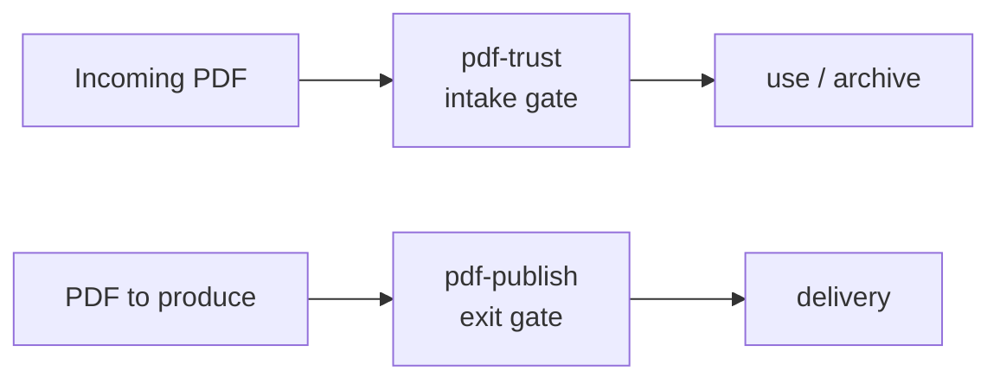

# Skills

Where the MCPs own deterministic computation and cryptography, the Skills own procedure, knowledge and orchestration. The judge is code, the narrative is the LLM — that division of labour is the family's design principle.

| Skill | Role | Required MCPs |
|---|---|---|
| [pdf-trust](/skills/pdf-trust) | Orchestrates the incoming audit and returns a Trust Report | pdf-verify **required** (v0.7.0+) / reader, spec and houki-* optional |
| [pdf-publish](/skills/pdf-publish) | The write → read-back → verify delivery pipeline | pdf-writer / pdf-reader / pdf-verify |
