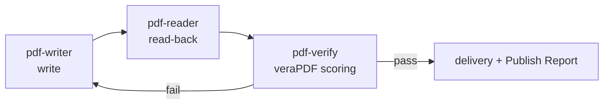

# pdf-publish — Delivery Pipeline

A Skill that orchestrates PDF creation and editing all the way to delivery, with quality gates. It writes with pdf-writer, reads the result back with pdf-reader, machine-scores it with pdf-verify (veraPDF) — the **write → read-back → verify loop** — and delivers with a **Publish Report**.

## Supported scenarios

- Generating PDF/UA-conformant (tagged) PDFs
- Japanese e-bookkeeping law (電帳法): PDF/A-3b plus attachments (`attach_file`). When PDF/A-4 is requested, use **`pdfa-4f`** — plain `pdfa-4` requires every attachment to be PDF/A itself, which is incompatible with bundling CSV/XML
- Making forms PDF/UA-conformant (`tag_form_fields`)
- General quality-assured delivery

## Key rules

- After writing a declaration (`ensure_pdfa` / `ensure_tagged`), always run `validate_conformance` with the matching flavour — **if you cannot measure it, do not write the declaration**
- The verdict belongs to veraPDF. Report "veraPDF judged it COMPLIANT", never "conforms to ISO 19005"

<!-- TODO: Publish Report sample, loop cutoff conditions (Phase 3) -->
