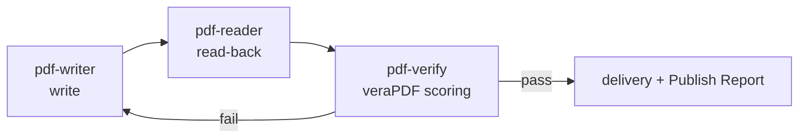

# pdf-publish — Delivery Pipeline

A Skill that orchestrates PDF creation and editing all the way to delivery, with quality gates. It writes with pdf-writer, reads the result back with pdf-reader, machine-scores it with pdf-verify (veraPDF) — the **write → read-back → verify loop** — and delivers with a **Publish Report**.



## Supported scenarios

- Generating PDF/UA-conformant (tagged) PDFs
- Japanese e-bookkeeping law (電帳法): PDF/A-3b plus attachments (`attach_file`). When PDF/A-4 is requested, use **`pdfa-4f`** — plain `pdfa-4` requires every attachment to be PDF/A itself, which is incompatible with bundling CSV/XML
- Making forms PDF/UA-conformant (`tag_form_fields`)
- General quality-assured delivery

## Quality gate levels

Choose how far to check before delivering — the central setting of this Skill.

| Level | Meaning | Required MCPs |
|---|---|---|
| `none` | Write only, no gate (drafts, throwaways) | writer |
| `readback` | Read the output back with reader and observe that it matches the intent | writer + reader |
| `conformance(flavour)` | Until veraPDF scores it COMPLIANT. The flavour names the standard to measure (`pdfa-3b` / `pdfa-4f` / `pdfua-1`, …) | writer + verify (veraPDF recommended) |

## Key rules

- After writing a declaration (`ensure_pdfa` / `ensure_tagged`), always run `validate_conformance` with the matching flavour — **if you cannot measure it, do not write the declaration**
- The verdict belongs to veraPDF. Report "veraPDF judged it COMPLIANT", never "conforms to ISO 19005"

## Measured example — Publish Report summary (2026-08-11)

A demo invoice (Japanese, tagged, CSV attachment — the e-bookkeeping-law pattern) delivered at
gate level `conformance(pdfa-3b + pdfua-1)`:

| Phase | What ran | Result |
|---|---|---|
| 1 Write | `create_markdown_pdf` (tagged, lang: ja) → `attach_file` (CSV, **Data**) → `ensure_pdfa` (**always last**) | First call failed with `FONT_REQUIRED` → recovered by following the structured error's `next_actions` (fontPath) |
| 2 Read-back | read_text / extract_structured_text / inspect_fonts / inspect_tags / inspect_structure | Every identifier and figure preserved; exactly one H1; font embedded + subset; **Names / AF / OutputIntents** present in the catalog |
| 3 Gate | identify_conformance + validate_conformance ×2 | **veraPDF judged PDF/A-3b COMPLIANT (146/146) and PDF/UA-1 COMPLIANT (106/106)** |
| 4 Fix loop | — | **0 iterations** (passed first time) |

`ensure_pdfa` always returns a warning, even on success:

> This file now **CLAIMS** PDF/A-3b …, but conformance was **NOT checked** here. … Verify before
> relying on it: pdf-verify-mcp validate_conformance(flavour: "pdfa-3b")

This is design, not a defect. The moment a declaration is written, verification stops being
optional — the warning is transcribed into the Report, and the matching flavour is measured
before delivery.

## Loop cutoff conditions

- The fix loop has a **hard cap of 3 iterations**. Beyond that, stop and hand over to human review with the remaining violations plus clause grounds (via pdf-spec when connected)
- **The same violation twice in a row → hand over immediately** — that fix is not working
- When an earlier step fails, later steps are recorded as "**skipped**", not "failed" (prevents misreading the cause)
- `compliant: null` from the native engine means "no violations in the checked subset", not conformance — the gate verdict is withheld and installing veraPDF is recommended

## Installation

```sh
/plugin marketplace add shuji-bonji/claude-plugins
/plugin install pdf-writer-mcp@shuji-bonji   # required foundation
/plugin install pdf-verify-mcp@shuji-bonji   # required at the conformance gate level
/plugin install pdf-publish@shuji-bonji
# recommended: pdf-reader-mcp (read-back)
```

Repository: [shuji-bonji/pdf-publish-skill](https://github.com/shuji-bonji/pdf-publish-skill) (SKILL.md itself and the error-code mapping)

## Degraded operation

- pdf-writer not connected → cannot proceed; the Skill says so and stops
- pdf-verify not connected → `conformance`-level jobs are **aborted** (continuing requires agreeing to downgrade to `readback`). Any job that uses `ensure_pdfa` / `ensure_tagged` requires verify regardless of level — if it cannot be measured, the declaration is not written
- pdf-reader not connected → read-back recorded as "not performed (tool not connected)"
- Non-Latin text without an embeddable font → `FONT_REQUIRED` (structured error); resolved via `fontPath` or the `PDF_WRITER_FONT` environment variable
