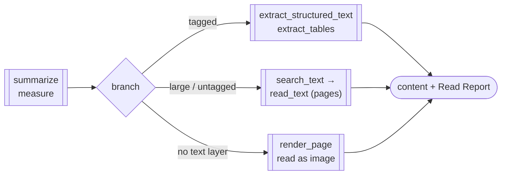

# pdf-read — Reading Pipeline

A Skill that orchestrates the most frequent job of all: **getting content out of a PDF**. Where [pdf-trust](/skills/pdf-trust) audits a PDF you received and [pdf-publish](/skills/pdf-publish) guarantees a PDF you ship, pdf-read covers the third path — extract the section you need from a 500-page document, read a scanned page as an image — and closes with a **Read Report** that states what was read and, just as deliberately, what could not be.



## The core rule

**An empty extraction result is not evidence that a page has no text.** ISO 32000-2 §9.10.1 defines the state where glyphs can be shown but cannot be converted to Unicode, and pdf-reader-mcp v0.12.0 reports it per page: `extracted` / `no_text_layer` (a scan — the text is pixels) / `not_extractable` (a font offers no route to Unicode, with the fonts named) / `not_observed` (encrypted or unreadable). This Skill reads that state before the text, and never concludes "not in the document" over pages it could not read.

## Phases

| Phase | What happens |
|---|---|
| 0 Measure | `summarize` (JSON): page count, tagged?, encrypted?, per-page extractability, and the reader's own `next` suggestions |
| 1 Branch | encrypted → stop (the reader does not decrypt); unreadable pages → Phase 4; tagged → Phase 2; else → Phase 3 |
| 2 Structure route | `extract_structured_text` (logical content order, real headings), `extract_tables` (page-spanning tables stay whole) |
| 3 Narrow & extract | past ~50 pages, `search_text` first, then `read_text` with an explicit page range; `split_columns` for untagged multi-column, `compact_whitespace` for Japanese forms |
| 4 Image route | `render_page` (PDFium-WASM) rasterises the page; a vision model reads the pixels, and the Report says the content came from an image |
| 5 Read Report | pages read, route used, extractability tally, **what could not be read and why**, truncation if any |

## Read Report

```markdown
## Read Report
- Target: report.pdf (412 pages)
- Read: pages 12-18, 301 / Route: narrowed (search_text → read_text)
- Extractability: extracted 410, no_text_layer 2 (pages 87, 88)
- Could not read: pages 87-88 are image-only (read via render_page, reported as such)
- Truncation: none
```

The "could not read" line is never left blank by default — it says "none" only when that was verified. An unchecked blank would read as "checked, no problems".

## Installation

```sh
/plugin marketplace add shuji-bonji/claude-plugins
/plugin install pdf-reader-mcp@shuji-bonji   # required foundation (v0.12.0+)
/plugin install pdf-read@shuji-bonji
```

`render_page` uses the reader's optional dependency `@hyzyla/pdfium` (PDFium compiled to WebAssembly). Without it, every other tool works and the Skill reports the affected pages as unread, with the install command.

Repository: [shuji-bonji/pdf-read-skill](https://github.com/shuji-bonji/pdf-read-skill)

## Out of scope

- OCR — replaced by render + vision reading, and declared as such in the Report
- Authenticity and tamper auditing → [pdf-trust](/skills/pdf-trust)
- Generating or editing PDFs → [pdf-publish](/skills/pdf-publish)
- Structural inspection of PDFs at a URL — `read_url` returns text only; download first, then pass the local path
