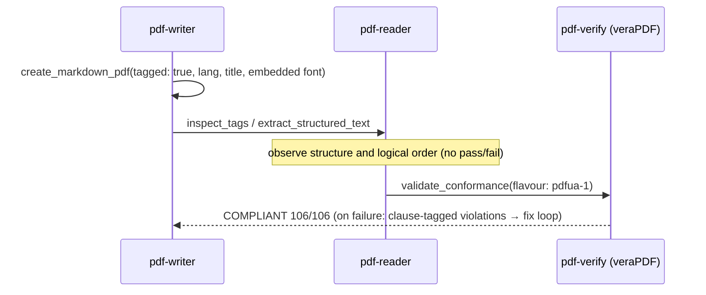

# Accessibility (PDF/UA)

## Scenario

**Produce** a PDF a screen reader can read (tagged generation → scoring), or **measure** whether
an incoming PDF has a readable structure. PDF/UA-1 (ISO 14289-1) is inside the spec corpus,
so violations can be stated **with the clause quoted** (T1 — the big difference from PDF/A).

Everything below is a **real measurement from 2026-08-11** (tagged demo invoice = the passing
side / the Japanese official gazette = the failing side).

## Cast

| Actor | Role |
|---|---|
| [pdf-writer](/mcp/pdf-writer) | Generation with `tagged: true`, `tag_form_fields`, `ensure_tagged` (claim only) |
| [pdf-verify](/mcp/pdf-verify) | `validate_conformance(pdfua-1)` — veraPDF delegation, violations with clause IDs |
| [pdf-reader](/mcp/pdf-reader) | `inspect_tags` (structure tree), `extract_structured_text` (logical order) |
| [pdf-publish Skill](/skills/pdf-publish) | Producer-side orchestration (`tagged` implies the `pdfua-1` gate) |

## Sequence

## Prompt examples

- "Make this report an accessible PDF, verification included"
- "Can a screen reader read this PDF? What's missing?"
- "Make this form PDF/UA conformant" (→ `tag_form_fields`)

## Measured examples — both sides

**Producer side** (demo invoice): `tagged: true` + embedded font + title + lang → read-back
confirms one H1 and a TH/TD table → **veraPDF judged PDF/UA-1 COMPLIANT (106/106)**.

**Auditor side** (the gazette, 2026-08-10 issue): **NOT COMPLIANT** — 10 of 106 rules failed:

| Clause (ISO 14289-1) | Violation |
|---|---|
| 7.1-3 | **236** pieces of real content neither tagged nor marked as Artifact |
| 7.1-11 | No StructTreeRoot (no structure tree at all) |
| 6.2-1 | No MarkInfo/Marked |
| 7.21.7-1 | 9 fonts without ToUnicode |

For a real untagged document, "what cannot be read" can be enumerated this concretely, clause by clause.

## How to read the results

- **PDF/UA-1 is T1** — a violation can be stated as "ISO 14289-1 7.1-3 requires…", one step
  stronger than PDF/A's "veraPDF judged it so"
- Native-engine violations carry a severity: only **error** proves non-conformance (warnings need human review)
- With `tagged: true`, an **embedded font and a title are mandatory** even without CJK text
  (the standard 14 fonts always violate 7.21.4.1)
- Machines validate structure only. **Whether alt text is meaningful and the reading order is
  natural remains human review**
- `ensure_tagged` writes a claim — once used, `pdfua-1` must be measured
